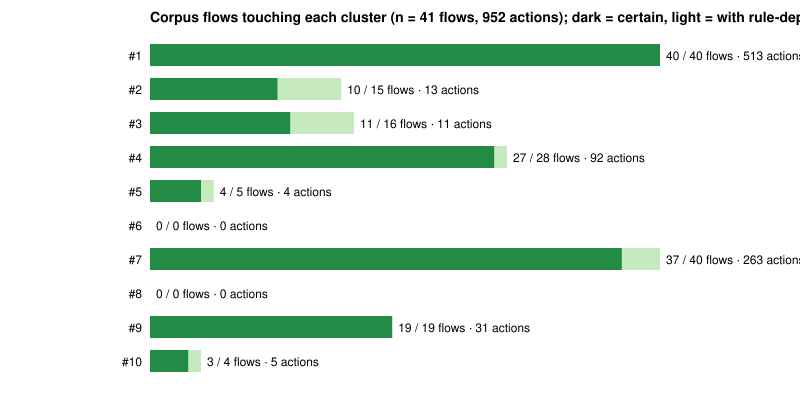
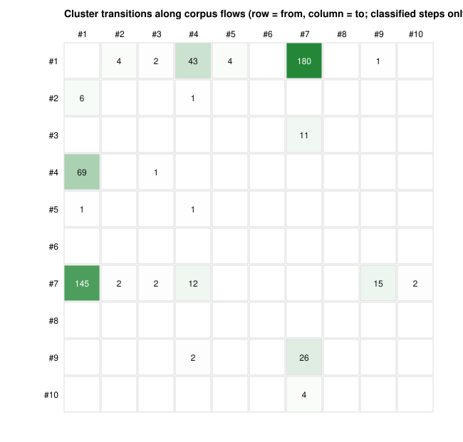
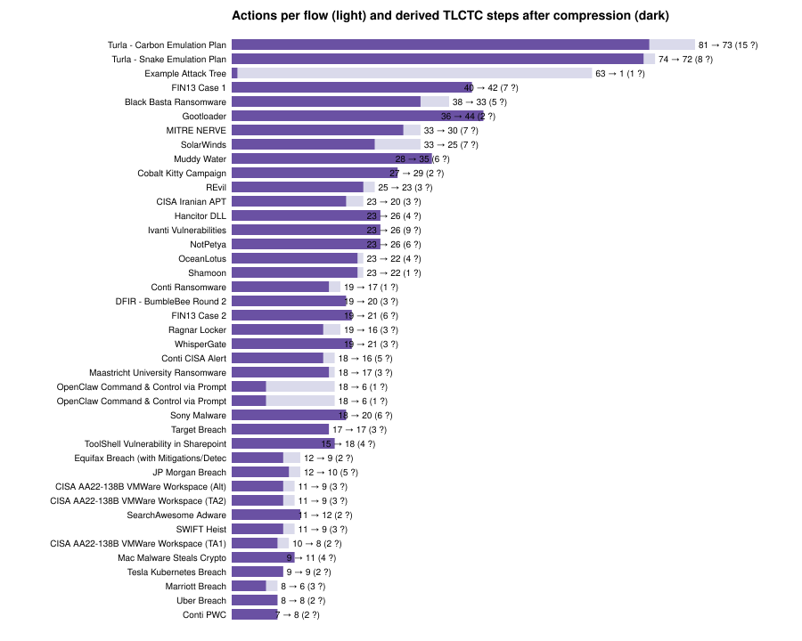

# What Attack Flow Says and What It Cannot: A TLCTC Reading of the 41 Attack Flow Corpus Flows

**Author:** Bernhard Kreinz
**Version:** 1.0
**Date:** 2026-09-18
**License:** CC BY 4.0
**Implements:** TLCTC framework specification v2.5 (canonical dictionary `json-schemas/layer-1/tlctc-framework.v2.5.json`); MITRE Attack Flow schema 2.0.0 and corpus at `center-for-threat-informed-defense/attack-flow` commit `0bd4a2d` (main, 2026-08-13, Builder 4.0 in development); ATT&CK→TLCTC mapping `mappings/mitre-attack-enterprise/tlctc-enterprise-attack.json` (698 techniques) and ATLAS→TLCTC mapping `mappings/mitre-atlas/tlctc-atlas.json` (211 techniques: ATLAS v2026.09 plus the STIX distribution's retired ids). This study introduces no normative content; every cluster, axiom and rule is cited from the core paper and the dictionary.
**Companion to:** *A Cause-Oriented Cyber Threat Taxonomy: The TLCTC Framework* (v2.5 core paper) — DOI [10.5281/zenodo.20633176](https://doi.org/10.5281/zenodo.20633176); the integration lives in `integrations/attack-flow/` of the TLCTC repository.

## Abstract

Attack Flow, the MITRE Center for Threat-Informed Defense's language for describing how adversaries compose ATT&CK techniques into attacks, already has what most incident formats lack: order. A flow is a graph of actions, conditions and operators, and every action names a technique. What it does not have is cause: a technique is a behaviour, and the same behaviour can exploit different generic vulnerabilities. This study joins the two. A converter reads any Attack Flow (`.afb` v2 or STIX 2.1), sends every action through the repository's 698-technique ATT&CK→TLCTC mapping, and derives a TLCTC path in the flow's own order; a second direction exports a TLCTC Layer 3 attack path to an Attack Flow bundle with a formal STIX property extension, importable into the Builder; and a source bundle in the shape the Builder consumes for its other frameworks makes TLCTC selectable on any action. Run over the 41 flows of the Attack Flow corpus (952 actions), the classifier, using the repository's ATT&CK and ATLAS mappings, resolves 70% of actions to one cluster or one cluster sequence, leaves 13% rule-dependent (the flow does not say whether a technique was performed by the operator or by a running payload, or on which side of a server/client interface), and finds 13% of actions carry no technique at all. Two corpus incidents that also exist as hand-classified TLCTC paths give a step-level check: for SolarWinds the hand path is a subsequence of the derived one and every cluster is reached; for Tesla Kubernetes three of four steps align and the entry differs for a stated reason. The dominant transition in the corpus, function abuse alternating with malware, is the granularity gap the study names: Attack Flow records a payload's behaviours as separate actions where TLCTC records one #7 step and its features. The pieces are offered to the Attack Flow project as a framework source, an extension and, later, corpus flows.

**Keywords:** Attack Flow; ATT&CK; STIX 2.1; attack paths; cause-oriented taxonomy; TLCTC; sequencing; extension

## 1. Introduction

Attack Flow [1] is a STIX 2.1 extension [2] that represents an attack as a directed graph: `attack-action` objects (each an ATT&CK technique, or a tactic when the technique is unknown), `attack-condition` objects that branch on the success of an action, `attack-operator` objects that join or fork the flow with AND and OR, and `attack-asset` objects an action acts upon. The Attack Flow Builder edits flows visually and saves them as `.afb` files; the project's corpus holds 41 worked flows, from SolarWinds and NotPetya to emulation plans and a 2026 prompt-injection incident. Version 4.0, under development on `main` at the time of writing, adds pluggable frameworks beyond ATT&CK (MITRE ATLAS, D3FEND and the Fight Fraud Framework), per-object tags, mitigations and detections, and AI-assisted generation from incident reports [3].

Attack Flow therefore already records the one thing that TLCTC's incident work most often has to add to other formats: the order of steps. What it does not record is why a step succeeded. An ATT&CK technique is an observed behaviour; TLCTC classifies a step by the generic vulnerability it exploited, one of ten, and keeps outcomes separate as Data Risk Events [4]. The two questions are complementary, and the repository's ATT&CK→TLCTC mapping [5] answers the second for each technique, sometimes uniquely, sometimes with a rule that needs information the technique does not carry.

This study builds the bridge in both directions and measures what it carries. Section 2 gives the method: the readers, the classifier, the exporter, the source bundle and the extension. Section 3 describes the source bundle and the extension as artefacts. Section 4 reports the corpus: what the classifier resolves, what it cannot, the derived path of every flow, the transitions the corpus shows, and a step-level comparison with two hand-classified TLCTC paths. Section 5 discusses what Attack Flow gains from a cause axis, what only the analyst can add, and what the Attack Flow project is offered.

## 2. Method

### 2.1 Reading a flow

`.afb` v2 files (the whole corpus) store every diagram object with a template name, an instance id, a list of properties and a map of anchors; anchors hold latches; a `dynamic_line` joins a source latch to a target latch. The owner of a latch is the block whose anchor lists it, so every line resolves to a (source block, target block) pair. Lines between actions, conditions and operators are flow edges; a condition's outgoing lines are labelled by the anchor they leave (`branch:True`, `branch:False`); lines from an action to an asset, tool, malware, note or other STIX object are attachments and never carry the flow. STIX bundles are read from `start_refs`, `effect_refs`, `on_true_refs` and `on_false_refs`. Both readers produce the same model; the Builder 4.0 option labels (`[ENT] T1078 Valid Accounts`) are reduced to the id.

### 2.2 Classifying

Each action's technique id (a sub-technique first, then its parent if the sub-technique is unknown) is looked up in the ATT&CK→TLCTC mapping, or in the ATLAS→TLCTC mapping for `AML.` ids, whose `tlctcMapping` strings use a small grammar: `#N`, `A → B` for a sequence, `A | B` for alternatives, parentheses, and `N/A` for threat potential outside the target domain. The string is parsed into alternatives of cluster sequences. An action is *resolved* when exactly one alternative remains (a single cluster, or a sequence such as `#10 → #7` for a compromised software supply chain), *rule-dependent* when several remain, *preparation* when the mapping says N/A (Resource Development techniques: acquiring infrastructure, developing capabilities), *unmapped* when the technique is unknown to both mappings (ATT&CK for ICS, revoked ATT&CK ids), and *no technique* when the action names only a tactic.

The derived path walks the flow in topological order from its declared start (or from the actions with no incoming edge). Resolved actions contribute their clusters in order; rule-dependent and technique-less actions contribute `?` with candidates; preparation is left out of the path and listed separately; a condition continues on its true branch and the false branch is noted; an AND operator marks its successors as parallel; an OR operator lists its alternatives in order. The *compressed* form collapses consecutive steps with the same cluster into one step and keeps the count, and renders a run of several unresolved actions as `…` (a gap) rather than a string of `?`. Δt is computed only where two adjacent actions both carry `execution_start`. Three corpus flows contain a cycle; the walk breaks it in insertion order and the result flags it.

The derived path is a classification report, not a Layer 3 record. It is not written into `attack-paths/`, and two things an analyst would decide are left open on purpose: whether a technique was performed by the operator (a step) or by a running payload (a feature of an earlier #7 step), and on which side of an interface a code flaw sat (#2 or #3 by R-ROLE).

### 2.3 Exporting

A TLCTC Layer 3 path becomes an Attack Flow bundle: one `attack-action` per step (name `#N <cluster name>`, an ATT&CK technique where the step's evidence names one, the step notes as description), one `AND` operator per parallel group that the members lead into, `effect_refs` following the sequence, and both extension-definitions with their identities. Every TLCTC field of the step sits in the TLCTC extension block. Ids are uuid5 over the incident id and the step id, so exports are reproducible. The Node validator checks every export against the pinned Attack Flow JSON Schema (which pulls the STIX 2.1 common properties from the OASIS schemas, pinned alongside) and every extension block against the extension schema.

### 2.4 Data and what is not claimed

The corpus is the 41 `.afb` files at the pinned commit; the study script downloads them into a cache and verifies each against a committed sha256 list, and three are vendored as test fixtures under their Apache-2.0 notice. The corpus is a curated demonstration set (25 incidents, 8 malware families, 3 campaigns, 2 threat actors, 2 emulation plans and one attack tree), not a sample of anything; its numbers describe how Attack Flow authors model attacks, not how attacks happen. The ATT&CK→TLCTC mapping is AI-generated and human-reviewed and has not been independently validated; where it is ambiguous the study says so rather than guessing.

## 3. The Source Bundle and the Extension

**Source bundle.** The Builder loads a framework from a STIX 2.1 bundle of `x-mitre-tactic` and `attack-pattern` objects whose `external_references` carry an accepted `source_name`, and generates a TypeScript enumeration from it; ATLAS and the Fight Fraud Framework enter this way. `stix/tlctc-stix-bundle.json` is generated from the dictionary and the operational enumeration: ten tactics (the clusters, shortnames `tlctc-01` to `tlctc-10`, definitions verbatim) and 21 techniques (ten cluster roots `TLCTC-0N.00`, "vector unspecified", carrying the generic vulnerability and the attacker's view verbatim, plus the eleven published sub-clusters such as `TLCTC-02.10 Protocol vector`), each technique's `kill_chain_phases` naming its cluster. In the Builder's two-level slot the tactic therefore holds the strategic cluster and the technique the operational position, which is the framework's own two-layer model. Ids are uuid5 over stable names, so the bundle regenerates byte for byte; the validator checks that and the verbatim strings on every run.

**Extension.** `extension-definition--69b4eaba-45a8-4101-b935-3a7ae2cb3a1a`, "TLCTC for Attack Flow" 1.0.0, a `property-extension`. On `attack-action`: `tlctc_status` (classified or unresolved), `tlctc_cluster`, `tlctc_sub_cluster`, `tlctc_fec_executed`, `tlctc_fec_recorded_in_step_id`, `tlctc_delta_t_to_next`, `tlctc_boundary` (context, source and target spheres, transit spheres), `tlctc_intra_system_boundaries`, `tlctc_dre`, `tlctc_evidence_refs`, `tlctc_step_id`, `tlctc_notes`, and for unresolved steps `tlctc_unresolved_type`, `tlctc_estimated_count`, `tlctc_candidates`. On `attack-flow`: version, incident id, notation, framework reference and hash, analyst confidence, source. On `attack-operator`: group id, mode, Δt. The JSON Schema constrains clusters to the ten, DRE codes to the dictionary's tree, boundary types to the four intra-system types, and refuses a cluster or a DRE on an unresolved step (R-UNRES-2, R-UNRES-5). The old `tools/stix-exporter` used `x_tlctc_*` custom properties for want of exactly this definition; it stays for consumers that are not Attack Flow aware.

## 4. Results

All numbers come from `integrations/attack-flow/study/results.json` (generated 2026-09-18 from the pinned corpus); `results.md` holds every table and the derived path of every flow.

### 4.1 The corpus as modelled

**Table 1. Corpus profile.**

| Measure | Value |
|---|---|
| Flows | 41 (25 incidents, 8 malware families, 3 campaigns, 2 threat actors, 2 emulation plans, 1 attack tree) |
| Actions | 952 |
| Actions with a technique id | 827 (86.9%) |
| Actions with a tactic only | 125 (13.1%) |
| Actions with `execution_start` | 46 (4.8%) |
| Conditions / operators | 147 / 118 |
| Flows using ATLAS techniques | 2 (36 actions) |
| Flows with a cycle in the flow graph | 3 |

Attack Flow's own timing field is almost unused: 46 actions carry a start timestamp, all but a few in two flows (the BumbleBee and MITRE NERVE incidents), so Δt could be computed on 40 of the 1,153 adjacent step pairs in the corpus. Every flow has order; almost none has velocity.

### 4.2 What the mapping resolves

**Table 2. Classification outcome per action (952 actions).**

| Outcome | Actions | Meaning |
|---|---|---|
| resolved | 668 (70.2%) | one cluster, or one cluster sequence (151 of them `#1 → #7`: a tool is brought in through a designed function and then runs; 46 `#4 → #1`; 26 `#9 → #7`) |
| rule-dependent | 124 (13.0%) | the mapping leaves a rule open the flow cannot decide |
| preparation | 28 (2.9%) | Resource Development and AI attack staging: outside the target domain, no step |
| unmapped | 7 (0.7%) | 3 ATT&CK for ICS, 4 revoked or non-Enterprise ATT&CK ids; the 36 ATLAS actions of the two OpenClaw flows classify through the ATLAS mapping |
| no technique | 125 (13.1%) | tactic-only actions; 63 of them in the attack-tree example |

The rule-dependent actions are dominated by one question. `T1041` Exfiltration over C2 channel (11 actions), `T1003.001` LSASS memory (8), `T1027` Obfuscated files (8), `T1529` System shutdown (5), `T1132.001` Standard encoding (5), `T1219` Remote access software (4) and `T1090` Proxy (4) all map to `#1 | #7`: the technique is function abuse when the operator performs it with the system's own tools and a feature of the payload when the payload performs it. `T1555` Credentials from password stores maps to `(#1 | #7) → #4`, the same question followed by credential use. `T1068` Exploitation for privilege escalation maps to `(#2 | #3) → #7`, the server/client question of R-ROLE. An Attack Flow does not record who acts, the operator or the implant, and it does not record the role of a flawed component, so these 124 actions stay `?` with their candidates.

### 4.3 Clusters and entries

**Table 3. Clusters touched (actions certain / with alternatives; flows certain / with alternatives).**

| Cluster | Actions | Flows |
|---|---|---|
| #1 Abuse of Functions | 511 / 624 | 40 / 40 |
| #2 Exploiting Server | 13 / 20 | 10 / 15 |
| #3 Exploiting Client | 11 / 22 | 11 / 16 |
| #4 Identity Theft | 92 / 104 | 27 / 28 |
| #5 Man in the Middle | 4 / 6 | 4 / 5 |
| #6 Flooding Attack | 0 / 0 | 0 / 0 |
| #7 Malware | 263 / 380 | 37 / 40 |
| #8 Physical Attack | 0 / 0 | 0 / 0 |
| #9 Social Engineering | 31 / 35 | 19 / 19 |
| #10 Supply Chain Attack | 5 / 9 | 3 / 5 |



Two clusters never appear: #6, because no corpus flow models a flood, and #8, because none models physical access. #1 is present in 40 of 41 flows and accounts for 511 certain actions, led by `T1105` Ingress Tool Transfer (61 actions, the first half of `#1 → #7`), indicator removal, disabling tools, and the discovery techniques (`T1057`, `T1082`, `T1083`, `T1018`). #7 is present in 37 flows; its top techniques are deobfuscation (`T1140`), application-layer C2 (`T1071.001`), data encryption for impact (`T1486`) and embedded payloads (`T1027.009`), that is, things a payload does. #4 appears in 27 flows, almost always as `T1078` Valid Accounts and its cloud sub-technique.

**Table 4. Entry cluster (the first classified step of the derived path).**

| Entry | Flows |
|---|---|
| #9 Social Engineering | 14 |
| #1 Abuse of Functions | 8 |
| #2 Exploiting Server | 5 |
| #3 Exploiting Client | 4 |
| #4 Identity Theft | 4 |
| #10 Supply Chain Attack | 3 |
| #7 Malware | 2 |
| none (no action resolves) | 1 |

In 9 of 41 flows the first step of the derived path is unresolved (the entry cluster is then the first classified step after it); in one flow no action resolves at all: the attack-tree example, whose 63 actions carry no technique. The two OpenClaw prompt-injection flows, whose actions are ATLAS techniques, classify through the ATLAS mapping to `? → #1 → #3 → #7 → #1 → #7`: indirect injection at the agent's designed interface, a drive-by compromise, and the agent driven to execute attacker content, the path B and path E shapes of the agentic-AI corpus.

### 4.4 Transitions and the granularity gap

**Table 5. Most frequent cluster transitions along derived paths (classified steps only, after compression).**

| Transition | n | Transition | n |
|---|---|---|---|
| #1 → #7 | 179 | #7 → #9 | 15 |
| #7 → #1 | 144 | #7 → #4 | 12 |
| #4 → #1 | 69 | #3 → #7 | 11 |
| #1 → #4 | 43 | #2 → #1 | 6 |
| #9 → #7 | 26 | #1 → #2 | 4 |



Two transitions make up 61% of the 531 classified edges, and they are each other's reverse: `#1 → #7` (179) and `#7 → #1` (144). The corpus's typical flow reads, after compression, `#9 → #7 → #1 → #7 → #1 → #7 → …`: a lure, a payload, then an alternation of function-abuse techniques (discovery, tool transfer, defence evasion) and payload techniques (C2, encoding, encryption). In TLCTC that alternation is largely one step. Once foreign code executes (#7, R-EXEC), the techniques the payload performs are features of that step, not new exploitations of a generic vulnerability; only an operator reaching a new function, a new credential or a new flaw opens a new step. Attack Flow cannot make the distinction because an `attack-action` has no actor field for "the implant did this", and the mapping cannot make it because a technique id does not say who ran it. Compression therefore removes little: 952 actions become 853 steps, 1.12 actions per step, and no flow is fully classified (164 of the 853 steps are `?` or `…`).



The other frequent pairs are the ones the core paper's worked examples predict: `#9 → #7` (phishing to payload), `#4 → #1` and `#1 → #4` (credential use and function abuse taking turns as an intrusion widens), `#3 → #7` (client exploit to payload), `#2 → #1` (server exploit then function abuse on the foothold).

### 4.5 Two flows the repository also classified by hand

**Table 6. Derived path against the hand-classified Layer 3 path.**

| | SolarWinds | Tesla Kubernetes (2018) |
|---|---|---|
| Hand path | `#10 → #7 → #4 → #1` (4 steps) | `#1 → #7 → #1 → #4` (4 steps) |
| Derived (compressed) | `? → #10 → #7 → #1 → #7 → ? → #1 → #7 → ? → #7 → ? → #1 → #7 → #1 → ? → #1 → #4 → #1 → #7 → #4 → ? → #1 → #7 → #1 → ?` (25 steps from 38 raw) | `… → #4 → #1 → #4 → #1 → #7 → #4 → #1 → ?` (9 steps from 11 raw) |
| Hand clusters reached | 4 of 4 | 3 of 3 |
| Derived clusters not in the hand path | none | none |
| Longest common cluster subsequence | 4 of 4 | 3 of 4 |
| Entry cluster agrees | yes (#10) | no |

For SolarWinds the hand path is a subsequence of the derived path: the four clusters appear in the order the analysts recorded them, and the derived path adds nothing outside them; what it adds is 21 further alternations of #1 and #7 that the hand path folds into the SUNBURST step and the post-compromise step, plus seven `?` from `#1 | #7` techniques and two revoked technique ids. For Tesla the derived path reaches every hand cluster, but its entry differs: the corpus flow opens with acquiring infrastructure (preparation, no step), a proxy and a non-standard port (`#1 | #7`, unresolved), then `T1133` External Remote Services, which the mapping reads as #4, whereas the hand path opens with #1, the unauthenticated Kubernetes dashboard abused as a designed function. The disagreement is in the mapping's reading of `T1133` for a service that required no credential, not in the flow, and it is exactly the kind of row an inter-rater test would catch.

### 4.6 What Attack Flow cannot say

Structurally, and independently of any mapping: no cause (a technique is a behaviour; 124 actions stay rule-dependent for that reason), no actor of an action (operator versus payload; the granularity gap of §4.4), no responsibility-sphere or intra-system boundary (the `#10` steps in SolarWinds, NotPetya and Target are recognisable only through the technique id, never as a Trust Acceptance Event), no Data Risk Event (the corpus records "Data Encrypted for Impact" as an action, not as an `Ac` outcome on the records), and velocity only where an author typed timestamps (40 pairs of 1,153). All of these have a field in the TLCTC extension of §3, and none changes what Attack Flow already does well.

## 5. Discussion

**Attack Flow plus a cause axis.** The corpus shows what joining the two buys. Every flow gains a cluster reading of seven in ten of its actions at no authoring cost, a derived path that a defender can compare across incidents ("#9 → #7 → #1" is the same story whether the payload was Conti, REvil or Black Basta), an entry-cluster statistic (Social Engineering opens 14 of 38 classifiable flows; server exploitation, 5), and a list of exactly the actions where an analyst's judgement is needed. In the Builder, once TLCTC is a selectable framework, that judgement becomes a click on the action: the tactic slot takes the cluster, the technique slot the operational position.

**What only the analyst adds.** The granularity gap is not a defect of the mapping; it is the difference between a behaviour catalogue and a cause taxonomy. Attack Flow authors model what was observed, technique by technique, and a payload's twelve behaviours are twelve observations. TLCTC asks which of them opened a new exploitation of a generic vulnerability, and the answer requires knowing who acted. The extension gives the analyst the fields to record the answer (`tlctc_fec_executed`, `tlctc_fec_recorded_in_step_id`, the boundary, the DRE) and the derived path gives them the list of places to look. A flow that carries both, ATT&CK on every action and a TLCTC cluster on the actions that are steps, is more useful than either alone, and the SolarWinds comparison shows the two are consistent where both exist.

**A coverage gap the study closed, and two it left.** The first run of the study found the two OpenClaw prompt-injection flows (36 actions) unmapped because the repository had no ATLAS→TLCTC mapping; that mapping now exists (`mappings/mitre-atlas/`, every technique of ATLAS v2026.09 and of the STIX distribution, doctrine from the agentic-AI paths: injection, jailbreak, RAG and context poisoning and agent tool abuse are #1, supply chain is #10 at the Trust Acceptance Event, staging is N/A) and the two flows classify. ATT&CK for ICS (3 actions) still has no mapping. Revoked Enterprise ids (`T1063`, `T1183`, `T1076`) in older flows are an upstream corpus matter.

**Precision the extension enforces.** Two points where a naive export would have produced wrong Attack Flow: a parallel group is not an operator that fans out but a set of actions that lead into an AND operator, and a flow cannot start at an operator, so a leading parallel group starts at its members; and an unresolved step carries neither a cluster nor a DRE, which the extension schema refuses rather than leaves to convention.

**What the TLCTC project offers next.** (1) The Builder framework source, as a pull request prepared to the project's contribution rules (signed-off commits, tests passing), with the bundle served from this repository and regenerated on every TLCTC release. (2) Corpus flows for incidents the repository has already classified (the Shai-Hulud npm worm, the Chaos/MuddyWater false-flag ransomware) with both ATT&CK and TLCTC on every action, once the framework is selectable. (3) The ATLAS→TLCTC mapping, now in this repository, as the Builder's TLCTC reading of ATLAS-based flows. (4) The derived-path classifier as an optional check in the Builder's validator or as an `af` sub-command, so an author sees which actions a cause reading cannot resolve. (5) A tag set for the ten clusters for authors who want the colour without the framework.

## 6. Limitations

The ATT&CK→TLCTC mapping is one analyst's reading, AI-generated and human-reviewed, with no inter-rater test; the Tesla entry disagreement is a concrete instance of a row that may need revising, and every derived path inherits every such row. The corpus is a demonstration set curated by the Attack Flow team and its contributors, weighted towards ransomware and espionage intrusions on Windows estates, with no flood, no physical access and almost no timestamps; nothing here estimates how attacks are distributed. The derived path's handling of branches is a convention (true branch followed, false branch noted, OR alternatives in order) that suits a summary and not a formal semantics; three flows contain cycles the walk has to break. Compression collapses only exact repeats of a cluster; it does not attempt the operator-versus-payload judgement, which is the analyst's. Builder 4.0 is unreleased, so the framework-source contract could still move before Phase 2.

## 7. Reproducibility

```bash
npm run build-attack-flow && npm run validate-attack-flow    # regenerate the source bundle; validate bundle, extension, examples, results
cd integrations/attack-flow
python -m unittest discover tests                             # readers, mapping grammar, classifier, exporter, CLI
python -m cli classify tests/fixtures/corpus/SolarWinds.afb --format md
python -m cli export ../../json-schemas/layer-3/examples/solarwinds-2020.json -o solarwinds.attack-flow.json
python study/run-study.py                                     # downloads the 41 corpus flows at the pinned commit, verifies sha256, rewrites results
```

Pinned inputs: `center-for-threat-informed-defense/attack-flow` commit `0bd4a2d45dceacce499d7e94b85f7966e70f5399` (schema 2.0.0, extension-definition, 41 corpus files with sha256 in `study/corpus-sha256.json`); OASIS `cti-stix2-json-schemas` common schemas (stix2.1 branch); the TLCTC v2.5 dictionary, the operational enumeration, the ATT&CK→TLCTC mapping and the ATLAS→TLCTC mapping (ATLAS STIX from `mitre-atlas/atlas-navigator-data` commit `2f55d5f`, 170 techniques, and `atlas-data` release v2026.09, 208 techniques) at the repository commit that carries this document.

## References

1. MITRE Center for Threat-Informed Defense. *Attack Flow.* https://center-for-threat-informed-defense.github.io/attack-flow/ · repository https://github.com/center-for-threat-informed-defense/attack-flow (Apache-2.0).
2. OASIS. *STIX Version 2.1*, Committee Specification, 2021, §7.3 Extension Definition. https://docs.oasis-open.org/cti/stix/v2.1/os/stix-v2.1-os.html
3. Attack Flow, *Changelog* (versions 3.1, 3.2, 4.0) and *AI Generation*, docs at the pinned commit. https://github.com/center-for-threat-informed-defense/attack-flow/blob/main/docs/changelog.rst
4. B. Kreinz. *A Cause-Oriented Cyber Threat Taxonomy: The TLCTC Framework*, v2.5.1 core paper, 2026. DOI 10.5281/zenodo.20633176.
5. TLCTC Project. *MITRE ATT&CK Enterprise → TLCTC Mapping* (698 techniques). `mappings/mitre-attack-enterprise/tlctc-enterprise-attack.json`, https://github.com/Barnes70/TLCTC
6. MITRE. *ATT&CK* v19.1 (Enterprise), https://attack.mitre.org/; *ATLAS*, https://atlas.mitre.org/ (data: https://github.com/mitre-atlas/atlas-data, STIX distribution: https://github.com/mitre-atlas/atlas-navigator-data)
6a. TLCTC Project. *MITRE ATLAS → TLCTC Mapping* (211 techniques). `mappings/mitre-atlas/tlctc-atlas.json`, https://github.com/Barnes70/TLCTC
7. B. Kreinz. *Applying the Top Level Cyber Threat Clusters*, v2.5.1 application paper, 2026. DOI 10.5281/zenodo.22697636.
8. TLCTC Project. *TLCTC for Attack Flow* (source bundle, extension, converter, study). https://github.com/Barnes70/TLCTC/tree/main/integrations/attack-flow
