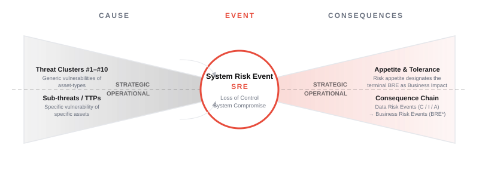
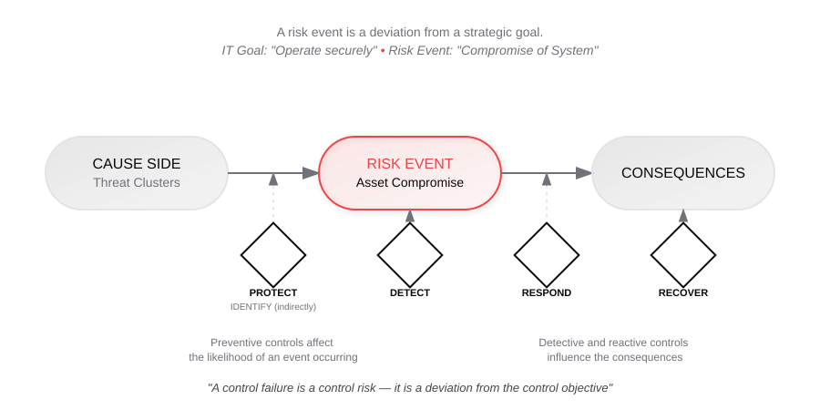
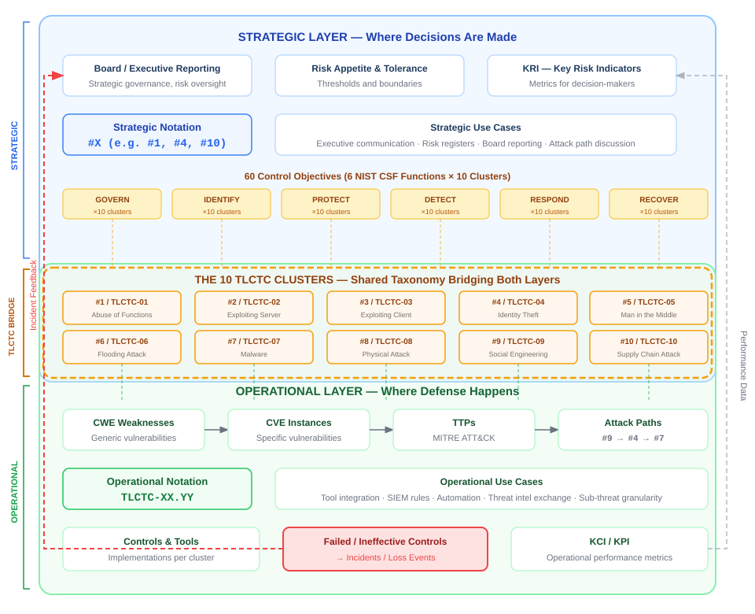

&nbsp;

&nbsp;

# Top Level Cyber Threat Clusters (TLCTC)

## Version 2.0 — Canonical Definitions

&nbsp;

**Bernhard Kreinz**

&nbsp;

March 2026

&nbsp;

---

&nbsp;

## Abstract

Despite the proliferation of cybersecurity standards bearing "Cyber" in their names—from ISO/IEC 27001 to NIST CSF 2.0, CMMC 2.0, and EU regulations—a comprehensive analysis reveals a critical gap: the absence of a unified, cause-oriented cyber threat taxonomy that enables consistent risk assessment across organizations and sectors. Top Level Cyber Threat Clusters (TLCTC) addresses this foundational deficit by providing a cause-oriented, actor-agnostic framework that establishes a consistent language for describing cyber risk through ten non-overlapping cyber threat clusters spanning human, physical, and digital domains. Each cluster classifies a distinct attack vector according to the generic vulnerability it initially targets, enabling sequential expression of real attack paths from initial compromise to follow-on steps—without conflating threats with outcomes such as data loss, fraud, or service disruption. By separating a strategic management view (cluster-level risk and generic vulnerabilities) from an operational security view (concrete vulnerabilities, techniques, and procedures), TLCTC creates a stable backbone for governance, control design, threat intelligence, and incident learning. Its primary value is semantic clarity: TLCTC reduces ambiguity across stakeholders and makes complex cyber security discussions comparable, measurable, and decision-ready across technologies, environments, and organizations—providing the taxonomic foundation that existing "cyber" standards conspicuously lack.

## PART I: THE CORE FRAMEWORK

*The "Physics" — What TLCTC IS*

## 1.1 Introduction

Cybersecurity suffers from a persistent language problem: we describe fundamentally different things using the same words, and we use different words for the same thing. In practice, “cyber threat” is routinely mixed with threat actors, vulnerabilities, control failures, incidents, and outcomes (e.g., data breach, denial of service, ransomware). This semantic blur makes it difficult to compare cyber incidents, aggregate cyber threat intelligence, design targeted controls, or communicate cyber risk consistently between leadership, risk functions, and technical teams.

The **Top Level Cyber Threat Clusters (TLCTC)** framework addresses this by anchoring cyber analysis in **causality**: a cyber threat is defined by the **generic vulnerability (root weakness)** it exploits, not by who performs it and not by what consequence follows. From a Bow-Tie perspective, cyber threats live on the **cause side**; outcomes such as Loss of Confidentiality/Integrity/Availability are recorded separately as risk events.

TLCTC is built on a simple but strict classification rule: **every attack step exploits exactly one generic vulnerability**, and each generic vulnerability belongs to **exactly one** of ten non-overlapping clusters. Each **attack vector** is therefore defined by the generic vulnerability it initially targets, and complete real-world intrusions can be represented as **attack paths**—ordered sequences of cluster steps—without changing the meaning of the individual steps.

To remain universally applicable, TLCTC deliberately avoids differentiating by “system type.” Whether the environment is enterprise IT, cloud, SaaS, OT/SCADA, IoT, endpoints, or network infrastructure, the same foundational attack surfaces recur: software functions and implementation flaws, identity artifacts, communication paths, capacity limits, executable-content handling, physical accessibility, human psychology, and third-party trust dependencies. The framework also separates a **Strategic Management Layer** (stable clusters and generic vulnerabilities used for governance and control mapping) from an **Operational Security Layer** (concrete vulnerabilities and techniques used in detection, response, and engineering), allowing both layers to align without collapsing into each other.

This white paper provides the canonical definitions and boundary logic required to use TLCTC as a consistent vocabulary across stakeholders and processes. Its intent is to function as a translation layer between risk management and security operations: enabling comparable incident documentation, clearer threat identification, and more precise mapping from threats to controls—so decisions can be made on a shared semantic foundation rather than on ambiguous labels.


*Figure: The TLCTC Dual-Layer Bow-Tie. The central Risk Event acts as the pivot point between Strategic Risk (Top) and Operational Security (Bottom). TLCTC connects strategic cyber risk management, security operations, and secure development through a shared, cause‑oriented taxonomy. A single cyber threat language that aligns risk management (NIST/ISO/FAIR), operations (ATT&CK/CVE/STIX), and SSDLC (CWE/CVE).*

## 1.2 Axioms and Assumptions

> Why Axioms?
> TLCTC is intended to be a precise, cause-oriented language for describing cyber threats. Any formal approach that aims for consistent reasoning begins by stating its foundational premises explicitly—an axiomatic baseline that defines what terms mean and what kinds of statements are allowed.
> In cybersecurity, conceptual mixing is endemic: "threat" is used interchangeably for actors, vulnerabilities, incidents, control failures, and outcomes. This produces contradictions, weak comparability, and inconsistent conclusions across teams and cases.
> TLCTC therefore relies on non-negotiable axioms as constraints on interpretation. They force methodological consequence, prevent logical shortcuts and category errors, and ensure that independent practitioners can classify the same situation in the same way—making analysis comparable, auditable, and operationally useful.

---

### Scope Axioms (I–II)

*What does TLCTC analyze?*

---

#### Axiom I — No System-Type Differentiation

TLCTC applies to generic IT assets and their context and therefore does not differentiate by IT system type. Sector labels (e.g., SCADA, IoT, cloud, medical devices, network appliances) do not create new threat classes; they only change the specific vulnerabilities and controls at the operational level.

---

#### Axiom II — Client–Server as the Universal Interaction Model

Any networked system interaction can be modeled as client–server (caller–called) interaction at one or more layers. The TLCTC clusters address the generic vulnerabilities that arise from these interactions, independent of protocol or architecture depth.

---

### Separation Axioms (III–V)

*What must TLCTC keep distinct?*

---

#### Axiom III — Threats Are Causes, Not Outcomes

Threat clusters are on the cause side of the Bow-Tie model. They must not be conflated with outcomes (data risk events) such as Loss of Confidentiality, Loss of Integrity, or Loss of Availability/Accessibility (e.g., "data breach," "service outage").

---

#### Axiom IV — Threats Are Not Threat Actors

Threat clusters are separate from threat actors. Actor identity (attribution, motivation, capability) is not a structuring element for threat categorization; TLCTC classifies actions and exploited generic vulnerabilities, not "who."

---

#### Axiom V — Control Failure Is Not a Threat

Control failure is control-risk (deviation from a control objective / lack of effectiveness) and must not be treated as a threat category. Risk remains structured as Threat → Event/Incident → Consequences; controls influence likelihood and impact but do not define the threat cluster.

---

### Classification Axioms (VI–VIII)

*How do we assign clusters?*

---

#### Axiom VI — One Step, One Generic Vulnerability, One Cluster

Every distinct attack step exploits exactly one generic vulnerability (root weakness) in the attack surface of the target asset (software, hardware, or human). Each generic vulnerability maps to exactly one TLCTC threat cluster.

---

#### Axiom VII — Attack Vectors Are Defined by the Initial Generic Vulnerability

Each distinct attack vector is defined by the generic vulnerability it initially targets. Classification is anchored in this initial cause, not in technique labels or downstream effects.

---

#### Axiom VIII — Strategic vs Operational Layering

Each Top-Level Threat Cluster encompasses operational sub-threats, separating a stable Strategic Management Layer (clusters / generic vulnerabilities) from an Operational Security Layer (specific vulnerabilities, techniques, and procedures).

---

### Sequence Axioms (IX–X)

*How do attacks flow?*

---

#### Axiom IX — Clusters Chain into Attack Paths; Δt Expresses Velocity

Top-Level Threat Clusters are chained into attack paths to represent complete scenarios (including lateral movement and parallel steps). The order and branching depend on the scenario script. The time between successive cluster steps is a scenario attribute (Δt); the set of Δt values expresses the attack velocity of the path.

---

#### Axiom X — Credentials Have Dual Operational Nature

Credentials (passwords, tokens, keys, session identifiers, and equivalent access-enabling representations) exhibit dual operational nature:

- **Acquisition (Credential as Data):** (capture, exposure) maps to the enabling cluster—the generic vulnerability that made obtaining or creating the credential possible.
- **Application (Credential as System Element):** (presenting, derivation, forgery credentials to an authentication/authorization decision point to operate as an identity) always maps to **#4 Identity Theft**.

When both occur in a scenario, express as a sequence: `(enabling cluster) → #4`.

---

### Summary Table

| # | Axiom | Group | Core Statement |
| --- | --- | --- | --- |
| I | No System-Type Differentiation | Scope | Generic IT assets; sector labels don't create threat classes |
| II | Client–Server Model | Scope | Universal interaction abstraction |
| III | Causes, Not Outcomes | Separation | Threats ≠ data risk events |
| IV | Not Threat Actors | Separation | Threats ≠ actor identity |
| V | Not Control Failure | Separation | Control-risk ≠ threat category |
| VI | Single-Cluster Rule | Classification | One step = one vulnerability = one cluster |
| VII | Initial-Vulnerability Rule | Classification | Vector defined by initial generic vulnerability |
| VIII | Strategic–Operational Layering | Classification | Clusters → sub-threats |
| IX | Sequence + Velocity | Sequences | Clusters chain; Δt measures velocity |
| X | Credential Duality | Sequences | Acquisition vs application |

---

## 1.3 The Thought Experiment

> Deriving the 10 Clusters Through Systematic Decomposition: The 10 TLCTC clusters aren't an arbitrary enumeration or industry convention—they are logically derived through a systematic decomposition technique that ensures completeness and mutual exclusivity. It's a logical trick.

Imagine the complex world of information technology as a single object. This object, although robust and seemingly closed, has various attack surfaces – the generic vulnerabilities (**root weaknesses**).

**1.** We are at asset software. First, we concentrate on the essentials and take care of the functional domain and scope and realize that every function can be abused and that more scope also means more attack surface. Here our first threat cluster arises: **Abuse of Functions**

**2.** Every software, although optimized, may contain code flaws that can be exploited, especially when the software is in a **server role** and processes attacker-controlled requests or inputs. This leads us to the threat cluster: **Exploiting Server**

**3.** Even on the client side, there is a risk that existing software code flaws can be exploited. This type of attack, where the client **processes attacker-controlled resources/content** during outbound interaction, manifests itself in the threat cluster: **Exploiting Client**

**4.** Our software interacts with identities and credentials, both human and technical. When **access-enabling identity artifacts** (credentials, tokens, keys, session identifiers, etc.) are **used/presented** to impersonate an identity, they can be abused. This leads to the threat cluster: **Identity Theft**

**5.** Communication is crucial in our connected world. Yet, as data is transmitted between points A and B, rogue parties might eavesdrop, modify, or inject themselves. This reveals the threat cluster: **Man in the Middle**

**6.** This continuous connectivity also makes us susceptible to attacks that deliberately **exhaust or overload resources** and thereby degrade service. This leads us to the threat cluster: **Flooding Attack**

**7.** In the digital landscape, there is a continuous exchange of files and data. Some of these transfers may introduce **foreign executable content**, and if such content is **executed**, it poses a threat. Here the threat cluster arises: **Malware**

**8.** We must not forget that there are physical points of access and interaction through which intruders might come. Therefore, we have the threat cluster: **Physical Attack**

**9.** And we should not forget about the human factor. We are susceptible to deception, manipulation, and misconduct. This human element leads us to the threat cluster: **Social Engineering**

**10.** Our software or hardware ecosystems are almost always linked with third-party software, hardware, or services. When an organization **accepts and relies on** such a third-party trust relationship (components, updates, providers), that trust can be leveraged by attackers. This leads to the last threat cluster: **Supply Chain Attack**

> Through this thought experiment and careful examination of vulnerabilities in the IT landscape, I have derived these 10 distinct top level cyber threat clusters. It offers us a clear structure and a deeper understanding of the diverse threats that our IT systems, people, and processes face.

---

## 1.4 The Bow-Tie Anchor


*Figure: Bow-Tie risk model — A risk event is a deviation from a strategic goal. TLCTC classifies the cause side.*

TLCTC is anchored in the **Bow-Tie** risk model to enforce a strict separation between **cause** and **effect** in cyber risk analysis. The purpose of this section is to establish one non-negotiable rule for the remainder of this white paper:

> **TLCTC is a cause-side taxonomy.**
> It classifies *how compromise happens* (threats exploiting generic vulnerabilities), not *what happens afterwards* (outcomes such as breach, disruption, fraud, or "ransomware impact").

This anchor prevents the most common category error in cybersecurity language: using outcome labels ("data breach", "denial of service", "ransomware") as if they were threat categories. Such conflation destroys comparability and makes incident learning, control mapping, and intelligence sharing imprecise.

### 1.4.1 Bow-Tie Model: Structure and Vocabulary

A Bow-Tie model represents risk as a structure with five elements:

| Element | Position | Description |
| --- | --- | --- |
| **Threats** | Left side (cause) | Initiating forces that exploit vulnerabilities and can trigger the central event |
| **Preventive Controls** | Left side | Barriers that reduce likelihood of threats reaching the central event (IDENTIFY/PROTECT) |
| **Central Event** | Knot | The decisive loss-of-control state (DETECT) |
| **Mitigating Controls** | Right side | Barriers that detect, contain, reduce impact, or enable recovery (RESPOND/RECOVER) |
| **Consequences** | Right side (effect) | What results after the central event, including technical and business impact (event chains) |

In TLCTC:

- The **threat** element is implemented as the **10 Top Level Cyber Threat Clusters**, each defined by exactly one **generic vulnerability**. This is the only place threats are classified.
- **Consequences** are recorded as **Data Risk Events** (Loss of Confidentiality, Integrity, or Availability) and subsequent business risk events and impacts. Outcomes are never threat categories.
- **Controls** are mapped to their position in a Bow-Tie Event: preventive controls reduce likelihood of cluster steps; mitigating controls address detection, response, and recovery after compromise.

---

### 1.4.2 Hard Boundary Statement (Normative)

This section operationalizes **Axiom III** (Threats Are Causes, Not Outcomes). The following rules apply throughout this white paper and any TLCTC-conformant implementation:

**Rule 1 — Cause-Side Classification**

- A TLCTC cluster **MUST** be used only to classify a **cause-side attack step**: an attacker action that exploits a generic vulnerability.
- A TLCTC cluster **MUST NOT** be used to classify outcomes such as "data breach", "outage", "fraud", "data destruction", or "ransomware impact".

**Rule 2 — Outcomes Recorded Separately**

- Effects and outcomes **MUST** be recorded separately from TLCTC cluster steps as **Data Risk Events** (Loss of Confidentiality / Integrity / Availability) or business risk event and impact categories.
- Recording a Data Risk Event **MUST NOT** change the cluster classification of the step that preceded it.
- The notation `[Data Risk Event: C/I/A]` or equivalent **SHOULD** be used to document outcomes alongside attack paths.

**Rule 3 — Control Failure Is Not a Threat**

- A control failure **MUST NOT** be modeled as a threat category.
- Control failure is **control-risk** (a property of control design, implementation, or operational effectiveness) and is tracked on a separate dimension from threats.
- Risk structure remains: **Threat → Event/Incident → Consequences**; controls influence likelihood and impact but do not define the threat cluster.

**Interpretation note:** If this boundary is violated, TLCTC loses comparability and becomes indistinguishable from common effect-oriented vocabularies that conflate "what happened" with "how it happened."

---

### 1.4.3 Central Event: Loss of Control / System Compromise

The **central event** in the TLCTC Bow-Tie is:

> **Loss of Control / System Compromise:**
> The point at which the attacker achieves unauthorized control over the system's behavior, privileges, data, or trust relationships—sufficient to pursue attack objectives.

This central event is intentionally positioned **before** outcomes for two reasons:

**1. Compromise can exist without immediate observable impact**

An attacker may achieve persistent control today while the Data Risk Event (e.g., exfiltration causing Loss of Confidentiality) occurs days or weeks later. Placing Loss of Control at the center:

- Creates a critical **detection window** between initial compromise and data risk events
- Reflects modern attack reality where adversaries maintain persistence before executing objectives
- Enables mapping of detective and reactive controls in the period between compromise and impact

**2. Some threats cause immediate Data Risk Events**

In other scenarios, compromise and consequence occur effectively together:

- A successful SQL injection (#2) may immediately cause Loss of Confidentiality through unauthorized data access
- A successful Flooding Attack (#6) immediately causes Loss of Availability
- A successful Man in the Middle (#5) may immediately cause Loss of Confidentiality through eavesdropping

The framework accommodates both patterns. The central event serves as the pivot point between threat realization and potential consequences, whether those consequences are delayed or immediate.

**Operational significance:**

- **Cause question:** *Which generic vulnerability was exploited? (Which cluster step occurred?)*
- **Effect question:** *What consequences occurred? (Which Data Risk Events followed?)*

This separation enables precise incident learning: the same outcome (e.g., "data exposure") can result from different causes, and TLCTC forces analysis to name the cause-side steps consistently.

---

### 1.4.4 What TLCTC Does NOT Classify

To reinforce the boundary, the following are explicitly **outside** TLCTC threat classification:

| Category | Status in TLCTC | Where Tracked |
| --- | --- | --- |
| Outcomes ("data breach", "ransomware impact", "service outage") | Not a threat category | Data Risk Events (C/I/A) |
| Actor types or attributions | Not a structuring element | Threat intelligence overlay |
| Control effectiveness or maturity | Not a threat category | Control-risk dimension |
| Business impact categories | Not a threat category | Consequence side of Bow-Tie |
| Compliance violations | Not a threat category | Regulatory/legal dimension |

These are tracked on separate dimensions, preserving the cause-side focus that makes TLCTC analysis comparable across incidents, organizations, and sectors.

---

### 1.4.5 Why This Matters: What TLCTC Gains from the Bow-Tie Anchor

**1. Comparable incident documentation**

Two incidents can have the same outcome ("customer data exposed") but different causes:

- Incident A: `#9 → #4` (phishing → credential use)
- Incident B: `#2` (SQL injection)

TLCTC forces the analysis to remain comparable by naming the cause-side steps consistently, rather than collapsing both into the outcome label "data breach."

**2. Cleaner control mapping**

Controls can be mapped to where they act in the Bow-Tie:

| Control Position | NIST CSF Function | Example |
| --- | --- | --- |
| Prevent cluster step (left side) | IDENTIFY, PROTECT | Input validation prevents #2 |
| Detect/contain around Loss of Control | DETECT, RESPOND | EDR detects #7 execution |
| Reduce impact and enable recovery (right side) | RESPOND, RECOVER | Backups mitigate Loss of Availability/Accessibility |

This mapping is only possible when threats and outcomes are separated.

**3. Eliminates ambiguous labels**

Labels like "ransomware", "DDoS", or "breach" are permitted as *descriptions* in operational communication, but they are **not valid threat categories** in TLCTC:

- "Ransomware attack" describes an outcome (encryption/extortion) and possibly a tool (#7), but the threat path might be `#9 → #7 → #4 → (#1 + #7)` and causes loss of accessibility/availability
- "DDoS attack" describes an outcome (Loss of Availability/Accessibility) that may result from #6 (capacity exhaustion) or #2/#3 (implementation flaw causing crash)
- "Data breach" is a Data Risk Event (Loss of Confidentiality), not a threat

The threat category is always the cause-side exploited generic vulnerability (cluster), and the outcome is recorded separately.

**4. Enables temporal and topological analysis**

Because TLCTC isolates cause-side steps, each step can carry additional attributes without confusing cause with consequence:

- **Attack Velocity (Δt):** Time between successive cluster steps (see Section 4)
- **Domain Boundaries (||):** Points where responsibility spheres change (see Section 5)
- **Confidence annotations:** Evidence strength for each step

This separation is foundational to the advanced notation and analysis capabilities introduced in Part I Sections 3–5.

---

### 1.4.6 Diagram: TLCTC Anchored in Bow-Tie


*Figure 1.4 — TLCTC Anchored in Bow-Tie*

**Figure 1.4 — TLCTC Bow-Tie Structure**

**Key relationships:**

1. Each threat cluster exploits exactly one generic vulnerability
2. Attack paths chain clusters on the cause side: `#9 → #4 → #1 → #7`
3. Loss of Control is the pivot between cause and effect
4. Data Risk Events are outcomes, not threats
5. Controls map to their Bow-Tie position, not to outcomes

---

### 1.4.7 Summary

The Bow-Tie anchor establishes TLCTC as a **cause-side taxonomy** with strict separation from outcomes. This is not a stylistic choice but a structural requirement: without this separation, threat classification devolves into outcome labeling, and the framework loses its value for comparable analysis, precise control mapping, and consistent communication.

The rules established in this section—cause-side classification, separate outcome recording, and control failure exclusion—are **normative** and apply throughout the remainder of this white paper.

---

## 2 Canonical Cluster Definitions

This document provides **normative** wording for the 10 TLCTC clusters, designed for:

- strategic control mapping,
- incident analysis/documentation,
- common language for CTI.

---

This section defines **how to classify** any observed or hypothesized attacker action into TLCTC. It is the **mandatory grammar** for classification and **MUST be applied before** consulting individual cluster definitions in Sections 2.1–2.10.

The classification grammar consists of:

- **Normative keywords** — interpretation of requirement levels
- **Naming conventions** — how clusters are identified
- **Global definitions** — terms used throughout classification
- **Scope boundaries** — what TLCTC does and does not classify
- **Global mapping rules (R-\* rules)** — mandatory logic that applies across clusters
- **Tie-breaker rules** — precedence when multiple clusters seem applicable
- **Topology classification** — bridge vs internal determination
- **Minimal classification procedure** — the operational workflow

> **Prerequisite:** This section assumes familiarity with the foundational axioms defined in Section 1.2. In particular, Axiom VI (one step = one generic vulnerability = one cluster) and Axiom VII (attack vectors are defined by the initial generic vulnerability) are referenced throughout. Axiom I (no system-type differentiation) and Axiom III (threats are causes, not outcomes) define the scope and separation constraints used by this grammar.

---

### 2.1 Cluster definitions

Each cluster below uses the same structure:

- **Definition**
- **Generic Vulnerability**
- **Attacker’s View**
- **Developer’s View**
- **Boundary Tests**
- **Topology**

---

#### #1 Abuse of Functions

**Definition:** Manipulation of legitimate software capabilities—features, APIs, configurations, administrative settings, workflows—through standard interfaces using built-in input types and valid sequences of actions (including configuration changes). The step achieves an attacker advantage **without requiring an implementation flaw**.

**Generic Vulnerability:** The inherent trust, scope, and complexity designed into software functionality and configuration.

**Attacker’s View:** “I abuse a functionality, not a coding issue.”

**Developer’s View:** “I must understand and constrain the functional domain of my code. Every feature and configuration surface needs explicit boundaries and misuse assumptions.”

**Boundary Tests (normative):**

- If an implementation flaw is required → **#2 or #3**.
- If this step enables execution of **FEC** → record **`#1`** for enablement and **`→ #7`** for execution (**`#1 → #7`**).
- If the step is primarily credential use/presentation → **#4**.

**Topology:** Internal.

---

#### #2 Exploiting Server

**Definition:** Triggering an **implementation flaw** in **server-role** software using **Exploit Code**, exploiting coding mistakes in how the server processes requests, handles data, enforces logic, or manages resources. This forces an UNINTENDED data→code transition.

**Exploit Code Mechanism:** Crafted payloads (SQL injection strings, buffer overflow, XXE payloads, etc.) that trigger specific implementation bugs to achieve unauthorized behavior or enable code execution.

**Role criterion:** The vulnerable component **accepts and handles inbound requests or stimuli** relative to the attacker.

**Generic Vulnerability:** Exploitable flaws within server-side source code implementation and its resulting logic, stemming from insecure coding practices.

**Attacker’s View:** “I abuse a flaw in the application’s source code on the server side.”

**Developer’s View:** “I must apply language-specific secure coding principles for all server-side code and implement appropriate safeguards for known pitfalls.”

**Boundary Tests (normative):**

- If behavior is achieved without an implementation flaw (pure feature/config misuse) → **#1**.
- If the vulnerable component is in a client role → **#3**.
- **TOCTOU / race conditions** are implementation flaws → **#2** (and **`→ #7`** only if FEC executes).
- If exploitation results in **FEC execution** → append **`→ #7`** (i.e., **`#2 → #7`**) per **R-EXEC**.
- If exploitation yields security impact **without** FEC execution (e.g., authz bypass, SQLi data read/write) → **#2** only; document outcomes as **Data Risk Events**.

**Topology:** Internal.

---

#### #3 Exploiting Client

**Definition:** Triggering an **implementation flaw** in **client-role** software through crafted content/responses/state (“exploit payload”), exploiting coding mistakes in parsing, rendering, state management, or response handling.

**Role criterion:** The vulnerable component **consumes external responses, content, or state**.

**Generic Vulnerability:** Exploitable flaws within client-role source code implementation, stemming from insecure handling of external data/responses, UI rendering, or client-side state/resources.

**Attacker’s View:** “I abuse a flaw in the source code of software acting as a client.”

**Developer’s View:** “I must apply secure coding principles for client-role code and never trust incoming data from servers, files, URLs, or APIs.”

**Boundary Tests (normative):**

- If behavior is achieved without an implementation flaw (pure feature misuse) → **#1**.
- If the vulnerable component is in a server role → **#2**.
- If exploitation results in **FEC execution** → append **`→ #7`** (i.e., **`#3 → #7`**) per **R-EXEC**.
- If exploitation yields security impact **without** FEC execution → **#3** only; document outcomes as **Data Risk Events**.

**Topology:** Internal.

---

#### #4 Identity Theft

**Definition:** Presentation/use of credentials, tokens, keys, session artifacts, or other identity representations to authenticate and act **as an identity different from the presenter’s own**.

**Generic Vulnerability:** Weak binding between identity and authentication artifacts, combined with insufficient credential and session lifecycle controls (issuance, storage, transmission, validation, rotation, revocation).

**Attacker’s View:** “I abuse credentials to operate as a legitimate identity.”

**Developer’s View:** “I must implement secure credential lifecycle management: storage, transmission, session handling, and robust authentication/authorization with defense-in-depth.”

**Boundary Tests (normative):**

- Credential acquisition/exposure/derivation/forgery maps to the enabling cluster; credential use/presentation always maps to **#4** (**R-CRED**).
- If the step involves creating fraudulent credentials, certificates, or tokens, map **that creation/derivation** to the enabling mechanism (**#1/#2/#3/#7/#10** as appropriate), then map subsequent use to **#4**.
- If the step is primarily persuading a human to reveal/approve → **#9** for that manipulation step.

**Topology:** Internal.

**Analytical note (non-normative):** #4 can be analyzed as a **micro-bridge** across the AuthN→AuthZ decision boundary, while still remaining within a single organizational control regime.

---

#### #5 Man in the Middle

**Definition:** Exploitation of a controlled position on a communication path through interception, observation, modification, injection, replay, or protocol downgrade/stripping.

**Generic Vulnerability:** Insufficient end-to-end confidentiality/integrity protection and implicit trust in local networks and intermediate path infrastructure.

**Attacker’s View:** “I abuse my position (on the local network or via control over an intermediary) between communicating parties.”

**Developer’s View:** “I must ensure confidentiality and integrity of data in transit: strong E2E protection, proper certificate/path validation, and designs that assume uncontrolled networks are hostile.”

**Boundary Tests (normative):**

- Gaining the privileged position maps to another cluster; **#5 begins once the position is controlled** (**R-MITM**).
- If the primary act is credential use after capture → **#4** for the use step.

**Examples (position acquisition, non-normative):**

- Via **#1**: abusing network/protocol functions to obtain a path advantage (local redirection patterns).
- Via **#8**: physical tap on cable or device access enabling interception.
- Via **#9**: tricking a user/admin into granting network access or installing a trust anchor.

**Topology:** Internal (within the communication/protocol domain).

---

#### #6 Flooding Attack

**Definition:** Exhaustion of finite system resources (bandwidth, CPU, memory, storage, quotas, pools) through volume or intensity that exceeds capacity limits, causing disruption/degradation/denial of service.

**Generic Vulnerability:** Finite capacity limitations inherent in any system component.

**Attacker’s View:** “I abuse the circumstance of always limited capacity in software and systems.”

**Developer’s View:** “I must implement efficient resource management: limits, timeouts, quotas, circuit breakers, and scalable designs—every loop and allocation must consider abuse.”

**Boundary Tests (normative):**

- If availability loss is primarily caused by an implementation defect (crash, algorithmic complexity weakness such as **ReDoS**) → **#2/#3**.
- If availability loss is primarily capacity exhaustion by volume/intensity → **#6** (**R-FLOOD**).
- If attackers amplify load by abusing legitimate functions, the enabling step may be **#1**, but the exhaustion event remains **#6**.

**Topology:** Internal.

---

#### #7 Malware

**Definition:** Execution of **Foreign Executable Content (FEC)** through the environment’s designed execution capabilities (binaries, scripts, macros, modules, or attacker-controlled commands fed into interpreters), including dual-use tooling when it executes attacker-controlled FEC.

**Generic Vulnerability:** The environment’s intended capability to execute potentially untrusted executable content.

**Attacker’s View:** “I abuse the environment’s designed capability to execute malware code, malicious scripts, or foreign-introduced tools for my purposes.”

**Developer’s View:** “I must control execution paths: allow-listing, code signing/verification, sandboxing, safe file handling, and avoiding uncontrolled dynamic execution.”

**Boundary Tests (normative):**

- If **FEC executes** → **#7** (per **R-EXEC**), even if execution is **in-memory** and no files are created.
- If legitimate function misuse enables FEC execution → **`#1 → #7`**.
- If exploit payload triggers an implementation flaw and results in FEC execution → **`#2/#3 → #7`**.
- If an implementation flaw is exploited but no FEC executes → **do not add #7**.

**Explicit SQLi clarification (non-normative but recommended):**

- SQL injection that reads/writes data **without** invoking a general-purpose execution engine → **#2** only (plus Data Risk Events).
- SQL injection that invokes OS/command execution via database features → **`#2 → #7`** (e.g., SQL Server `xp_cmdshell`, PostgreSQL `COPY … PROGRAM`, or equivalent OS-execution features).

**Topology:** Internal.

---

#### #8 Physical Attack

**Definition:** Unauthorized physical interaction with or interference to hardware, facilities, media, interfaces (including **removable media**), or signals—via direct contact or exploitation of physical phenomena/emanations.

**Generic Vulnerability:** Physical accessibility of infrastructure and the exploitability of physical-layer properties (interfaces, wireless spectrum, emanations, environmental dependencies).

**Attacker’s View:** “I abuse the physical accessibility or properties of hardware, devices, and signals.”

**Developer’s View:** “I must assume physical access can mean compromise: secure key storage, encryption at rest, tamper evidence, secure failure modes, and exposure-minimizing designs.”

**Boundary Tests (normative):**

- If the physical step leads to FEC execution → **`#8 → #7`**.

**Topology:** Bridge (Physical → Cyber).

---

#### #9 Social Engineering

**Definition:** Psychological manipulation that causes a human to perform an action counter to security interests—disclosing information, granting access, executing content, modifying configuration, or bypassing procedures.

**Generic Vulnerability:** Human psychological factors (trust, fear, urgency, authority bias, curiosity, ignorance, fatigue, etc.).

**Attacker’s View:** “I abuse human trust and psychology to deceive individuals.”

**Developer’s View:** “I must design interfaces and processes that promote secure behavior: clear indicators, safe defaults, and friction for high-risk actions.”

**Boundary Tests (normative):**

- Technical vulnerabilities (CVEs) are never **#9**.
- **#9** is only the human manipulation step; subsequent technical steps map to their own clusters.
- Typical sequences: **`#9 → #4`**, **`#9 → #7`**, **`#9 → #1`**.

**Topology:** Bridge (Human → Cyber).

---

#### #10 Supply Chain Attack

**Definition:** Exploitation of an organization’s **third-party trust link** such that the organization (or its systems) **accepts third-party–originating artifacts or decisions as authoritative within the organization’s domain**, enabling unauthorized action or compromise.

**Hook terms (normative):**

- **Third-Party Trust Link (TTL):** any reliance relationship where a third party can influence your domain (components, services, federation, managed control planes, update/signing/provenance, firmware channels).
- **Trust Artifact / Trust Decision (TAD):** what crosses the boundary and is accepted as authoritative (e.g., SAML/OIDC assertion, token, signed update/package, CI build artifact, policy/config push, admin action, firmware image).
- **Trust Acceptance Event (TAE):** the moment your domain **honors** the TTL and treats a TAD as authoritative (validate/accept/install/apply/execute/attach privileges).

**Generic Vulnerability:** Necessary reliance on, and implicit trust placed in, external suppliers/services and their **trust-transfer mechanisms** (trust anchors, signing/attestation, federation, managed planes) whose security posture is outside direct organizational control.

**Attacker’s View:** “I abuse the target’s trust in third parties they rely on.”

**Developer’s View:** “I must minimize and compartmentalize third-party trust, harden trust-acceptance points, verify provenance/attestations, and ensure trust is continuously re-validated and revocable.”

**Boundary Tests (normative):**

- Place **#10 at the Trust Acceptance Event (TAE)** where the third-party trust link is **honored** and becomes authoritative inside the org.
- **Falsifiability:** If removing the third-party trust link stops this step from succeeding → **#10 belongs here**.
- Downstream effects map normally: often **`#10 → #7`** (accepted artifact leads to FEC execution) or **`#10 → #1`** (accepted auth/entitlement enables function abuse).
- Federation clarity: credential use at IdP is **#4**; acceptance of the IdP assertion/token at the SP is **#10**.

**Optional boundary notation (recommended):**

- Runtime federation: **`#4 → #10 ||[auth][@Vendor(IdP)→@Org(SP)]|| → #1`**
- Update channel delivery: **`#10 ||[dev][@Vendor→@Org]|| → #7`**

**Topology:** Bridge (Third-party → Organization).

---

### 2.2 Normative Keywords

The keywords **MUST**, **MUST NOT**, **REQUIRED**, **SHALL**, **SHALL NOT**, **SHOULD**, **SHOULD NOT**, **RECOMMENDED**, **MAY**, and **OPTIONAL** in this document are to be interpreted as described in RFC 2119 / RFC 8174.

When these keywords appear in lowercase, they carry their ordinary English meaning.

---

#### 2.2.1 Two-Layer Naming Convention

TLCTC provides two equivalent identifiers for the same cluster, serving different communication needs.


*Figure: Strategic Layer (where decisions are made) vs Operational Layer (where implementation happens).*

##### Strategic Layer (Human-First)

| Attribute | Specification |
| --- | --- |
| **Format** | `#X` where `X ∈ {1, 2, 3, 4, 5, 6, 7, 8, 9, 10}` |
| **Examples** | `#1`, `#4`, `#10` |
| **Use cases** | Executive communication, risk registers, board reporting, strategic planning, high-level attack path discussion |
| **Characteristics** | Human-readable, compact, suitable for verbal communication |

##### Operational Layer (Machine-First)

| Attribute | Specification |
| --- | --- |
| **Format** | `TLCTC-XX.YY` |
| **XX** | Two-digit cluster number (`01`–`10`), zero-padded |
| **YY** | Two-digit sub-cluster number (`00`–`99`), zero-padded |
| **Examples** | `TLCTC-04.00`, `TLCTC-10.02`, `TLCTC-02.01` |
| **Use cases** | Tool integration, SIEM rules, automation, threat intelligence exchange, detailed documentation, sub-threat granularity |
| **Characteristics** | Machine-readable, sortable, extensible |

##### Equivalence and Stability Rules (Normative)

1. `#X` and `TLCTC-0X.00` (or `TLCTC-10.00` for `#10`) refer to the **same top-level cluster** and **MUST** be treated as semantically equivalent.
2. `TLCTC-XX.00` is **reserved** for the top-level cluster. Sub-cluster `00` **MUST NOT** be used for any meaning other than the top-level cluster itself.
3. `TLCTC-XX.YY` where `YY ≠ 00` **MAY** be used to express an operational sub-threat (implementation detail or refinement), but it **MUST NOT** change the top-level meaning of cluster `XX`.
4. Cluster numbers `#1`–`#10` and their operational equivalents `TLCTC-01`–`TLCTC-10` are **immutable identifiers**. Their definitions **MUST NOT** be changed without axiom-level justification.
5. When converting between layers, the mapping **MUST** preserve semantic equivalence:

   - `#1` ↔ `TLCTC-01.00`
   - `#2` ↔ `TLCTC-02.00`
   - … through `#10` ↔ `TLCTC-10.00`

##### Reference Mapping Table

| Strategic | Operational (Top-Level) | Cluster Name |
| --- | --- | --- |
| `#1` | `TLCTC-01.00` | Abuse of Functions |
| `#2` | `TLCTC-02.00` | Exploiting Server |
| `#3` | `TLCTC-03.00` | Exploiting Client |
| `#4` | `TLCTC-04.00` | Identity Theft |
| `#5` | `TLCTC-05.00` | Man in the Middle |
| `#6` | `TLCTC-06.00` | Flooding Attack |
| `#7` | `TLCTC-07.00` | Malware |
| `#8` | `TLCTC-08.00` | Physical Attack |
| `#9` | `TLCTC-09.00` | Social Engineering |
| `#10` | `TLCTC-10.00` | Supply Chain Attack |

##### Hierarchical Sub-Cluster Convention

The two-digit suffix `YY` in `TLCTC-XX.YY` **SHOULD** be interpreted hierarchically rather than as a flat counter:

| Position | Meaning | Range |
| --- | --- | --- |
| `TLCTC-XX.00` | Top-level cluster (reserved, immutable) | — |
| `TLCTC-XX.Y0` (tens digit `Y`, ones digit `0`) | **Sub-cluster** — a vector class within the cluster | `.10` – `.90` (9 slots) |
| `TLCTC-XX.YZ` (ones digit `Z ≠ 0`) | **Refinement** — a specialization within the sub-cluster | `.Y1` – `.Y9` (9 per sub-cluster) |

This convention yields **81 operational positions** per cluster (9 sub-clusters × 9 refinements). At the strategic layer, the corresponding shorthand is `#X.Y` (e.g., `#8.1` maps to `TLCTC-08.10`).

> **Design Principle:** Every sub-cluster **MUST** answer the question: *"Through which vector does the attacker reach the same generic vulnerability?"* If the answer requires a different generic vulnerability, it belongs in a different cluster. If it is the same vulnerability reached through a different architectural path or physical mechanism, that is a legitimate sub-cluster.

##### Reference Sub-Cluster Definitions

The following four clusters have been refined into sub-cluster vectors. Each decomposition preserves the top-level generic vulnerability and distinguishes vectors by architectural path or physical mechanism. The remaining six clusters (`#1`, `#4`, `#5`, `#6`, `#7`, `#9`) have analytically feasible decompositions but are left open for community refinement and empirical validation.

**#2 Exploiting Server** — *Generic vulnerability: Code imperfection in server-side software.*

The three vectors decompose *where in the server's software architecture* the imperfection resides.

| Operational ID | Strategic | Vector | Description |
| --- | --- | --- | --- |
| `TLCTC-02.00` | `#2` | *(top-level, reserved)* | Exploiting Server |
| `TLCTC-02.10` | `#2.1` | Protocol vector | Server-side protocol handling flaws |
| `TLCTC-02.20` | `#2.2` | Core function vector | Internal processing / parsing flaws |
| `TLCTC-02.30` | `#2.3` | External handler vector | Delegated processing flaws |

*Examples:* A Heartbleed exploit targeting the server's TLS implementation is `#2.1`. An SQL injection through the application's query parser is `#2.2`. A vulnerability in a server-side PHP engine or Apache module is `#2.3`.

**#3 Exploiting Client** — *Generic vulnerability: Code imperfection in client-side software.*

The same three-vector structure mirrors `#2`. This falls directly out of Axiom VII (client-server as the fundamental interaction model). The three vectors decompose the same architectural layers, on the other side of the interaction.

| Operational ID | Strategic | Vector | Description |
| --- | --- | --- | --- |
| `TLCTC-03.00` | `#3` | *(top-level, reserved)* | Exploiting Client |
| `TLCTC-03.10` | `#3.1` | Protocol vector | Client-side protocol handling flaws |
| `TLCTC-03.20` | `#3.2` | Core function vector | Internal processing / parsing flaws |
| `TLCTC-03.30` | `#3.3` | External handler vector | Delegated processing flaws |

The structural symmetry between `#2` and `#3` produces a 2×3 matrix of exploit vectors — server/client × protocol/core/handler — that is complete by construction. Any code exploit on any networked software component maps to exactly one cell.

**#8 Physical Attack** — *Generic vulnerability: Physical accessibility of IT assets.*

The two vectors decompose the *physical mechanism of interaction*.

| Operational ID | Strategic | Vector | Description |
| --- | --- | --- | --- |
| `TLCTC-08.00` | `#8` | *(top-level, reserved)* | Physical Attack |
| `TLCTC-08.10` | `#8.1` | Mechanical vector | Physical contact with matter |
| `TLCTC-08.20` | `#8.2` | Signal vector | Energy propagation, no contact required |

*Mechanical* means the attacker physically touches or manipulates hardware: tampering, theft, intrusion into secure areas. *Signal* means the attacker exploits energy emissions or environmental conditions without direct contact: electromagnetic side-channels (TEMPEST), acoustic attacks, environmental manipulation. The distinction is falsifiable — it is physics, not interpretation — and maps to categorically different control regimes (physical access controls vs. signal shielding and emission standards).

**#10 Supply Chain Attack** — *Generic vulnerability: Necessary trust in third-party components, services, and processes.*

The three vectors decompose the *temporal phase and medium* through which the trust relationship is exploited.

| Operational ID | Strategic | Vector | Description |
| --- | --- | --- | --- |
| `TLCTC-10.00` | `#10` | *(top-level, reserved)* | Supply Chain Attack |
| `TLCTC-10.10` | `#10.1` | Update vector | Post-deployment, active delivery channel |
| `TLCTC-10.20` | `#10.2` | Development vector | Pre-deployment, silent insertion |
| `TLCTC-10.30` | `#10.3` | Hardware vector | Physical component supply chain |

*Examples:* A compromised software update pushed to customers is `#10.1`. A backdoor injected into a build pipeline or malicious library dependency is `#10.2`. A hardware implant introduced during manufacturing is `#10.3`. The SolarWinds 2020 incident passes through `#10.1` at the trust acceptance event — the moment the organization's infrastructure accepts the compromised update because it trusts the vendor's distribution channel.

---

#### 2.2.2 Global Definitions

The following terms are used throughout TLCTC classification. These definitions are **normative** unless explicitly marked otherwise.

##### Core Classification Terms

**Attack Step**
A single attacker action or event that exploits exactly **one generic vulnerability** in a specific context. Each Attack Step **MUST** map to **exactly one** TLCTC cluster (per Axiom VI).

**Attack Vector (in TLCTC)**
A distinct initiating method defined by the **initial generic vulnerability targeted** (per Axiom VII). The vector label **MUST** be based on cause, not outcome.

**Attack Path**
An ordered sequence of Attack Steps representing a complete attack scenario.

Basic notation: `#X → #Y → #Z`

Attack paths **MAY** include the following optional annotations:

- **Velocity annotations:** `#X →[Δt=value] #Y`
- **Domain boundary markers:** `||[context][@Source→@Target]||` (see **Domain Boundary Operator** below)
- **Parallel steps:** `(#X + #Y)` for simultaneous or tightly coordinated actions
- **Data Risk Event tags:** `+ [DRE: C]` appended to steps with data impact

**Generic Vulnerability**
The single root-level vulnerability category defining a cluster. For every generic vulnerability, there is exactly one TLCTC cluster (per Axiom VI). Generic vulnerabilities are stable across technologies and implementations.

##### Path Notation Terms

**Velocity Annotation**
Notation: `→[Δt=value]` or `→[Δt=Xh]`, `→[Δt=Xm]`, `→[Δt=Xs]`

Indicates the observed or estimated time interval between one Attack Step and the next. Velocity annotations are **OPTIONAL** but **RECOMMENDED** for operational analysis and threat intelligence sharing. A complete specification is provided later in the document.

**Domain Boundary Operator**
Notation: `||[context][@Source→@Target]||`

Used to explicitly mark where an attack path crosses responsibility spheres. The operator **SHOULD** accompany bridge cluster steps (`#8`, `#9`, `#10`) and **MAY** be used with any step that crosses a domain boundary.

Components:

- `[context]` — the channel or mechanism (e.g., `dev`, `update`, `auth`, `physical`, `human`)
- `[@Source→@Target]` — the responsibility spheres involved (e.g., `@Vendor→@Org`, `@Physical→@Cyber`)

Examples:

- `#10 ||[dev][@Vendor→@Org]||` — supply chain via development channel
- `#8 ||[physical][@Facilities→@IT]||` — physical access crossing to IT domain
- `#9 ||[human][@External→@Org]||` — social engineering from external party

**Parallel Steps**
Notation: `(#X + #Y)`

Indicates two or more clusters occurring simultaneously or in tight coordination within the same attack phase. Use when distinct generic vulnerabilities are exploited concurrently rather than sequentially.

Example: `#9 → #7 → #4 → (#1 + #7)` — credential theft followed by simultaneous function abuse and malware execution (e.g., Ryuk ransomware deployment pattern).

##### Outcome Terms

**Data Risk Event (DRE)**
An outcome event describing **Loss of Confidentiality (C)**, **Loss of Integrity (I)**, or **Loss of Availability/Accessibility (A)** for data.

**Availability vs Accessibility distinction:**
When precision is needed, the general code `A` **MAY** be refined into two sub-codes:

- **`Av` (Availability):** Data is gone or unreachable — the resource no longer exists or cannot be technically accessed by the infrastructure (e.g., deletion, storage failure, system offline).
- **`Ac` (Accessibility):** Data is present but unusable — the resource exists and can be reached, but cannot be used for its intended purpose by authorized processes (e.g., ransomware encryption, corruption, permission lockout).

The general code `A` remains valid and covers both. Analysts **SHOULD** use `Av` or `Ac` when the distinction is operationally relevant (e.g., ransomware = `Ac`, not `Av`).

Data Risk Events:

- **MUST** be recorded separately from cluster steps
- **MUST NOT** be used as threat categories
- **MUST NOT** change the cluster classification of the step that preceded them

Notation:

- Single impact: `[DRE: C]`, `[DRE: I]`, `[DRE: A]`
- Refined impact: `[DRE: Av]`, `[DRE: Ac]`
- Multiple impacts: `[DRE: C, I]`, `[DRE: C, A]`, `[DRE: C, I, Ac]`, `[DRE: C, I, A]`

**Normative constraint:** DREs are **annotations**, not attack steps. Therefore, DREs **MUST NOT** be represented as standalone nodes in an attack path. Use `#X + [DRE: …]` to annotate the step that produced the outcome.

Example usage: `#2 + [DRE: C]`

**Loss of Control / System Compromise**
The central event in the Bow-Tie model: the point at which the attacker achieves unauthorized control over the system's behavior, privileges, data, or trust relationships. This is the pivot between cause-side (threats) and effect-side (consequences).

##### Execution Terms

**Exploit Code**
Foreign code/payload crafted to **trigger implementation flaws** in software (#2 Exploiting Server or #3 Exploiting Client), forcing **unintended data→code transitions**. Exploit code creates execution paths that were never designed to exist.

Characteristics:

- Targets specific coding bugs (buffer overflows, injection flaws, parsing errors, etc.)
- Creates UNINTENDED code execution via implementation defects
- The mechanism BY WHICH #2/#3 threats occur
- May directly cause data risk events OR enable subsequent #7 execution

Examples:

- SQL injection payloads: `'; DROP TABLE users; --`
- Buffer overflow that triggers memory corruption
- Deserialization gadget chains
- XSS injection strings
- XML External Entity (XXE) payloads

**Malware Code (Malicious Executable Content)**
Foreign executable content (programs, scripts, commands, modules) that executes via the environment's **designed execution capabilities** (#7 Malware). Malware code uses INTENDED execution paths.

Characteristics:

- Uses designed execution engines (OS loaders, interpreters, macro engines)
- Creates INTENDED code execution via legitimate capabilities
- The malicious payload that executes in #7
- Includes dual-use tools executing attacker-controlled content

Examples:

- Ransomware binaries
- Trojan executables
- Malicious PowerShell scripts
- Office macro malware
- Webshells
- Attacker commands executed via cmd.exe/bash

**Critical Distinction:**

- **Exploit Code** (#2/#3) = Abuses BUGS → unintended execution
- **Malware Code** (#7) = Abuses FEATURES → intended execution

**Foreign Executable Content (FEC) — Legacy Term**
In TLCTC V2.0, "FEC" specifically refers to **Malware Code** that executes in #7. When documentation refers to "FEC execution," it means the general-purpose execution of malware code via designed capabilities, not the exploit code that triggers #2/#3 flaws.

FEC includes attacker-controlled **commands fed into such interpreters**.

**Terminology Note:** TLCTC V1.9.1 used "Exploit Code" and "Malware Code" distinctly. These terms are **preserved in V2.0** because they represent fundamentally different mechanisms. Early V2.0 drafts attempted to consolidate them under "FEC," but this consolidation obscured the critical distinction between exploiting bugs (#2/#3) versus exploiting features (#7).

**Data vs Code Boundary (Normative)**
Domain-specific expressions (e.g., SQL, LDAP, XPath, GraphQL, template syntax, configuration languages) are treated as **data** unless they directly cause **FEC execution** via a general-purpose execution engine.

- SQL injection that reads/writes data = **data** (no FEC)
- SQL injection that invokes `xp_cmdshell` or equivalent = triggers **FEC execution**

**No "On-Disk" Requirement (Normative)**
FEC execution includes:

- **In-memory (fileless)** execution
- **Interpreted** code (never written to disk)
- **Macro** execution
- **Reflective** loading

The absence of a file on disk does **not** prevent classification as FEC execution.

**Designed Execution Capability**
The environment's **intended** capability to load, interpret, or execute program content. This is the generic vulnerability exploited by `#7 Malware`. Examples: OS loaders, script interpreters, macro engines, browser JS engines, module loaders.

##### Identity Terms

**Credential / Identity Artifact**
Any secret, token, key, or session artifact that enables authentication or authorization decisions. Examples:

- Passwords, PINs, passphrases
- API keys, bearer tokens
- OAuth/OIDC tokens, SAML assertions
- Session cookies, session identifiers
- Private keys, client certificate keys
- Kerberos tickets (TGT, service tickets)
- SSH keys
- Hardware token seeds/OTPs
- Biometric templates (when used as authenticators)

**Credential Acquisition**
The act of obtaining, capturing, exposing, deriving, or forging a credential/identity artifact. Credential acquisition maps to the **enabling cluster**—the generic vulnerability that made the acquisition possible (e.g., `#9` for phishing capture, `#2` for server-side disclosure, `#7` for keylogger capture).

**Credential Forgery**
The act of creating a credential without possessing the legitimate secret. If forgery succeeds due to an **implementation flaw** (e.g., weak signing algorithm, missing validation, predictable tokens), the forgery step maps to `#2` or `#3` per R-ROLE. The subsequent **use** of the forged credential maps to `#4`.

**Credential Application**
The act of presenting, using, replaying, or leveraging a credential to authenticate and operate as an identity. Credential application **MUST** always map to **`#4 Identity Theft`**.

##### Role Terms

**Server-Role Component**
A component that **accepts and handles inbound requests or stimuli** relative to the attacker. The component is in "server role" for the specific interaction being classified.

**Client-Role Component**
A component that **consumes external responses, content, or state** relative to the attacker. The component is in "client role" for the specific interaction being classified.

**Role Determination (Normative)**
The same software product **MAY** appear as server-role in one interaction and client-role in another. Classification **MUST** follow the role of the **component being exploited in the step**, not:

- The product's marketing label
- The product's "typical" role
- The overall system architecture

##### Communication Terms

**MitM Position**
A controlled point on a communication path that enables interception, observation, modification, injection, replay, or protocol downgrade/stripping. The attacker has achieved the ability to influence communication between two endpoints.

**Position Acquisition vs Position Exploitation**

- **Gaining** a MitM position = maps to another cluster (`#1`, `#8`, `#9`, `#10`, or `#2/#3` depending on initial generic vulnerability)
- **Exploiting** a MitM position = maps to `#5`

##### Capacity Terms

**Capacity Exhaustion**
Degradation or denial of service caused **primarily** by volume or intensity exceeding finite resources. Resources include: bandwidth, CPU cycles, memory, storage, database connections, API quotas, thread/process pools, file handles.

**Implementation Defect (Availability Context)**
A flaw in code logic, parsing, memory handling, or resource handling that causes crash, hang, or degradation when triggered—**without** requiring volume/intensity to exceed normal capacity. Includes algorithmic complexity weaknesses (e.g., ReDoS).

##### Trust Terms

**Third-Party Trust Link (TTL)**
Any reliance relationship where a third party can influence your domain. Examples:

- Software components, libraries, dependencies
- Update/distribution channels
- Federation relationships (IdP/SP)
- Managed control planes, SaaS admin consoles
- Signing/attestation/provenance chains
- Firmware/hardware supply chains
- CI/CD pipeline integrations

**Trust Artifact / Trust Decision (TAD)**
What crosses the boundary and is accepted as authoritative. Examples:

- SAML/OIDC assertions, federated tokens
- Signed packages, updates, container images
- CI build artifacts, release binaries
- Policy/configuration pushes
- Admin actions from managed platforms
- Firmware images

**Trust Acceptance Event (TAE)**
The moment your domain **honors** the TTL and treats a TAD as authoritative. Actions at TAE include: validate, accept, install, apply, execute, attach privileges.

##### Topology Terms

**Domain**
A set of assets governed by a coherent control regime. Examples: "software security domain", "physical security domain", "vendor development environment", "human decision domain".

**Responsibility Sphere**
The organizational owner of a domain, denoted as `@Entity`. Examples: `@Org`, `@Vendor`, `@Facilities`, `@HR`, `@Cloud-Provider`. Different spheres have different policies, teams, governance structures, and potentially different legal boundaries.

**Domain Boundary**
A point where responsibility spheres or control regimes change. Crossing a domain boundary means the attack moves from one set of applicable controls to a different set.

**Bridge Cluster**
A **cluster-level** topology property: a threat cluster whose generic vulnerability inherently enables attacks to **cross domain boundaries**, transitioning from one responsibility sphere or control regime to another.

**Internal Cluster**
A **cluster-level** topology property: a threat cluster that operates **within a single domain's** control regime and trust model, without crossing to a different responsibility sphere.

**Bridge Step**
A **step-level instance** of a bridge cluster that crosses a specific domain boundary. When a bridge step crosses responsibility spheres, the boundary **SHOULD** be recorded in path notation via the domain boundary operator `||[context][@Source→@Target]||`.

---

#### 2.2.3 Classification Scope (Normative)

##### What TLCTC Classifies

TLCTC classifies **attacker actions** (Attack Steps) based on the **initial generic vulnerability exploited** to make each step succeed.

TLCTC is designed to answer: *"What root weakness did the attacker exploit?"*

##### What TLCTC Does NOT Classify (Out of Scope)

The following dimensions are **orthogonal** to cluster classification and **MUST NOT** influence which cluster is assigned:

| Dimension | Example | Correct Handling |
| --- | --- | --- |
| **Actor identity** | "APT29", "insider", "script kiddie" | Capture in threat intelligence metadata, not cluster |
| **Actor motivation** | "financial", "espionage", "hacktivism" | Capture in threat intelligence metadata, not cluster |
| **Control failures** | "missing MFA", "unpatched server" | Capture in risk assessment, not cluster |
| **Asset/system types** | "cloud", "OT/SCADA", "IoT" | Framework applies universally; asset context is metadata |
| **Outcome labels** | "breach", "ransomware incident" | Outcomes are DREs, recorded separately |
| **Tool names** | "Cobalt Strike", "Mimikatz" | Tools may span multiple clusters; classify the action |
| **Technique names** | "credential dumping", "lateral movement" | Techniques may span multiple clusters; classify the action |

**Rationale:** These dimensions are captured elsewhere in a complete threat intelligence or risk management system. Mixing them into cluster classification creates ambiguity and overlap, violating Axiom VI (single-cluster mapping).

---

#### 2.2.4 Global Mapping Rules (R-\* Rules)

These rules are **global**: they apply across all clusters and are **normative**. When classifying any Attack Step, these rules **MUST** be consulted and applied where relevant.

---

##### R-ROLE — Server vs Client Determination

**Rule (Normative):**

- If the vulnerable component **accepts and handles inbound requests or stimuli** relative to the attacker, the step **MUST** be classified as **`#2 Exploiting Server`**.
- If the vulnerable component **consumes external responses, content, or state** relative to the attacker, the step **MUST** be classified as **`#3 Exploiting Client`**.

**Clarifications (Normative):**

1. The same software product **MAY** appear as server-role in one interaction and client-role in another. Classification **MUST** follow the role of the **component being exploited in the step**, not the product's general characterization.
2. "Inbound" and "external" are relative to the attacker's position:

   - Attacker sends malicious request → target processes it → **server-role** (`#2`)
   - Attacker controls resource → target fetches/processes it → **client-role** (`#3`)
3. Internal components (e.g., a microservice calling another) follow the same logic: the component receiving and processing the call is in server-role for that interaction.

**Examples:**

| Scenario | Role | Cluster |
| --- | --- | --- |
| Web server processes malicious HTTP request | Server | `#2` |
| Browser renders malicious webpage | Client | `#3` |
| API gateway processes crafted API call | Server | `#2` |
| Email client parses malicious attachment | Client | `#3` |
| Database processes injected SQL | Server | `#2` |
| SSH client processes malicious server response | Client | `#3` |

---

##### R-CRED — Credential Lifecycle Non-Overlap

**Rule (Normative):**

- Credential **acquisition** (capture, exposure, derivation, forgery) maps to the **enabling cluster**—the generic vulnerability that made obtaining/creating the credential possible.
- Credential **application**—use, presentation, replay, or leveraging an identity artifact to operate as an identity—**MUST** always map to **`#4 Identity Theft`**.
- If both acquisition and application occur in the same scenario, they **MUST** be represented as **at least two steps**: `(enabling cluster) → #4`

**Interpretation Notes (Normative):**

1. The enabling cluster for acquisition depends on **how** the credential was obtained/created:

| Acquisition Method | Enabling Cluster |
| --- | --- |
| Phishing form captures password | `#9` |
| SQL injection dumps credential table | `#2` |
| Keylogger captures keystrokes | `#7` |
| MitM intercepts session token | `#5` |
| Memory dump via physical access | `#8` |
| Misconfigured API exposes tokens | `#1` |
| Weak signing/validation allows token forgery | `#2/#3` (per R-ROLE) |
| Compromised vendor IdP provides tokens | `#10` |

2. **Use always maps to `#4`**, regardless of how the credential was obtained:

   - Attacker logs in with stolen password → `#4`
   - Attacker presents captured session cookie → `#4`
   - Attacker replays intercepted token → `#4`
   - Attacker uses forged ticket/token → `#4`
3. **Credential Forgery Clarification:** When an attacker forges a credential (e.g., creates a valid JWT without the signing key due to algorithm confusion), the forgery step maps to `#2` or `#3` (the implementation flaw that allowed forgery). The subsequent use of that forged credential maps to `#4`. Path: `#2/#3 → #4`.

**Common Patterns:**

```
#9 → #4    (phishing → credential use)
#2 → #4    (server disclosure or forgery flaw → credential use)
#7 → #4    (keylogger → credential use)
#5 → #4    (MitM capture → credential use)
#8 → #4    (physical capture → credential use)
```

---

##### R-MITM — Position vs Action

**Rule (Normative):**

- The method of **gaining** a privileged communication-path position maps to another cluster (depending on the **initial generic vulnerability**).
- **`#5 Man in the Middle`** begins **only once** the attacker **controls a point on the communication path** and performs MitM actions (intercept, observe, modify, relay, inject, replay, downgrade).

**Clarifications (Normative):**

1. `#5` classifies **what the attacker does from the position**, not how they got there.
2. Position acquisition methods and typical enabling clusters (illustrative patterns; final classification **MUST** follow the initial generic vulnerability):

   - ARP spoofing on local network → often `#1`
   - BGP hijacking → often `#1`
   - DNS spoofing via misconfiguration → often `#1`
   - Physical tap on network cable → `#8`
   - Rogue access point deployment → `#8`
   - Social engineering admin to add proxy → `#9`
   - Compromised network device via third-party trust link → `#10`
3. **Guardrail (Normative):** If acquiring the position depends on an **implementation flaw**, classify that acquisition step via **R-ROLE** as `#2/#3` rather than defaulting to `#1`.
4. Once position is established, MitM **actions** map to `#5`:

   - Eavesdropping on traffic → `#5`
   - Modifying packets in transit → `#5`
   - Injecting malicious responses → `#5`
   - SSL stripping / protocol downgrade → `#5`
   - Replaying captured messages → `#5`
5. **Subsequent steps** after `#5` map to their own clusters:

   - `#5` intercepts credential → (credential acquisition occurs at `#5`)
   - Attacker uses captured credential → `#4` (new step)
   - Example path: `#1 → #5 → #4`

---

##### R-FLOOD — Capacity Exhaustion vs Implementation Defect

**Rule (Normative):**

- If the **primary mechanism** is **volume or intensity** exhausting finite resources, the step **MUST** be classified as **`#6 Flooding Attack`**.
- If the **primary mechanism** is an **implementation defect** that causes crash, hang, or degradation (including algorithmic complexity weaknesses such as ReDoS), the step **MUST** be classified as **`#2`** or **`#3`** per **R-ROLE**.

**Clarifications (Normative):**

1. **"Primary mechanism"** test: ask "What is the root cause of the availability impact?"

   - "Too much volume for the system's capacity" → `#6`
   - "A bug in how the system handles this input" → `#2/#3`
2. **Algorithmic complexity attacks** (ReDoS, hash collision DoS, XML bomb, zip bomb) are **implementation defects**:

   - The system should handle the input gracefully
   - The disproportionate resource consumption is a coding flaw
   - Classification: `#2` (server-role) or `#3` (client-role) per R-ROLE
   - **NOT** `#6`, despite the "exhaustion" appearance
3. **Composite cases (Normative):**

   - If legitimate function misuse is used to **amplify** load (e.g., DNS amplification), the enabling action **MAY** be recorded as `#1`, but the exhaustion event itself remains `#6`.
   - Path example: `#1 → #6` (abuse amplification function → flood target)

**Crash vs Exhaustion Distinction:**

| Scenario | Primary Mechanism | Cluster |
| --- | --- | --- |
| Million requests overwhelm web server | Capacity exhaustion | `#6` |
| Single malformed request crashes server | Implementation defect | `#2` |
| ReDoS regex causes CPU spike | Implementation defect | `#2` or `#3` |
| SYN flood exhausts connection table | Capacity exhaustion | `#6` |
| Billion laughs XML bomb | Implementation defect | `#2` or `#3` |
| Slowloris exhausts connection slots | Capacity exhaustion | `#6` |

---

##### R-EXEC — Foreign Execution Recording Rule

**Rule (Normative):**
Whenever **Foreign Executable Content (FEC)** is **interpreted, loaded, or executed**, a **`#7 Malware` step MUST be recorded** at the moment of execution, **independent of how execution was enabled**.

**Implications (Normative):**

1. **If legitimate function misuse enables FEC execution:** record `#1 → #7`

   - Example: abusing Task Scheduler to run attacker script
   - Example: using PowerShell (legitimately invoked) to execute attacker commands
   - (Invocation/enablement is `#1`; execution is `#7`.)
2. **If exploitation of an implementation flaw enables FEC execution:** record `#2/#3 → #7` (using R-ROLE)

   - Example: buffer overflow leads to shellcode execution → `#2 → #7`
   - Example: client-side code flaw enables execution → `#3 → #7`
3. **If no FEC executes:** **do NOT add `#7`**

   - SQL injection that only reads/writes data → `#2` (plus DRE tags as applicable)
   - Authorization bypass that accesses files → `#2`
   - Misuse of legitimate functions without execution → `#1`

**Explicit Recording (Normative):**

- `#7` **MUST** be recorded as its own step when FEC executes
- Analysts **MUST NOT** "absorb" execution into the enabling cluster
- `#7` is **additive** (it does not replace the enabling cluster)

**LOLBAS Clarification (Normative):**
When legitimate system binaries (cmd.exe, PowerShell, certutil, mshta, wmic, etc.) are invoked to execute attacker-controlled scripts or commands:

- The **invocation** of the legitimate binary may be `#1` (if no implementation flaw is exploited)
- The **execution** of attacker-controlled content is always `#7`
- The sequence `#1 → #7` applies

This distinction is critical: the binary itself is legitimate (`#1` abuse), but the attacker's payload executing through it constitutes FEC (`#7`).

**Common Execution Patterns:**

```
#1 → #7    (function abuse enables execution)
#2 → #7    (server exploit enables execution)
#3 → #7    (client exploit enables execution)
#8 → #7    (physical access enables execution)
#9 → #7    (social engineering leads to execution)
#10 → #7   (supply chain delivers executed content)
```

**SQLi Clarification:**

| SQL Injection Outcome | Classification |
| --- | --- |
| Data read (SELECT) | `#2` + `[DRE: C]` |
| Data modification (UPDATE/DELETE/INSERT) | `#2` + `[DRE: I]` |
| OS command execution (`xp_cmdshell`, `COPY PROGRAM`, etc.) | `#2 → #7` |

---

##### R-SUPPLY — Trust Acceptance Event Placement

**Rule (Normative):**
`#10 Supply Chain Attack` **MUST** be placed at the **Trust Acceptance Event (TAE)**—the moment where the third-party trust link is **honored** and the trust artifact becomes authoritative inside the organization's domain.

**Clarifications (Normative):**

1. **Falsifiability test:** If removing the third-party trust link would stop this step from succeeding → `#10` belongs here.
2. `#10` marks the boundary crossing, not the upstream compromise:

   - Attacker activities at the vendor are classified by their own clusters
   - `#10` is placed where **your organization** accepts the compromised artifact/decision
3. Downstream effects map normally:

   - `#10 → #7` — accepted artifact leads to FEC execution
   - `#10 → #1` — accepted entitlement enables function abuse
   - `#10 → #4` — accepted identity assertion enables impersonation
4. Federation clarity:

   - Credential use at IdP by attacker → `#4` (in the IdP domain)
   - SP accepts assertion/token as authoritative → `#10` (at SP, TAE)
   - Attacker uses granted access → `#1` or subsequent clusters

**Common Patterns:**

```
#10 → #7                     (trusted update delivers malware)
#10 → #1                     (trusted entitlement enables abuse)
#4 → #10 → #1                (credential use at IdP → federation acceptance → function abuse)
```

**Boundary Notation (Normative):**
When documenting `#10` steps, the domain boundary operator **SHOULD** be used:

```
#10 ||[context][@Source→@Target]||
```

Examples:

- `#10 ||[dev][@Vendor→@Org]||` — development/build channel
- `#10 ||[update][@Vendor→@Org]||` — update distribution channel
- `#10 ||[auth][@IdP→@SP]||` — federation/authentication channel

---

##### R-HUMAN — Human Manipulation Isolation

**Rule (Normative):**
If the attacker's advantage in the step comes from **psychological manipulation of a human**, that manipulation step **MUST** be classified as **`#9 Social Engineering`**, and any subsequent technical steps **MUST** be classified separately.

**Clarifications (Normative):**

1. `#9` is purely human manipulation. Technical vulnerabilities (CVEs, implementation flaws) are **never** `#9`.
2. The human is the "vulnerability" in `#9`. The generic vulnerability is human psychological factors (trust, fear, urgency, authority bias, curiosity, ignorance, fatigue).
3. What the human does as a result maps to subsequent clusters:

   - Human reveals credentials → `#9` (acquisition); attacker uses them → `#4`
   - Human runs attachment → `#9` leads to action; execution → `#7`
   - Human changes configuration → `#9` leads to action; change may enable `#1` or other steps
   - Human approves MFA prompt → `#9` (manipulation) → `#4` (authentication succeeds)
4. `#9` is not a shortcut. The analyst **MUST NOT** collapse technical steps into `#9` because a human was involved somewhere.

**Common Patterns:**

```
#9 → #4        (phishing → credential use)
#9 → #7        (malicious attachment → execution)
#9 → #1        (tricked admin → config change)
#9 → #8        (tailgating → physical access)
```

---

##### R-PHYSICAL — Physical Domain Isolation

**Rule (Normative):**
If the attacker's advantage in the step comes from **unauthorized physical interaction or interference** with hardware, facilities, media, or signals, that physical step **MUST** be classified as **`#8 Physical Attack`**, and subsequent technical steps **MUST** be classified separately.

**Clarifications (Normative):**

1. `#8` is purely physical. It covers:

   - Direct physical access (touching, connecting, tampering)
   - Indirect physical phenomena (emanations, signals, environmental)
2. What becomes possible after physical access maps to subsequent clusters:

   - Physical access → install malware via USB → `#8 → #7`
   - Physical access → extract credentials from device → `#8 → #4` (for use)
   - Physical access → tap network cable → `#8 → #5`
   - Physical access → steal device with data → `#8` + `[DRE: C]`
3. `#8` is a bridge cluster. It crosses from the physical security domain to the software security domain.

---

##### R-ABUSE — Function Misuse Determination

**Rule (Normative):**
If the attacker's success **does not require any implementation flaw** and instead abuses **intended functionality, scope, or configuration** via standard interfaces using expected input types, the step **MUST** be classified as **`#1 Abuse of Functions`**.

**Clarifications (Normative):**

1. `#1` is the classification when:

   - The software works exactly as designed
   - No code flaw is exploited
   - The attacker misuses legitimate capabilities
   - Input types are expected (data, parameters, configurations, action sequences)
2. **"Perfect Implementation" Test:** Would this attack work against a theoretically perfect implementation of the same functionality?

   - Yes → `#1` (the functionality itself is being abused)
   - No → `#2/#3` (a coding flaw is being exploited)
3. `#1` does **NOT** create data→code transitions on its own:

   - Pure `#1`: data manipulation through legitimate functions with no code execution
   - `#1 → #7`: function abuse that invokes/enables foreign code execution
4. **Residual Classification:** When no other R-\* rule applies and no implementation flaw is involved, the step defaults to `#1`.

**Examples of `#1`:**

| Scenario | Why `#1` |
| --- | --- |
| BGP hijacking via route announcements | Protocol works as designed; attacker abuses scope/trust |
| Enabling RDP via legitimate admin interface *(after valid auth)* | Intended configuration capability misused |
| Abusing an intentionally exposed export/report function at scale | Intended functionality; abused for attacker goals |
| Data poisoning in an ML training pipeline | Data ingestion works as designed; attacker abuses training data |
| Using LOLBins to invoke execution | Legitimate binary invocation (`#1`) and then FEC execution (`#7`) |

> **Avoidance note:** If “parameter tampering” succeeds because authorization is not enforced (IDOR-style access), that is an **implementation flaw** and maps to `#2` by R-ROLE—not `#1`.

---

##### R-TRANSIT — Transit Boundary Rules *(V2.1)*

**R-TRANSIT-3 — Vendor Code on Target Device (Normative):**

Vendor code running **on the target device** is **NOT** transit. It is the attack surface and **MUST** be classified by R-ROLE.

**Clarifications (Normative):**

1. A browser (e.g., Safari, Chrome) running on the victim's device is the **client-role component** being exploited — classify as `#3 Exploiting Client`, not as a transit party.
2. The transit operator (`⇒`) is reserved for entities that **relay or carry** the attack between spheres. If the component **processes** the exploit payload and is the point of compromise, it is the attack surface.
3. **Test:** Does the entity execute/process the malicious content on the target's behalf? → Attack surface (R-ROLE). Does the entity merely forward/relay the content to the target? → Transit (`⇒`).

**Examples:**

| Scenario | Classification | Rationale |
| --- | --- | --- |
| Safari renders exploit on victim's phone | `#3` (R-ROLE) | Safari is client-role software on the target — it is the attack surface |
| SMS gateway relays phishing link | `⇒@SMSProvider` (transit) | Gateway forwards the message without processing exploit content |
| CDN serves malicious JavaScript | `⇒@CDN` (transit) | CDN forwards content; the browser on the victim is the attack surface |

---

##### R-INTRA — Intra-System Boundary Rules *(V2.1)*

**R-INTRA-7 — Classification Independence (Normative):**

Intra-system boundaries **never change cluster classification**. They are **observability annotations**, not classification inputs.

**Clarifications (Normative):**

1. The cluster assigned to a step is determined solely by the generic vulnerability exploited (per R-ROLE, R-EXEC, R-ABUSE, etc.). An intra-system boundary annotation adds detail about **where within the host** the boundary was crossed, but does not alter the cluster.
2. A sandbox escape exploiting a client-side implementation flaw is `#3` (by R-ROLE). The `|[sandbox][@renderer→@os]|` annotation records the escape but does not create a new cluster or change the existing one.
3. Multiple intra-system boundary crossings in a single step are **non-conformant**. If two distinct intra-host boundaries are crossed, they **MUST** be represented as separate steps.

**R-INTRA-9 — Reserved Boundary Type (Normative):**

The `memory` boundary type is explicitly **deferred** and **MUST NOT** be used.

**Clarifications (Normative):**

1. Memory-level transitions (e.g., stack → heap, user-space → kernel-space memory) are reserved for potential future specification.
2. Tools and validators **SHOULD** reject `|[memory][@from→@to]|` as non-conformant.
3. This reservation ensures that memory-level granularity can be added in a future version without conflicting with existing annotations.

---

#### 2.2.5 Tie-Breaker / Precedence Rules

When a step appears to fit multiple clusters, apply the following precedence rules **in order**. These rules are **normative**.

---

##### Precedence 1: Classify by Initial Generic Vulnerability

Classification **MUST** be anchored in **which generic vulnerability is exploited first in the step**, not in:

- Outcome labels ("breach", "outage", "ransomware impact")
- Actor labels ("APT", "insider", "nation-state")
- Control failures ("missing MFA", "weak patching")
- Tool names ("PowerShell", "Cobalt Strike", "Mimikatz")
- Technique names ("credential dumping", "lateral movement")

**Ask:** "What root weakness did the attacker exploit to make this step succeed?"

---

##### Precedence 2: Implementation Flaw vs Legitimate Function Misuse

- If the attacker's success **requires an implementation flaw** (defect in code logic, parsing, memory handling, resource handling), the step **MUST** be `#2` or `#3` (per R-ROLE) and **MUST NOT** be `#1`.
- If **no implementation flaw is required** and the attacker abuses intended functionality, scope, or configuration via standard interfaces, the step **MUST** be `#1 Abuse of Functions`.

**Test:** "Would this attack work against a 'perfect' implementation of the same functionality?"

- Yes → `#1` (the functionality itself is being abused)
- No → `#2/#3` (a coding flaw is being exploited)

---

##### Precedence 3: Credential Use Always Wins for the Use Step

If the action being classified is **"operate as identity by presenting/using an identity artifact"**, the step **MUST** be `#4 Identity Theft`, regardless of:

- How the credential was obtained (that's a separate, earlier step)
- What the attacker does after authenticating (that's a separate, later step)

---

##### Precedence 4: MitM Starts at Controlled Position

- If the step is defined by **intercept/modify/relay actions from a controlled path position**, it **MUST** be `#5`.
- If the step is defined by **obtaining that position**, it **MUST NOT** be `#5` (use R-MITM to determine the enabling cluster).

---

##### Precedence 5: Flooding Is About Capacity; Defects Are #2/#3

- If the **primary mechanism** is capacity exhaustion by volume/intensity, it **MUST** be `#6`.
- If the **primary mechanism** is a defect-triggered crash/degradation (including algorithmic complexity), it **MUST** be `#2` or `#3` (per R-FLOOD + R-ROLE).

---

##### Precedence 6: FEC Execution Must Be Explicit

- If FEC executes, `#7` **MUST** be recorded as its own step, **in addition to** the enabling step (per R-EXEC).
- Analysts **MUST NOT** "absorb" execution into the enabling cluster.
- If unsure whether FEC executed, document the uncertainty but do not omit `#7` if evidence suggests execution occurred.

---

##### Precedence 7: Human / Physical / Third-Party Are Not Shortcuts

These three clusters represent **domain boundary crossings** and **MUST** be used when applicable:

- **`#9 Social Engineering`**: If the attacker's advantage comes from **human psychological manipulation**, `#9` **MUST** be recorded, and subsequent technical steps **MUST** be separate.
- **`#8 Physical Attack`**: If the attacker's advantage comes from **physical access/interference**, `#8` **MUST** be recorded, and subsequent technical steps **MUST** be separate.
- **`#10 Supply Chain Attack`**: If the attacker's advantage comes from a **third-party trust link being honored**, `#10` **MUST** be recorded at the TAE, and subsequent steps **MUST** be separate.

**Rationale:** These bridge clusters mark where an attack crosses from one control regime to another. Omitting them understates the attack path and misaligns controls.

---

##### Precedence 8: Document Non-Obvious Decisions

When classification is non-obvious, the analyst **SHOULD** record a short rationale stating:

1. What was considered the "initial generic vulnerability" for the step
2. Which rule(s) or tie-breaker(s) resolved ambiguity
3. What evidence supports that choice

This documentation enables review, consistency checking, and framework improvement.

---

#### 2.2.6 Topology Classification

TLCTC clusters are classified into two **topology types** based on whether they cross domain boundaries.

##### Bridge Clusters

**Definition:** Clusters whose generic vulnerability resides **outside the software domain** (physical domain, human decision domain, or third-party trust domain) and therefore commonly serve as **responsibility-sphere transition pivots** in attack paths.

| Cluster | Bridge Type | Boundary Crossed |
| --- | --- | --- |
| `#8 Physical Attack` | Physical → Software | Physical security domain → Software security domain |
| `#9 Social Engineering` | Human → IT | Human decision domain → IT domain |
| `#10 Supply Chain Attack` | Third-Party → Organization | External vendor domain → Internal organization domain |

**Characteristics of Bridge Clusters:**

- They bypass controls in the target domain by operating from a different domain
- They require cross-domain defense (controls in multiple domains)
- They often appear at initial access points and explicit domain transitions in attack paths
- They mark responsibility handoffs between different teams/owners

##### Internal Clusters

**Definition:** Clusters that operate primarily **within the software domain’s** attack surfaces.

| Cluster | Domain |
| --- | --- |
| `#1 Abuse of Functions` | Cyber |
| `#2 Exploiting Server` | Cyber |
| `#3 Exploiting Client` | Cyber |
| `#4 Identity Theft` | Cyber |
| `#5 Man in the Middle` | Cyber (communication/protocol sub-domain) |
| `#6 Flooding Attack` | Cyber |
| `#7 Malware` | Cyber |

**Characteristics of Internal Clusters:**

- They are addressable primarily by technical security controls within the software domain
- They typically appear in within-domain progression (lateral movement, exploitation, execution, misuse)
- They do not inherently require a cross-domain transition (human/physical/third-party) to be meaningful; however, they MAY still be annotated with ||...|| when a responsibility-sphere transition occurs (e.g., tenant-to-tenant, subsidiary-to-parent) without leaving the software domain.

##### Why `#5` Is Not a Bridge

A careful reader might ask: "`#5` sits between two communicating parties—why isn't that a bridge?"

**Answer:** `#5` operates **within the communication/protocol domain**. It exploits insufficient end-to-end protection in an existing communication channel. Both endpoints typically remain within the same organizational control regime. In contrast, bridge clusters (`#8`, `#9`, `#10`) cross into **different control regimes** (physical security, human decision-making, or third-party governance).

##### Implications for Defense (Non-Normative)

Bridge-aware defense architecture requires controls in each domain:

- **Human domain** → training, process controls, behavioral detection
- **Physical domain** → access controls, tamper detection, surveillance
- **Third-party domain** → TPRM, SCA, SBOM, provenance verification
- **Software domain** → technical controls for internal clusters

---

#### 2.2.7 Minimal Classification Procedure

To classify an Attack Step, follow this procedure:

##### Step 1: Identify the Attacker Action and Target

Clearly state:

- What action did the attacker take?
- What asset/component was targeted?
- What was the attacker trying to achieve in this step?

##### Step 2: Identify the Initial Generic Vulnerability

Ask: **"What root weakness did the attacker exploit to make this step succeed?"**

The answer **MUST** map to one of the 10 generic vulnerabilities underlying the 10 clusters:

| # | Generic Vulnerability | Cluster |
| --- | --- | --- |
| 1 | Functional scope/trust (designed capabilities abused) | `#1` |
| 2 | Server-side code implementation flaws | `#2` |
| 3 | Client-side code implementation flaws | `#3` |
| 4 | Identity-artifact binding / credential lifecycle (use) | `#4` |
| 5 | Lack of end-to-end communication protection | `#5` |
| 6 | Finite capacity limitations | `#6` |
| 7 | Designed execution capability for untrusted content | `#7` |
| 8 | Physical accessibility/interference | `#8` |
| 9 | Human psychological factors | `#9` |
| 10 | Third-party trust dependencies | `#10` |

##### Step 3: Apply Global Mapping Rules

Check each R-\* rule for applicability:

| Rule | Check |
| --- | --- |
| **R-ROLE** | Is an implementation flaw involved? If yes, is the component in server-role or client-role? |
| **R-CRED** | Are credentials involved? Is this acquisition or application? |
| **R-MITM** | Is a communication path position involved? Is this gaining or exploiting the position? |
| **R-FLOOD** | Is availability impacted? Is it capacity exhaustion or implementation defect? |
| **R-EXEC** | Does FEC execute? If yes, `#7` must be recorded (plus enabling cluster). |
| **R-SUPPLY** | Is a third-party trust link involved? Is this the TAE? |
| **R-HUMAN** | Is human psychological manipulation the mechanism? |
| **R-PHYSICAL** | Is physical access/interference the mechanism? |
| **R-ABUSE** | Is legitimate functionality being misused with no flaw required? |

##### Step 4: Apply Tie-Breakers If Needed

If multiple clusters still seem plausible after Step 3:

1. Apply tie-breaker precedence rules in order
2. Select the cluster matching the **initial** generic vulnerability
3. If still ambiguous, document the decision rationale

##### Step 5: Record Outcomes Separately

- If the step resulted in data impact, record as **Data Risk Event** (C/I/A)
- Data Risk Events are **separate from** the cluster classification
- Notation: `#X + [DRE: C]` or `#X + [DRE: C, I]`

##### Step 6: Split Multi-Cause Steps

If the scenario contains multiple distinct attacker actions exploiting different generic vulnerabilities:

- Split into multiple Attack Steps
- Each step maps to exactly one cluster
- Express as a path: `#X → #Y → #Z`

##### Step 7: Document the Classification

Record:

- Cluster assignment (strategic and/or operational notation)
- Brief rationale if classification was non-obvious
- Data Risk Events if applicable
- Position in attack path if part of a sequence
- Velocity annotations if temporal data is available

---

#### 2.2.8 Summary: Classification Decision Tree

```
┌─────────────────────────────────────────────────────────────────────────┐
│                    ATTACK STEP CLASSIFICATION                           │
└─────────────────────────────────────────────────────────────────────────┘
                                    │
                                    ▼
┌─────────────────────────────────────────────────────────────────────────┐
│ 1. Is the mechanism HUMAN PSYCHOLOGICAL MANIPULATION?                   │
│    └─ Yes → #9 Social Engineering (then classify subsequent steps)      │
└─────────────────────────────────────────────────────────────────────────┘
                                    │ No
                                    ▼
┌─────────────────────────────────────────────────────────────────────────┐
│ 2. Is the mechanism PHYSICAL ACCESS/INTERFERENCE?                       │
│    └─ Yes → #8 Physical Attack (then classify subsequent steps)         │
└─────────────────────────────────────────────────────────────────────────┘
                                    │ No
                                    ▼
┌─────────────────────────────────────────────────────────────────────────┐
│ 3. Is this a TRUST ACCEPTANCE EVENT for third-party artifact/decision?  │
│    └─ Yes → #10 Supply Chain Attack (then classify subsequent steps)    │
└─────────────────────────────────────────────────────────────────────────┘
                                    │ No
                                    ▼
┌─────────────────────────────────────────────────────────────────────────┐
│ 4. Is the action CREDENTIAL USE (present/replay identity artifact)?     │
│    └─ Yes → #4 Identity Theft                                           │
└─────────────────────────────────────────────────────────────────────────┘
                                    │ No
                                    ▼
┌─────────────────────────────────────────────────────────────────────────┐
│ 5. Is the action EXPLOITING A CONTROLLED COMMUNICATION PATH POSITION?   │
│    └─ Yes → #5 Man in the Middle                                        │
│    (Note: GAINING position is a different step/cluster)                 │
└─────────────────────────────────────────────────────────────────────────┘
                                    │ No
                                    ▼
┌─────────────────────────────────────────────────────────────────────────┐
│ 6. Is there an AVAILABILITY IMPACT?                                     │
│    └─ Primary mechanism = volume/intensity exhausting capacity?         │
│       └─ Yes → #6 Flooding Attack                                       │
│       └─ No (bug/defect) → Continue to step 7                           │
└─────────────────────────────────────────────────────────────────────────┘
                                    │ No / Not primary
                                    ▼
┌─────────────────────────────────────────────────────────────────────────┐
│ 7. Does FOREIGN EXECUTABLE CONTENT (FEC) EXECUTE?                       │
│    └─ Yes → #7 Malware MUST be recorded                                 │
│       (Also classify the ENABLING step: #1, #2, #3, #8, #9, or #10)     │
│       Note: #7 is ADDITIVE (does not replace the enabling step).        │
│    └─ No → Continue to step 8                                           │
└─────────────────────────────────────────────────────────────────────────┘
                                    │ No FEC
                                    ▼
┌─────────────────────────────────────────────────────────────────────────┐
│ 8. Is an IMPLEMENTATION FLAW being exploited?                           │
│    └─ Yes → Apply R-ROLE:                                               │
│       └─ Server-role component → #2 Exploiting Server                   │
│       └─ Client-role component → #3 Exploiting Client                   │
│    └─ No → Continue to step 9                                           │
└─────────────────────────────────────────────────────────────────────────┘
                                    │ No implementation flaw
                                    ▼
┌─────────────────────────────────────────────────────────────────────────┐
│ 9. Is LEGITIMATE FUNCTIONALITY being misused (no flaw required)?        │
│    └─ Yes → #1 Abuse of Functions                                       │
└─────────────────────────────────────────────────────────────────────────┘
                                    │
                                    ▼
┌─────────────────────────────────────────────────────────────────────────┐
│ 10. RECORD OUTCOMES SEPARATELY                                          │
│     └─ Data impact? → [DRE: C], [DRE: I], [DRE: A], or combinations     │
│     └─ Outcomes do NOT change cluster classification                    │
└─────────────────────────────────────────────────────────────────────────┘
```

---

#### 2.2.9 Quick Reference: R-\* Rules Summary

| Rule | Distinguishes | Key Decision |
| --- | --- | --- |
| **R-ROLE** | `#2` vs `#3` | Server-role (accepts inbound) → `#2`; Client-role (consumes external) → `#3` |
| **R-CRED** | Acquisition vs Use | Acquisition → enabling cluster; Use → always `#4` |
| **R-MITM** | Gaining vs Exploiting | Gaining position → enabling cluster; Exploiting position → `#5` |
| **R-FLOOD** | Capacity vs Defect | Volume exhaustion → `#6`; Implementation defect → `#2/#3` |
| **R-EXEC** | FEC Execution | If FEC executes → `#7` MUST be recorded (plus enabling cluster) |
| **R-SUPPLY** | TAE Placement | `#10` at Trust Acceptance Event where third-party trust is honored |
| **R-HUMAN** | Human Manipulation | Psychological manipulation → `#9`; subsequent tech steps separate |
| **R-PHYSICAL** | Physical Access | Physical interaction → `#8`; subsequent tech steps separate |
| **R-ABUSE** | Function Misuse | No flaw required, legitimate capability abused → `#1` |

---

#### 2.2.10 Notation Quick Reference

##### Attack Path Notation

| Element | Notation | Example |
| --- | --- | --- |
| Sequential steps | `→` | `#9 → #4 → #1` |
| Velocity annotation | `→[Δt=value]` | `#9 →[Δt=2h] #4` |
| Parallel steps | `(#X + #Y)` | `(#1 + #7)` |
| Domain boundary | `||[context][@Src→@Tgt]||` | `#10 ||[dev][@Vendor→@Org]||` |
| Data Risk Event | `+ [DRE: X]` | `#2 + [DRE: C]` |

##### Cluster Notation

| Layer | Format | Example |
| --- | --- | --- |
| Strategic | `#X` | `#4` |
| Strategic (sub-cluster) | `#X.Y` | `#8.1` |
| Operational (top-level) | `TLCTC-XX.00` | `TLCTC-04.00` |
| Operational (sub-cluster) | `TLCTC-XX.Y0` | `TLCTC-10.10` |
| Operational (refinement) | `TLCTC-XX.YZ` | `TLCTC-02.21` |

##### Data Risk Event Notation

| Impact | Notation |
| --- | --- |
| Confidentiality | `[DRE: C]` |
| Integrity | `[DRE: I]` |
| Availability/Accessibility (general) | `[DRE: A]` |
| Availability (data gone/unreachable) | `[DRE: Av]` |
| Accessibility (data present but unusable) | `[DRE: Ac]` |
| Multiple | `[DRE: C, I]` or `[DRE: C, I, A]` or `[DRE: C, Ac]` |

---

## 3. Attack Path Notation

This section defines the **syntax and semantics** for expressing TLCTC attack sequences as compact, shareable strings. It is **pure notation mechanics**—cluster **classification decisions** are defined in **Section 2.0**.

> **Reminder:** An attack path expresses **cause-side attacker steps** (threats exploiting generic vulnerabilities). Outcomes (e.g., data loss) are recorded separately as **Data Risk Events (DRE)** and **MUST NOT** be used as step substitutes.

---

### 3.0 Path Semantics & Step Granularity (Normative)

#### 3.0.1 Definition

A **TLCTC attack path** is an **ordered list** of **Attack Steps** written as a sequence of cluster references connected by operators.

- Each **Attack Step MUST map to exactly one TLCTC cluster**, representing the **initial generic vulnerability exploited** in that step (see Section 2.0 and Axiom VI).
- The same cluster **MAY** appear multiple times in a single path (retries, re-entry, multiple systems, repeated actions).

#### 3.0.2 Granularity Rules

An attack path is only comparable across incidents and organizations if step granularity is consistent. Therefore:

1. **One step = one initial generic vulnerability in one domain context.**
   If the attacker exploits two different generic vulnerabilities, it **MUST** be expressed as **two steps** (sequence or parallel).
2. **Execution is explicit (R-EXEC).**
   If **Foreign Executable Content (FEC)** executes, a **`#7 Malware` step MUST be recorded** as its own step at the moment of execution—**in addition to** the enabling step (e.g., `#2 → #7`, `#1 → #7`, `#9 → #7`).
3. **Domain transitions are explicit when known.**
   If the attack crosses a **responsibility sphere / control regime boundary**, the path **SHOULD** include a **Domain Boundary Operator** `||...||` at the boundary-crossing step. If the boundary is undisputed and obvious, omission is permitted for brevity—but the default is to record it.

#### 3.0.3 Ordering Rules

1. Paths **MUST** be written in **best-estimate chronological order** (left → right).
2. If the order between two steps is **uncertain**, the analyst:

   - **MUST** choose the most supported ordering, and
   - **SHOULD** annotate uncertainty using optional annotations (e.g., `[conf=low]`, `[order=uncertain]`), rather than inventing new operators or reinterpreting existing ones.

#### 3.0.4 Minimal vs Expanded Paths

- A **minimal path** is permitted: include all **evidence-backed steps**, plus any **required steps** implied by TLCTC rules (e.g., explicit `#7` on observed execution).
- An **expanded path** MAY include inferred steps, but inferred steps **MUST** be marked (e.g., `[inferred]`) and **SHOULD** carry a confidence tag.

#### 3.0.5 Outcomes Are Not Steps

- **Data Risk Events (DRE)** are **outcomes**, not threats. They **MUST NOT** be written as stand-alone steps.
- DRE tags **MAY** be appended to steps for documentation.

---

### 3.1 Sequence Operator (→)

#### 3.1.1 Semantics (Normative)

The **Sequence Operator** `→` means:

- the right-hand step occurs **after** the left-hand step, and
- the left-hand step **enables or makes possible** the right-hand step in the described scenario.

A path is read **left-to-right** as chronological progression:

```
#9 → #4 → #1 → #7
```

#### 3.1.2 Constraints (Normative)

1. A path **MUST NOT** end with `→`.
2. `→` **MUST NOT** be used to represent “and” or “or”. Use `+` (parallel) or multiple alternative paths (outside this notation) instead.
3. If timing is known or estimated, `→` **MAY** carry an attached **Δt annotation** .

#### 3.1.3 ASCII Alternative (Recommended)

For environments that cannot reliably render `→`, the ASCII form `->` **MAY** be used. Tools **SHOULD** accept both as equivalent.

---

### 3.2 Parallel Operator (+)

#### 3.2.1 Semantics (Normative)

The **Parallel Operator** `+` denotes **concurrent** (or effectively concurrent) steps—actions that occur in the same phase where their **ordering is not meaningful**.

Parallel steps **MUST** be grouped using parentheses:

```
(#1 + #7)
```

#### 3.2.2 Constraints (Normative)

1. `+` **MUST NOT** appear outside parentheses.
   Non-grouped `#1 + #7` is **non-conformant**.
2. Each element inside a parallel group is still a **separate Attack Step**, and therefore **each element MUST be a single cluster reference** (with optional annotations).
3. A parallel group **MUST** contain **at least two** steps.
4. If you know there is an order—even if fast—use `→` (and optionally `→[Δt=0s]`) rather than `+`.

#### 3.2.3 Examples

- Enable persistence while executing payload:

  ```
  #4 → (#1 + #7)
  ```
- Concurrent lateral abuse and execution:

  ```
  #4 → #1 → (#1 + #7)
  ```

---

### 3.3 Domain Boundary Operator (||...||)

The Domain Boundary Operator makes **responsibility-sphere transitions** explicit in textual paths. This is particularly important for **bridge clusters** (#8, #9, #10) and for any scenario where control ownership changes.

#### 3.3.1 Syntax (Normative)

Full form:

```
||[context][@Source→@Target]||
```

Where:

- `[context]` describes the boundary channel/mechanism (examples: `dev`, `update`, `auth`, `physical`, `human`, `msp`, `svc`).
- `@Source` is the originating responsibility sphere.
- `@Target` is the receiving responsibility sphere.

Canonical placement:

- The operator **MUST** appear **immediately after the step** that represents the boundary-crossing event, and **before** the next `→` or the end of the step token.

Example:

```
#10 ||[update][@Vendor→@Org]|| → #7
```

#### 3.3.2 Semantics (Normative)

A boundary operator asserts that the annotated step is the **pivot point** where:

- a trust/authority/interaction crossing occurs, and
- the next step(s) are understood to occur under a different **control regime / ownership context**.

Absence of a boundary operator implies **no explicit responsibility-sphere transition is being claimed** in the textual representation (even if one exists in reality).

#### 3.3.3 Constraints (Normative)

1. `||...||` **MUST NOT** appear on its own. It is an operator that **annotates a step**, not a step itself.
2. A boundary operator **MUST NOT** be the final element of a path.
   There must be a subsequent step to which the transition leads.
3. `||...||` operators **MUST NOT** be adjacent with no cluster step between them.
   Boundary-to-boundary (`... ||...|| ||...|| ...`) is **non-conformant**.
4. The boundary operator **SHOULD** be used with bridge clusters:

   - `#8 ||[physical][@Facilities→@Org]||`
   - `#9 ||[human][@External→@Org]||`
   - `#10 ||[auth][@IdP→@Org]||`
     but **MAY** also be used with internal clusters if a real responsibility boundary is crossed (e.g., subsidiary → parent, partner tenancy → customer tenancy).

#### 3.3.4 Examples

- Supply chain update accepted and executed:

  ```
  #10 ||[update][@Vendor→@Org]|| → #7
  ```
- Federated access accepted at SP:

  ```
  #4 → #10 ||[auth][@Vendor(IdP)→@Org(SP)]|| → #1
  ```
- Physical access enables interception (two bridge steps in one chain, separated by a concrete step):

  ```
  #8 ||[physical][@Facilities→@Org]|| → #5 → #4
  ```

#### 3.3.5 Transit Boundary Operator (⇒) *(V2.1 Extension)*

The Transit Boundary Operator is an **additive, backward-compatible** extension that marks responsibility spheres that **carry or relay** the attack but are neither the source nor the target. Transit parties pass the attack through without being the origin or the final victim.

##### 3.3.5.1 Syntax (Normative)

Single transit party:

```
||[context][@Source⇒@Carrier→@Target]||
```

Chained transit (right-to-left relay order):

```
||[context][@Source⇒@CarrierB⇒@CarrierA→@Target]||
```

Where:

- `⇒` denotes a **transit** relationship — the carrier relays the attack without being the intended source or target.
- `→` denotes **delivery** to the final target sphere.
- In chained transit, relay order reads **right-to-left**: `@CarrierA` receives from `@CarrierB`, which receives from `@Source`.

##### 3.3.5.2 Semantics (Normative)

A transit annotation asserts that the marked sphere(s) **relay the attack** between source and target. The transit party:

- is not the originating attacker sphere,
- is not the final victim sphere,
- carries, routes, or forwards the attack vector through its infrastructure or services.

Transit annotations are **observability metadata** — they enrich the path with relay information but do **not** change cluster classification.

##### 3.3.5.3 Key Rules (Normative)

1. **R-TRANSIT-3:** Vendor code running on the target device is **NOT** transit. For example, Safari on the victim's phone is not a transit party — it is the attack surface. Classify by R-ROLE as `#3 Exploiting Client`.
2. Transit annotations **MUST** appear inside a domain boundary operator (`||...||`). They are not standalone operators.
3. Transit parties **SHOULD** be annotated when the relay path is operationally relevant (e.g., for forensics, takedown coordination, or regulatory reporting).

##### 3.3.5.4 Transit vs #10 Supply Chain

Transit (`⇒`) and `#10 Supply Chain Attack` are **different concepts**:

- **Transit** marks a relay/carrier that passes the attack through without the target placing trust in the carrier's output.
- **#10** marks the **Trust Acceptance Event** — where a trust artifact becomes authoritative inside the target domain.

| Scenario | Notation | Rationale |
| --- | --- | --- |
| SMS provider relaying a phishing link | `#9 \|\|[human][@Attacker⇒@SMSProvider→@Victim]\|\|` | SMS provider is a passive relay; victim does not trust SMS content as authoritative software |
| Compromised npm package installed by target | `#10 \|\|[dev][@Attacker→@Org]\|\|` | Trust acceptance — the package becomes authoritative in the target's build/runtime |
| CDN serving malicious ad content | `#3 \|\|[web][@Attacker⇒@AdNetwork⇒@CDN→@Victim]\|\|` | Chained transit; the client-side browser is the attack surface |

##### 3.3.5.5 Examples

- Phishing SMS relayed through a carrier:

  ```
  #9 ||[human][@Attacker⇒@SMSProvider→@Victim]||
  ```
- Malvertising through ad network and CDN:

  ```
  #3 ||[web][@Attacker⇒@AdNetwork⇒@CDN→@Victim]||
  ```
- Watering hole via compromised third-party site:

  ```
  #3 ||[web][@Attacker⇒@CompromisedSite→@Victim]||
  ```

---

#### 3.3.6 Intra-System Boundary Operator (|...|) *(V2.1 Extension)*

The Intra-System Boundary Operator is an **additive, backward-compatible** extension that marks boundary crossings **within a single host or system**. Unlike the domain boundary operator (`||...||`) which marks inter-sphere transitions, the intra-system operator annotates privilege escalations, sandbox escapes, and other intra-host boundary crossings.

##### 3.3.6.1 Syntax (Normative)

```
|[type][@from→@to]|
```

Where:

- Single pipe delimiters (`|...|`) distinguish intra-system boundaries from inter-sphere boundaries (`||...||`).
- `type` is one of the following defined boundary types:

| Type | Meaning | Example |
| --- | --- | --- |
| `sandbox` | Escape from a sandboxed execution context | Browser renderer → OS, app sandbox → kernel |
| `privilege` | Privilege level escalation | User → root, low-integrity → high-integrity |
| `process` | Cross-process boundary violation | IPC exploitation, process injection |
| `hypervisor` | Virtual machine escape | Guest VM → hypervisor / host |

- `@from` is the originating context within the system.
- `@to` is the target context within the system.

##### 3.3.6.2 Semantics (Normative)

An intra-system boundary annotation asserts that the step involves crossing an **internal boundary** within a single host or system. These annotations are **observability metadata** — they provide visibility into the depth of compromise but do **not** change cluster classification.

##### 3.3.6.3 Key Rules (Normative)

1. **R-INTRA-7:** Intra-system boundaries **never change cluster classification**. They are observability annotations, not classification inputs. The cluster is still determined by the generic vulnerability exploited (R-ROLE, R-EXEC, etc.).
2. **R-INTRA-9:** The `memory` boundary type is explicitly **deferred** and **MUST NOT** be used. Memory-level transitions (e.g., stack → heap, user-space → kernel-space memory) are reserved for potential future specification.
3. Intra-system operators **MAY** appear alongside domain boundary operators on the same step if both an intra-host boundary crossing and an inter-sphere transition occur.

##### 3.3.6.4 Examples

- Browser exploit escaping renderer sandbox:

  ```
  #3 |[sandbox][@renderer→@os]|
  ```
- Kernel exploit for privilege escalation:

  ```
  #2 |[privilege][@user→@root]|
  ```
- VM escape from guest to hypervisor:

  ```
  #2 |[hypervisor][@guest→@host]|
  ```
- Process injection:

  ```
  #7 |[process][@malware→@lsass]|
  ```
- Full chain combining both operators (sandbox escape after phishing):

  ```
  #9 ||[human][@External→@Org]|| → #3 |[sandbox][@renderer→@os]| → #7 |[privilege][@user→@root]|
  ```

---

### 3.4 Responsibility Spheres (@Entity)

#### 3.4.1 Definition (Normative)

A **Responsibility Sphere** is the organizational owner of a domain with distinct governance, policies, teams, or legal responsibility. Spheres are denoted as `@Entity`.

#### 3.4.2 Naming Rules (Normative)

1. Sphere names **MUST** start with `@`.
2. Sphere identifiers **SHOULD** be short, stable, and human-readable (e.g., `@Org`, `@Vendor`, `@Facilities`, `@HR`, `@CloudProvider`, `@MSP`, `@Partner`, `@Attacker`).
3. If additional role context is required, a parenthetical qualifier **MAY** be used (e.g., `@Vendor(IdP)`), but machine-readable interchange **SHOULD** reference an explicit sphere ID (see Part II, JSON Architecture).

#### 3.4.3 Recommended Common Spheres (Non-Normative)

- `@Org` — the target organization / victim domain
- `@Vendor`, `@Supplier` — third-party provider domains
- `@CloudProvider` — cloud platform governance domain
- `@MSP` — managed service provider domain
- `@Facilities` — physical security governance domain
- `@HR` / `@Human` — human/process governance domain
- `@Attacker` — attacker-controlled infrastructure and assets
- `@Partner` — partner organization domain

---

### 3.5 Optional Annotations

Optional annotations add metadata without changing the meaning of the underlying cluster sequence. Annotations **MUST NOT** be used to “smuggle” classification decisions into the notation.

#### 3.5.1 Step-Level Annotations (Recommended)

Step annotations appear after a step (and after any domain boundary operator). Examples:

- Confidence:
  - `[conf=high]`, `[conf=medium]`, `[conf=low]`
- Inference marker:
  - `[inferred]`
- Evidence reference:
  - `[evidence=IR-42]`, `[evidence=IOC-123]`
- Timestamp:
  - `[t=2025-12-14T10:03:00Z]`

Example:

```
#2 [conf=low] → #7 [evidence=EDR-991]
```

If multiple annotations are used, the following order is **RECOMMENDED** for consistency:

1. Domain boundary operator (if any): `||...||`
2. Timestamps: `[t=...]`
3. Evidence: `[evidence=...]`
4. Confidence / inference: `[conf=...] [inferred]`

#### 3.5.2 Transition-Level Annotation: Δt (Attack Velocity)

Δt annotations attach to the **sequence operator**, not to steps.

Syntax:

```
#X →[Δt=value] #Y
```

Examples:

```
#9 →[Δt=2h] #4 →[Δt=5m] #1 →[Δt=instant] #7
```

The normative definition of Δt, velocity classes, and handling unknown Δt are specified in **Chapter 4**.

#### 3.5.3 Data Risk Event Tags (DRE)

DRE tags record **outcomes** (C/I/A) and do not change cluster classification.

Syntax (appended to a step):

```
#X + [DRE: C]
#X + [DRE: C, I]
#X + [DRE: C, I, A]
#X + [DRE: Ac]
```

When the distinction between Availability and Accessibility is operationally relevant, use `Av` (data gone/unreachable) or `Ac` (data present but unusable) instead of the general `A`.

Examples:

```
#2 + [DRE: C]                 (data disclosure following a #2 exploit)
#6 + [DRE: Av]                (availability loss following a flood — service unreachable)
#2 → #7 + [DRE: Ac]           (execution leading to accessibility impact, e.g., ransomware encryption)
#8 + [DRE: A]                 (general availability/accessibility impact — distinction unknown)
```

Constraints (Normative):

1. DRE tags **MUST NOT** appear as stand-alone steps.
2. If DRE is recorded inline, it **MUST** be appended using `+ [DRE: ...]` to the step it describes.

---

### 3.6 Conformance Rules (Normative)

A textual TLCTC path is **conformant** with this specification if it satisfies all of the following:

1. Contains **at least one** valid step (cluster reference).
2. Uses only defined operators:
   - Sequence: `→` (or `->` as accepted alternative)
   - Parallel: `+` inside parentheses only
   - Domain boundary: `||[context][@Source→@Target]||` attached to a step
   - Transit boundary *(V2.1)*: `||[context][@Source⇒@Carrier→@Target]||` attached to a step
   - Intra-system boundary *(V2.1)*: `|[type][@from→@to]|` attached to a step
3. Has **balanced parentheses** for all parallel groups.
4. Does not contain:
   - trailing sequence operators (`... →`)
   - `+` outside parentheses
   - boundary operator as the final element
   - adjacent boundary operators with no step between
5. *(V2.1)* Intra-system boundary types are limited to: `sandbox`, `privilege`, `process`, `hypervisor`. The `memory` type is reserved and **MUST NOT** be used (R-INTRA-9).

---

### 3.7 Formal Grammar (ABNF, Normative)

The following ABNF specifies the **textual** TLCTC attack path notation. Whitespace (`SP`) is optional between tokens unless stated otherwise.

```
PATH          = PHASE *(SP* EDGE SP* PHASE)

EDGE          = (ARROW / ARROW_ASCII) [SP* DT_ANN]
ARROW         = "→"
ARROW_ASCII   = "->"

PHASE         = STEP / PAR_GROUP

PAR_GROUP     = "(" SP* STEP *(SP* "+" SP* STEP) SP* ")"

STEP          = CLUSTER_REF [SP* BOUNDARY] [SP* INTRA_BOUNDARY] *(SP* STEP_ANN) [SP* DRE_TAG]

CLUSTER_REF   = STRATEGIC / OPERATIONAL
STRATEGIC     = "#" ( "10" / "1" / "2" / "3" / "4" / "5" / "6" / "7" / "8" / "9" )
OPERATIONAL   = "TLCTC-" 2DIG "." 2DIG

BOUNDARY      = "||" "[" CONTEXT "]" "[" SPHERE_LIST "]" "||"
SPHERE_LIST   = SPHERE *(TRANSIT_ARROW SPHERE) BOUNDARY_ARROW SPHERE
BOUNDARY_ARROW = (ARROW / ARROW_ASCII)
TRANSIT_ARROW = "⇒"                                  ; V2.1 transit operator
CONTEXT       = 1*(ALPHA / DIGIT / "_" / "-")

SPHERE        = "@" 1*(ALPHA / DIGIT / "_" / "-" / "(" / ")")

; V2.1 Intra-System Boundary Operator
INTRA_BOUNDARY = "|" "[" INTRA_TYPE "]" "[" SPHERE BOUNDARY_ARROW SPHERE "]" "|"
INTRA_TYPE     = "sandbox" / "privilege" / "process" / "hypervisor"

STEP_ANN      = "[" ANN_KEY "=" ANN_VAL "]" / "[inferred]"
ANN_KEY       = 1*(ALPHA / DIGIT / "_" / "-")
ANN_VAL       = 1*(VCHAR)     ; no closing bracket "]"

DT_ANN        = "[" "Δt" "=" DT_VAL "]"
DT_VAL        = 1*(VCHAR)     ; e.g., 2h, 5m, instant, fast, ?, ~15m

DRE_TAG       = "+" SP* "[DRE:" SP* DRE_LIST "]"
DRE_LIST      = DRE_LET *(SP* "," SP* DRE_LET)
DRE_LET       = "C" / "I" / "A" / "Av" / "Ac"

2DIG          = DIGIT DIGIT
SP            = %x20
ALPHA         = %x41-5A / %x61-7A
DIGIT         = %x30-39
VCHAR         = %x21-7E
```

---

### 3.8 Examples (Informative)

- **MFA bombing / fatigue pattern (V1.9 example, rendered with V2.0 formatting):**

  ```
  #4 → #1 → #9 → #4
  ```
- **Server exploit leading to execution and availability loss:**

  ```
  #2 → #7 + [DRE: A]
  ```
- **Supply-chain acceptance leading to execution:**

  ```
  #10 ||[update][@Vendor→@Org]|| → #7
  ```
- **Phish-driven execution followed by credential use and function abuse (illustrative):**

  ```
  #9 → #7 → #4 → #1
  ```

---

## 4. Attack Velocity (Δt)

This section defines **Attack Velocity (Δt)** as a **temporal dimension** of TLCTC attack paths.

Attack Velocity answers a different question than classification:

- **Section 2.0** answers: *“What generic vulnerability was exploited?”* (cluster)
- **Section 3** answers: *“In what order did steps occur?”* (notation)
- **This section** answers: *“How much time passed between steps?”* (Δt)

Δt is a **performance-relevant** property: it describes the defender’s available time window between adjacent attacker steps. Δt does **not** change cluster classification.

---

### 4.0 Definitions (Normative)

#### 4.0.1 Attack Velocity (Δt)

**Attack Velocity (Δt)** is the **time interval** between two adjacent **Attack Steps** in an attack path.

For an edge `#X → #Y`, the value `Δt(X→Y)` represents the elapsed time between step `#X` and step `#Y` in the described scenario.

#### 4.0.2 Δt Is an Edge Property

Δt is attached to the **transition** (the sequence operator), not to the steps themselves.

Normative consequence:

- Δt **MUST** be represented as a **transition-level annotation**.
- Step timestamps, evidence references, and confidence are **step-level metadata**.

#### 4.0.3 “Observed”, “Estimated”, and “Bounded” Δt

Because precise timestamps are often unavailable, TLCTC supports multiple evidence grades:

- **Observed Δt:** computed from two concrete time observations.
- **Estimated Δt:** an approximate value derived from partial evidence.
- **Bounded Δt:** a minimum or maximum bound derived from known constraints.
- **Unknown Δt:** no supported time statement can be made.

The notation forms for these grades are defined later.

---

### 4.1 Measurement Model (Normative)

#### 4.1.1 Timepoints Used for Δt

For an edge `A → B`, define:

- `tA` = timepoint associated with step `A`
- `tB` = timepoint associated with step `B`

Then:

```
Δt(A→B) = tB − tA
```

**Normative rule:** `tA` and `tB` **MUST** be selected consistently within a dataset.

#### 4.1.2 Recommended Default: First Evidence Time

Unless a more rigorous model is available, the **RECOMMENDED** default for `tStep` is:

- **the earliest timestamp where there is evidence that the step occurred**, as observed in logs/telemetry, with the data source recorded in step annotations.

This approach optimizes comparability across organizations and tools.

#### 4.1.3 Alternative Time Models (Allowed)

Organizations **MAY** use alternative definitions for `tStep` (e.g., “time of completion”, “time of first effect”, “time of first detection”) if and only if:

1. the definition is applied consistently, and
2. the dataset declares the model used (e.g., in metadata for reports or in the JSON representation).

**Non-normative note:** “Time of first detection” is useful for defense performance, but it is not the same as “time of step occurrence”. If you use it, label it explicitly.

#### 4.1.4 Clock Issues & Normalization (Normative)

When computing Δt across heterogeneous sources (e.g., IdP logs + EDR + SaaS audit logs):

- Analysts **SHOULD** account for clock skew and time zone normalization.
- Timestamps **SHOULD** be recorded in UTC using ISO 8601 (e.g., `2025-12-14T10:03:00Z`).
- If clock uncertainty materially affects Δt, the analyst **SHOULD** express Δt as a bound (e.g., `Δt<5m`) or an approximation (e.g., `Δt~5m`).

---

### 4.2 Δt Notation (Normative)

Δt annotations attach to the **sequence operator**.

Canonical form:

```
#X →[Δt=value] #Y
```

ASCII-compatible form:

```
#X ->[Δt=value] #Y
```

#### 4.2.1 Canonical Duration Values

For machine-consistent interchange, the **RECOMMENDED** canonical duration format is:

```
<number><unit>
```

Where `<unit>` is one of:

- `ms` (milliseconds)
- `s` (seconds)
- `m` (minutes)
- `h` (hours)
- `d` (days)
- `w` (weeks)
- `mo` (months)
- `y` (years)

Examples:

- `Δt=0s`
- `Δt=12m`
- `Δt=24h`
- `Δt=7d`
- `Δt=2w`

#### 4.2.2 Coarse-Grained Duration Tokens (Allowed)

For early-stage reporting, coarse tokens **MAY** be used when precision is unavailable:

- `Δt=seconds`
- `Δt=minutes`
- `Δt=hours`
- `Δt=days`
- `Δt=weeks`
- `Δt=months`

If used, coarse tokens **SHOULD** be treated as a range descriptor rather than a single numeric value.

#### 4.2.3 Approximate and Bounded Δt

The following value modifiers are **normative** and **MUST** be interpreted consistently:

- Approximate: `Δt~15m` *(approximate; uncertainty not specified)*
- Upper bound: `Δt<15m`
- Lower bound: `Δt>15m`
- Range: `Δt=10m..20m`
- Unknown: `Δt=?`

Examples:

```
#9 →[Δt=days] #4
#2 →[Δt<30s] #7
#4 →[Δt~10m] #1
#10 ||[update][@Vendor→@Org]|| →[Δt=2w] #7
```

#### 4.2.4 “Instant” (Allowed)

`Δt=instant` **MAY** be used when the transition is effectively immediate at the relevant analysis scale.

**Recommended interpretation:** `instant` corresponds to `Δt≤1s` unless otherwise declared in dataset metadata.

---

### 4.3 Step Timestamps and Evidence (Recommended)

Δt is most useful when steps carry at least one of:

- a timestamp (e.g., `[t=...]`)
- an evidence reference (e.g., `[evidence=...]`)
- a confidence tag (e.g., `[conf=...]`)

Recommended pattern:

```
#9 [t=2025-12-14T08:00:00Z][evidence=MAIL-4711][conf=high]
→[Δt=2h]
#4 [t=2025-12-14T10:00:00Z][evidence=IDP-993][conf=high]
```

**Normative guardrail:** Evidence and confidence **MUST NOT** change classification; they are metadata only.

---

### 4.4 Operational Velocity Classes (Normative)

To support consistent, action-oriented reporting, Δt values are grouped into **four operational velocity classes**. These classes describe the **defender’s feasible response mode**.

> **Note:** The class is derived from the **dominant Δt** relevant to the analysis objective (often the **minimum** Δt in the path, or the Δt of the critical edge).

#### 4.4.1 Velocity Classes

| Velocity Class | Typical Δt Scale | Typical Threat Dynamics | Primary Defense Mode |
| --- | --- | --- | --- |
| **VC-1: Strategic** | **Days → Months** | Slow transitions, long dwell windows | **Log retention**, **threat hunting**, strategic monitoring |
| **VC-2: Tactical** | **Hours** | Human-operated transitions | **SIEM alerting**, **analyst triage**, guided response |
| **VC-3: Operational** | **Minutes** | Automatable transitions | **Automation** (SOAR/EDR), rapid containment, prebuilt playbooks |
| **VC-4: Real-Time** | **Seconds → Milliseconds** | Machine-speed transitions | **Architecture** & **circuit breakers**, rate-limits, hardening, automatic isolation |

#### 4.4.2 Interpretation Rules (Normative)

1. If a critical transition is **VC-3 or faster**, purely human response is **structurally insufficient** for prevention at that edge. Controls must be automated or architectural.
2. If a critical transition is **VC-1**, detection and response often depend on:

   - long log retention,
   - cross-source correlation,
   - deliberate hunting and validation.
3. Velocity classes are **operational lenses**, not threat categories. They **MUST NOT** be used to replace clusters.

---

### 4.5 Supply Chain & Boundary-Aware Velocity (Normative)

Δt becomes especially important when attack paths cross responsibility spheres.

#### 4.5.1 Boundary Segments

When a boundary operator is present, Δt refers to time progression **across that boundary transition**, and the next step is interpreted under the receiving sphere’s control regime.

Example (illustrative):

```
#9 →[Δt=days] #4 →[Δt=mins] #1
→[Δt=weeks] #10 ||[dev][@Vendor→@Org]|| →[Δt=0s] #7
```

#### 4.5.2 Dwell Time in Third-Party Spheres

In supply chain scenarios, long Δt segments may occur **inside a third-party sphere** before the Trust Acceptance Event (TAE). Such dwell is often the most important window for detection—yet it lies outside the primary victim’s direct controls.

**Recommended:** record both:

- the **boundary crossing** (`#10 ||[...]||`), and
- the **dwell Δt** leading up to it (the edge immediately before `#10`).

---

### 4.6 Derived Performance Metric: Defender Control Speed (DCS) (Informative)

A practical metric derived from Attack Velocity is the ratio between **defender latency** and **attacker transition time**.

Define:

- `Δt_attack` = attacker time between two steps (as recorded in the path)
- `Δt_def` = defender time relevant to that edge (e.g., time-to-alert, time-to-contain, time-to-block)

Then:

```
DCS = Δt_def / Δt_attack
```

Interpretation (informative):

- `DCS < 1` → the defender is **faster than the adversary** at that edge *(winning condition)*
- `DCS > 1` → the adversary completes the transition before the defender responds *(losing condition)*

Example:

- attacker moves from `#4 → #1` in `10m`
- defender alerts in `15m`
- `DCS = 15/10 = 1.5` → detection is systematically too slow for that edge without automation.

**Important:** DCS depends on the chosen defender latency definition; declare it explicitly (e.g., `Δt_def=TTD`, `Δt_def=TTC`).

---

### 4.7 Aggregation & Reporting Guidance (Recommended)

#### 4.7.1 Edge-Focused Reporting

Because Δt is an edge property, operational reporting **SHOULD** summarize:

- the **distribution** of Δt for the same edge type across incidents, and
- the **minimum** (fastest) Δt edges that define the required response mode.

Recommended statistics: median, 25/75 percentiles, and minimum.

#### 4.7.2 Path Duration

The total duration of a purely sequential path can be approximated as the sum of Δt values:

```
T_path ≈ Σ Δt_i
```

For paths containing parallel groups, the phase duration is approximated by the **maximum** duration among concurrent branches (if branch timings are known).

#### 4.7.3 Unknowns

If some Δt values are unknown:

- report known Δt values explicitly, and
- represent unknown intervals as `Δt=?` rather than leaving gaps.

---

### 4.8 Examples (Informative)

1. **Human-operated credential progression (hours):**

   ```
   #9 →[Δt=24h] #4 →[Δt=12m] #1
   ```
2. **Supply chain with third-party dwell and instant execution on install:**

   ```
   #9 →[Δt=days] #4 →[Δt=mins] #1
   →[Δt=weeks] #10 ||[dev][@Vendor→@Org]|| →[Δt=0s] #7
   ```
3. **Fast exploit-to-execution edge (seconds):**

   ```
   #2 →[Δt<30s] #7
   ```
4. **Ransomware-style final phase (parallel):**

   ```
   #4 →[Δt=10m] (#1 + #7) + [DRE: Ac]
   ```

---

## 5. Threat Topology: Bridge vs Internal

This section defines **Threat Topology** as a **structural property** of TLCTC: whether a threat cluster (or a concrete attack step) operate primarily **within the software domain’s** attack surfaces.

Threat topology is essential for **control ownership** and **defense alignment**:

- **Internal threats** can be primarily addressed within the **Software security** control regime.
- **Bridge threats** require controls in **multiple regimes** (human, physical, third-party governance) and often involve **organizational handoffs**.

> **Reminder:** Topology does **not** change cluster classification. Classification remains anchored in the **initial generic vulnerability** per Section 2.0.

---

### 5.0 Topology in TLCTC (Normative)

#### 5.0.1 Two Topology Types

TLCTC uses two topology types:

- **Bridge** — the generic vulnerability is exploited **from a different control regime**, enabling entry into or leverage over the software domain.
- **Internal** — the generic vulnerability is exploited **within** the software domain’s control regime.

#### 5.0.2 Cluster-Level vs Step-Level Topology

TLCTC distinguishes topology at two levels:

- **Cluster-Level Topology** (stable): a property of the cluster definition itself.
  Example: `#9 Social Engineering` is always a bridge cluster.
- **Step-Level Topology** (contextual): whether a specific step crosses a concrete **domain boundary** in a scenario.
  Example: `#2 Exploiting Server` is an internal cluster, but a `#2` step **MAY** cross a boundary in multi-tenant or partner contexts, and should then be annotated with `||...||` in the path.

Normative consequence:

- “Bridge cluster” and “bridge step” are related but **not identical** concepts.

---

### 5.1 Topology Definitions (Normative)

#### 5.1.1 Domain

A **Domain** is a set of assets governed by a coherent **control regime** (policies, monitoring, enforcement, and accountability). Domains may be technical, organizational, or socio-technical.

Examples:

- cyber/IT domain
- physical security domain
- human decision domain
- vendor development domain
- cloud provider control-plane domain

#### 5.1.2 Responsibility Sphere

A **Responsibility Sphere** is the organizational owner of a domain, denoted as `@Entity`.

Examples:

- `@Org`, `@Vendor`, `@CloudProvider`, `@MSP`, `@Facilities`, `@HR`

A single organization may contain multiple relevant spheres (e.g., `@Org(Human)` vs `@Org(Cyber)`) when control regimes differ meaningfully.

#### 5.1.3 Domain Boundary

A **Domain Boundary** exists when a step transitions from one control regime to another (different governance, owners, enforcement mechanisms, or legal responsibility).

#### 5.1.4 Bridge Cluster

A **Bridge Cluster** is a TLCTC cluster whose generic vulnerability **inherently** enables crossing into (or leveraging over) a different domain’s control regime.

In TLCTC, the bridge clusters are:

- `#8 Physical Attack`
- `#9 Social Engineering`
- `#10 Supply Chain Attack`

#### 5.1.5 Internal Cluster

An **Internal Cluster** is a TLCTC cluster whose generic vulnerability is exploited primarily **within the software domain’s** attack surfaces.

The internal clusters are:

- `#1`–`#7`

#### 5.1.6 Bridge Step

A **Bridge Step** is a *step-level instance* that crosses a concrete domain boundary in the described scenario.

Normative consequence:

- Every `#8`, `#9`, and `#10` step is **normally** a bridge step.
- Steps from internal clusters (`#1`–`#7`) **MAY** also be bridge steps if the scenario truly crosses responsibility spheres (e.g., tenant-to-tenant, partner-to-customer, subsidiary-to-parent). In such cases, the boundary **SHOULD** be explicitly annotated in the path.

---

### 5.2 Topology Classification of the 10 Clusters (Normative)

#### 5.2.1 Cluster Topology Table

| Cluster | Topology | Why (Generic Vulnerability Location) |
| --- | --- | --- |
| `#1 Abuse of Functions` | Internal | Misuse of designed cyber functions within the software domain |
| `#2 Exploiting Server` | Internal | Server-side implementation flaws within the software domain |
| `#3 Exploiting Client` | Internal | Client-side implementation flaws within the software domain |
| `#4 Identity Theft` | Internal | Credential use within the cyber identity/control domain |
| `#5 Man in the Middle` | Internal | Exploits insufficient end-to-end protection within the communication/protocol domain |
| `#6 Flooding Attack` | Internal | Exploits finite capacity limitations within the software domain |
| `#7 Malware` | Internal | Exploits designed execution capability within the software domain |
| `#8 Physical Attack` | Bridge | Exploits physical accessibility/interference to enable cyber compromise |
| `#9 Social Engineering` | Bridge | Exploits human psychology to enable system compromise |
| `#10 Supply Chain Attack` | Bridge | Exploits trusted third-party dependencies at the Trust Acceptance Event (TAE) |

#### 5.2.2 Why `#5` Is Not a Bridge (Normative)

`#5 Man in the Middle` sits “between” parties, but it does **not inherently** cross into a different governance domain. The generic vulnerability is insufficient end-to-end protection inside a communication relationship (protocol/domain-internal weakness).

By contrast, `#8`, `#9`, and `#10` inherently originate from **different control regimes** (physical security, human decision-making, third-party governance).

---

### 5.3 Domain Boundary Annotation (Normative)

#### 5.3.1 Boundary Operator in Paths

When a step is a bridge step (or should be treated as one in context), the path **SHOULD** annotate the boundary crossing using the **Domain Boundary Operator**:

```
||[context][@Source→@Target]||
```

Canonical placement:

- Immediately after the boundary-crossing step token, before the next sequence operator.

Example:

```
#10 ||[update][@Vendor→@Org]|| → #7
```

#### 5.3.2 Minimum Information Requirement

When a boundary is known, the annotation **SHOULD** include:

- a `context` label, and
- at least `@Target` (the domain receiving the impact).

If `@Source` is unknown, use an explicit placeholder:

- `@Unknown` or `@External`

Example:

```
#9 ||[human][@Unknown→@Org]|| → #4
```

#### 5.3.3 Boundaries Within the Same Legal Entity

A boundary can exist even when both spheres are the same legal organization, if control regimes differ materially.

Example (internal staff manipulation leading to cyber action):

```
#9 ||[human][@Org(Human)→@Org(Cyber)]|| → #1
```

---

### 5.4 Topology Rules for Analysts (Normative)

#### T-1 — Do Not “Flatten” Bridge Steps

Bridge steps **MUST NOT** be omitted because a later internal step is more technically salient.

Incorrect:

```
#4 → #1 → #7
```

Correct (bridge preserved):

```
#9 ||[human][@External→@Org]|| → #4 → #1 → #7
```

#### T-2 — Keep Upstream Vendor Compromise Separate from `#10`

`#10` is placed at the **Trust Acceptance Event** (TAE) in the target’s domain. Upstream compromise activities in the vendor domain are classified using their own clusters and may appear in a separate path segment if documented.

Example (illustrative split):

```
(@Vendor segment)   #2 → #7 → #1
(@Org segment)      #10 ||[update][@Vendor→@Org]|| → #7
```

#### T-3 — Internal Clusters May Still Cross Boundaries

If a step from `#1`–`#7` crosses a real responsibility boundary (e.g., tenant-to-tenant, partner-to-customer), record the boundary operator. Do not misclassify it as a bridge cluster.

Example:

```
#1 ||[admin-plane][@MSP→@Org]|| → #1
```

(Abuse of a managed admin interface to act in the customer tenant is still `#1`, but it is a bridge step due to governance transition.)

#### T-4 — Topology Does Not Replace Classification

Bridge/internal topology **MUST NOT** be used to decide the cluster. First classify the step per Section 2.0; then annotate topology/boundaries if applicable.

---

### 5.5 Defensive Implications (Recommended)

Topology determines **who must act** and **where controls live**.

#### 5.5.1 Control Ownership by Topology

- **Bridge controls** are often owned outside traditional IT security:

  - `#9` → HR, awareness programs, process controls, communications policy, fraud controls
  - `#8` → facilities, physical access management, hardware handling policy, device lifecycle controls
  - `#10` → procurement, vendor management, legal, product security, CI/CD governance, platform trust teams
- **Internal controls** are primarily owned by IT/security engineering:

  - `#2/#3` → secure SDLC, patching, WAF, runtime hardening
  - `#4` → IAM hardening, token policy, session management, MFA, anomaly detection
  - `#7` → application control, EDR, least privilege, execution prevention and containment

#### 5.5.2 Bridge Clusters and “Entry Pressure”

Bridge clusters frequently appear at or near **initial access**, because they circumvent cyber controls by attacking from outside the cyber control regime.

However:

- It is **not required** that every attack path starts with a bridge cluster.
- Pre-compromised environments, insiders, or inherited compromise may produce paths that start with internal clusters (`#1`–`#7`).

#### 5.5.3 Topology and Risk Handoffs

Boundary annotations enable a clean statement of:

- **Where** the attack crosses into your sphere of responsibility, and
- **Which teams** are accountable for prevention/detection at each segment.

This supports clearer risk registers, incident reviews, and control mapping (e.g., TLCTC × NIST CSF matrices).

---

### 5.6 Worked Examples (Informative)

#### 5.6.1 Social Engineering → Credential Use → Function Abuse

```
#9 ||[human][@External→@Org]|| → #4 → #1
```

#### 5.6.2 Physical Access → MitM → Credential Use

```
#8 ||[physical][@Facilities→@Org]|| → #5 → #4
```

#### 5.6.3 Supply Chain Update Accepted → Execution

```
#10 ||[update][@Vendor→@Org]|| → #7
```

#### 5.6.4 Internal Cluster Crossing a Governance Boundary (MSP to Customer)

```
#4 → #1 ||[admin-plane][@MSP→@Org]|| → #1
```

Interpretation:

- The attacker first achieves identity operation (`#4`) within the MSP sphere,
- then abuses the MSP’s administrative function (`#1`) to act within the customer sphere,
- and continues within the customer sphere (`#1`).

---

### 5.7 Conformance (Normative)

A TLCTC document is topology-conformant if it satisfies all of the following:

1. It uses the stable cluster topology:

   - Bridge clusters: `#8`, `#9`, `#10`
   - Internal clusters: `#1`–`#7`
2. When a concrete boundary crossing is known and relevant, the path representation **SHOULD** include a domain boundary operator `||...||` at the responsible step.
3. The presence or absence of a boundary operator **MUST NOT** be used to change the cluster classification of a step.

---

## PART II: APPLICATION & IMPLEMENTATION

The "Engineering" — How to USE TLCTC

---

## 6. Architectural Application

TLCTC Framework — Version 2.0

### 6.1 Introduction

This chapter demonstrates how the Top Level Cyber Threat Clusters (TLCTC) framework applies consistently at every architectural abstraction level—from network APIs down to intra-process calls, protection ring boundaries, and field devices—without creating "special threat models" for OT, PLCs, sensors, or high-assurance systems.

The goal is not to describe outcomes ("data breach", "RCE", "process disruption"), but to classify the cause of compromise: which generic vulnerability was targeted first, and therefore which TLCTC threat cluster applies. Complex attacks are described as sequences of clusters (attack paths).

Key Principle

The first step of an attack path is always defined by the first generic vulnerability targeted, regardless of the complexity of the following chain.

### 6.2 Universal Interaction Model (Sender–Receiver / Client–Server)

#### 6.2.1 The Architectural Invariant

All networked and distributed systems can be reduced to interactions between two roles:

- **Sender / Receiver** (communication lens)
- **Client / Server** (service lens)

These are roles in a specific interaction, not permanent labels of devices. A component can be a server in one interaction and a client in another.

**Key Implication:** Every interface—whether an HTTP API, a fieldbus frame, a function call, or an RPC—is an "interaction surface" that can be evaluated using the same TLCTC logic.

#### 6.2.2 Classification Method for Any Interaction

For a given interaction, classify the initial targeted generic vulnerability using the following decision logic:

| Question | Cluster |
| --- | --- |
| Is a legitimate function being misused (no code flaw)? | #1 Abuse of Functions |
| Is a code flaw in receiving "server-side" logic exploited? | #2 Exploiting Server |
| Is a code flaw in sending "client-side" logic exploited? | #3 Exploiting Client |
| Is identity/credential material used to impersonate? | #4 Identity Theft |
| Is the communication path position abused? | #5 Man in the Middle |
| Are capacity limits abused (resource exhaustion)? | #6 Flooding Attack |
| Is foreign executable content introduced/executed? | #7 Malware |
| Is physical accessibility/properties abused? | #8 Physical Attack |
| Is a human psychologically manipulated? | #9 Social Engineering |
| Is trust in third-party components/updates abused? | #10 Supply Chain Attack |

### 6.3 API & Protocol Interface Level

"API level" includes classical web APIs (REST/GraphQL), OT/ICS protocols (e.g., OPC UA, Modbus/TCP), message buses, and device management protocols. Nine threat clusters apply (all except #9 Social Engineering, which targets humans).

#### Minimal Examples (Attack-Path Notation)

- Example A — Workflow abuse: A legitimate endpoint is used in an unintended way (e.g., privilege boundary mistakes in business logic).
  `Path: #1`
- Example B — Server-side parsing flaw: A crafted request triggers a server-side implementation weakness.
  `Path: #2` (If execution follows: `#2 → #7`)
- Example C — Stolen API token: Attacker uses stolen OAuth token to call endpoints.
  `Path: #4 → #1`
- Example D — Message tampering: Attacker modifies commands between client and API service.
  `Path: #5 → #1`

### 6.4 Function Call / IPC / RPC Level

The same TLCTC logic applies to internal calls, privilege boundaries, and safety/security kernels. The caller function acts as the "client" and the called function as the "server."

#### Common TLCTC Mappings at Call Level

- **#1 Abuse of Functions:** Calling legitimate privileged operations with abusive parameters/timing
- **#2 Exploiting Server:** Memory-safety or parsing flaws in the callee/service handler
- **#3 Exploiting Client:** Flaws in the caller's handling of returned data
- **#4 Identity Theft:** Unauthorized function calls using stolen credentials/tokens at call time
- **#6 Flooding:** Resource starvation (threads, handles, IPC queues, scheduler pressure)
- **#10 Supply Chain:** Compromised libraries or dependencies containing vulnerable functions

##### Call-Level Mapping Rules

1. Parameter tampering, unauthorized function selection, or misuse of valid functions without executing foreign code is always **#1 Abuse of Functions**.
2. Presentation of identity artifacts at call time (e.g., stolen API keys, session tokens, cookies, Kerberos tickets) to impersonate a subject is always **#4 Identity Theft**.

This rule prevents overlap: logic misuse (#1) vs. identity presentation/use (#4).

### 6.5 Vertical Stack Analysis: Protection Rings and Trust Boundaries

This section applies TLCTC to an end-to-end system by identifying trust boundaries, role flips, and protection ring transitions. Understanding how threats manifest at different privilege levels is critical for accurate vulnerability mapping and control implementation.

#### 6.5.1 Core Concepts

**Client-Server Relationship is Contextual**

The client-server relationship in a vertical stack is contextual rather than absolute. Key principles:

- **Client:** Entity that requests a service
- **Server:** Entity that provides that service
- **Dynamic Roles:** Components can switch between client and server roles depending on interaction context

**Directional Analysis**

- Request Direction determines roles
- Call initiation defines client status
- Response handling defines server status
- Role changes occur at protection ring boundaries

#### 6.5.2 Protection Ring Architecture

Modern operating systems use a layered privilege model (protection rings) that creates distinct trust boundaries. The TLCTC framework applies at each ring boundary.

Component Interaction Model:

```
+-------------------+
| Application       | Ring 3: User Mode
| (Client)          |         |
+-------------------+         V (System Call)
                              |
+-------------------+
| OS Services       | Ring 2: Services
| (Client/Server)   |         |
+-------------------+         V (Driver Request)
                              |
+-------------------+
| HAL/Driver Level  | Ring 1: Drivers
| (Client/Server)   |         |
+-------------------+         V (Hardware Access)
                              |
+-------------------+
| Kernel            | Ring 0: Kernel Mode
| (Server)          |
+-------------------+
```

Ring 0 (Kernel Mode)

- **Asset Type:** Software + Hardware
- **Primary Role:** Core system services provider
- **Generic Vulnerabilities:**
  - Server-side code flaws in kernel services (#2)
  - Client-side vulnerabilities in hardware interfaces (#3)
  - Function scope and privilege boundaries (#1)

Ring 1 (HAL/Driver Level)

- **Asset Type:** Software
- **Primary Role:** Hardware abstraction and device control
- **Generic Vulnerabilities:**
  - Server-side flaws in driver interfaces (#2)
  - Client-side vulnerabilities in hardware communication (#3)
  - Function scope in driver operations (#1)

Ring 2 (OS Services)

- **Asset Type:** Software
- **Primary Role:** System service provision
- **Generic Vulnerabilities:**
  - Server-side flaws in service handlers (#2)
  - Client-side vulnerabilities in service requests (#3)
  - Function scope in service operations (#1)

Ring 3 (User Mode)

- **Asset Type:** Software
- **Primary Role:** Application execution
- **Generic Vulnerabilities:**
  - Server-side flaws in application handlers (#2)
  - Client-side vulnerabilities in API calls (#3)
  - Function scope in application operations (#1)

#### 6.5.3 Attack Surface Analysis at Ring Boundaries

Ring Boundary Interactions

- Each boundary represents a potential attack surface
- Vulnerabilities can exist on either side of the boundary
- Attack paths can traverse multiple boundaries
- Direction of exploitation is critical for threat classification

Vulnerability Mapping Principles

1. Identify the exact location of vulnerable code
2. Determine the direction of the interaction
3. Analyze the component's role at time of exploitation
4. Map to appropriate threat cluster based on vulnerability context

#### 6.5.4 Bidirectional Attack Paths

Attacks can traverse protection rings in either direction. The cluster assignment depends on the vulnerability location and the role of the component at the time of exploitation.

Downward Path Example (Ring 3 → Ring 0)

1. Client exploit of system call interface (#3)
2. Server exploit in Ring 2 service (#2)
3. Server exploit in Ring 1 driver (#2)
4. Abuse of kernel functions (#1)

Path: #3 → #2 → #2 → #1

Upward Path Example (Ring 0 → Ring 3)

1. Server exploit in interrupt handler (#2)
2. Client exploit in Ring 2 callback (#3)
3. Client exploit in Ring 3 handler (#3)
4. Malware execution in application (#7)

Path: #2 → #3 → #3 → #7

#### 6.5.5 Threat Cluster Application per Ring Boundary

Nine threat clusters apply at each ring boundary (excluding #9 Social Engineering, which targets humans):

| Cluster | Manifestation at Boundary | Generic Vulnerability |
| --- | --- | --- |
| #1 Abuse of Functions | Privilege escalation across rings | Function scope at boundaries |
| #2 Exploiting Server | Service vulnerabilities | Code flaws in ring services |
| #3 Exploiting Client | Interface vulnerabilities | Client interface handling |
| #4 Identity Theft | Credential abuse across rings | Authentication between rings |
| #5 Man in the Middle | Inter-ring communication interception | Communication path control |
| #6 Flooding Attack | Resource exhaustion across rings | Capacity limitations |
| #7 Malware | Malicious code execution | Code execution capabilities |
| #8 Physical Attack | Hardware-level compromises | Physical accessibility |
| #10 Supply Chain | Compromised ring components | Third-party dependencies |

#### 6.5.6 Implementation Framework

Security Control Requirements

- Address bidirectional threats at boundaries
- Map to specific generic vulnerabilities
- Consider all applicable threat clusters
- Implement NIST function controls (IDENTIFY, PROTECT, DETECT, RESPOND, RECOVER)
- Monitor both downward and upward paths
- Validate cross-ring transitions

Ring Boundary Controls

Ring 3 → Ring 2

- **IDENTIFY:** Monitor system call patterns
- **PROTECT:** Implement call validation
- **DETECT:** Identify abnormal transitions
- **RESPOND:** Block suspicious calls
- **RECOVER:** Reset service state

Ring 2 → Ring 1

- **IDENTIFY:** Audit driver interfaces
- **PROTECT:** Validate driver requests
- **DETECT:** Monitor driver behavior
- **RESPOND:** Isolate compromised drivers
- **RECOVER:** Restore driver state

Ring 1 → Ring 0

- **IDENTIFY:** Map kernel entry points
- **PROTECT:** Enforce strict privilege checks
- **DETECT:** Monitor privilege transitions
- **RESPOND:** Block unauthorized elevation
- **RECOVER:** Reset kernel security state

#### 6.5.7 Case Studies

Case Study 1: Kernel Buffer Overflow (Server-Side)

A kernel component contains a buffer overflow vulnerability during system call processing. A user-mode process exploits this by crafting a specific system call that overflows the kernel's buffer on the server side code.

Classification: #2 Exploiting Server

**Rationale:** The vulnerability exists in the server code processing a user request. The kernel is acting as a server receiving and processing the system call.

Case Study 2: Driver Callback Vulnerability (Client-Side)

A driver handling network data receives a carefully crafted packet that triggers a buffer overflow in the driver's processing code during a network event handling callback. Though triggered by network data, this is a client-side issue in how it processes responses from the network.

Classification: #3 Exploiting Client

**Rationale:** The driver is acting as a client receiving and processing data. The vulnerability is in the client-side handling code.

Case Study 3: Hyper-V VSP Vulnerability (Real-World)

A vulnerability exists within the Hyper-V VSP (Virtual Service Provider) component where it acts as a client making calls to the NT Kernel. The vulnerability involves the VSP component mismanaging a response from the Kernel, leading to a buffer overflow on the client side.

Classification: #3 Exploiting Client

**Despite:** The final impact involving privilege elevation and kernel code execution.

**Rationale:** The initial vulnerability is exploited within the client-side code (VSP mishandling the kernel's response). The outcome (privilege escalation) does not determine classification—the root cause does.

#### 6.5.8 Common Misconceptions

Misconception 1: Privilege Escalation Determines Classification

Wrong: "This leads to kernel code execution, so it must be #2 Exploiting Server."

Correct: Classification is based on the location of the vulnerability and the role of the component at exploitation time, not the outcome. Client-side exploits can and do lead to privilege escalation.

Misconception 2: The Kernel is Always the Server

Wrong: "The kernel provides services, so vulnerabilities in kernel code are always #2."

Correct: Components switch roles depending on interaction context. When the kernel requests data from hardware (via drivers), it acts as a client. When processing system calls from user space, it acts as a server.

Misconception 3: Impact Determines Classification

Wrong: "This caused a data breach, so it must involve #4 Identity Theft."

Correct: Impact (data breach, RCE, DoS) is an outcome on the effect side of the bow-tie. Classification is based on the cause—the generic vulnerability exploited.

Key Analysis Requirements

- Deep understanding of OS architecture and protection mechanisms
- Knowledge of how threats manifest at different privilege levels
- Ability to map vulnerabilities accurately regardless of outcome
- Expertise in secure interface design across trust boundaries
- Detailed analysis of call direction and component roles
- Understanding of vertical stack implications for security controls

### 6.6 OT/ICS Architectural Application

Operational Technology (OT) and Industrial Control Systems (ICS) are not special categories requiring unique threat models—they are simply endpoints in sender–receiver interactions with the same generic vulnerabilities. The TLCTC framework applies identically; what differs is the physical and operational context.

#### 6.6.1 PLC Case Study: Attack Variants

PLC compromise follows normal TLCTC sequences expressed in a PLC context:

| Variant | Description | TLCTC Path |
| --- | --- | --- |
| A: Engineering Abuse | Stolen engineering credentials used to access PLC via legitimate maintenance functions, then malicious logic uploaded | #4 → #1 → #7 |
| B: Service Exploit | Implementation flaw in protocol handler or communication stack exploited to execute arbitrary code | #2 → #7 |
| C: Supply Chain | Compromised firmware delivered via trusted vendor update mechanism | #10 → #7 |
| D: Physical Access | Direct physical access to PLC used to connect unauthorized programming device | #8 → #7 |
| E: Social Engineering | Operator tricked into making configuration change or running malicious update | #9 → #1 (or #9 → #7) |

#### 6.6.2 Field Level: Sensors & Actuators

Sensors and actuators are simply endpoints in sender-receiver interactions. They typically face three architectural exposure types:

| Exposure Type | Description | Primary Clusters |
| --- | --- | --- |
| Communication-path exposure | Wired/wireless/shared segments vulnerable to interception or injection | #5, #6 |
| Physical exposure | Tamper, access, interference, environmental attacks | #8 |
| Trusted component exposure | Firmware, calibration tools, configuration interfaces | #10, #2 |

---

## 7. The JSON Architecture

### Purpose

This chapter specifies a **machine-readable interchange format** for TLCTC that covers both:

- **Static definitions** (the framework itself: clusters, axioms, rule identifiers), and
- **Dynamic instances** (attack paths / incidents: sequences, boundaries, velocity Δt, and outcome tags).

The goal is consistency across tools and teams: the *same* TLCTC version and the *same* boundary vocabulary must produce the *same* interpretation of an incident record.

---

### 7.1 Architecture Overview

The TLCTC JSON architecture is organized into three layers:

#### Layer 1 — Framework Definition (Static)

Defines the immutable “dictionary” for a TLCTC release:

- Strategic cluster identifiers `#1..#10`
- Optional operational namespace roots `TLCTC-XX.00`
- Cluster definitions, attacker’s view, generic vulnerability statement
- Topology type (`internal` vs `bridge`)
- The axiom set and referenced rule identifiers (e.g., `R-EXEC`)

**Artifact types**

- `tlctc-framework.schema.json` (schema)
- `tlctc-framework.v2.0.json` (content package)

#### Layer 2 — Reference Registry (Context)

Defines reusable reference objects used by incident instances:

- Responsibility spheres (`@Org`, `@Vendor`, …)
- Allowed boundary operator contexts (`human`, `physical`, `update`, …)

This layer is intentionally environment-specific. Different organizations can publish different registries while maintaining the same Layer 1 framework.

**Artifact types**

- `tlctc-reference.schema.json` (schema)
- `@Org-registry.vX.Y.Z.json` (content package)

#### Layer 3 — Attack Path Instances (Dynamic)

Defines specific incidents and attack scenarios:

- Ordered sequences and explicit parallel groups
- Optional boundary annotations per step
- Attack velocity `Δt` between sequence items
- Outcome tags (`C`, `I`, `A`) as **effects** (not classification drivers)
- Conditional enforcement for Foreign Executable Content execution (R-EXEC)

**Artifact types**

- `tlctc-attack-path.schema.json` (schema)
- `incident-<id>.json` (content instance)

---

### 7.2 Design Principles (Normative)

#### 7.2.1 Separation of Meaning from Measurement

- Layer 1 defines *meaning* (what a cluster is).
- Layer 3 records *measurement/observation* (what happened in an incident).

Incident records MUST NOT re-define clusters. They MUST reference a specific Layer 1 framework package (by filename and optionally by hash).

#### 7.2.2 Strict Validation with Explicit Extensions

Schemas in this chapter use `additionalProperties: false` so that invalid or drifting fields do not silently enter exchange pipelines.

If a producer needs to add non-standard fields, they MUST be placed inside an `extensions` object at the document or step level.

#### 7.2.3 Linear + Parallel Modeling

The incident format models the attack path as an ordered list of `sequence_item` entries:

- `attack_step` for a single step
- `parallel_group` for `(#X + #Y)` patterns

Member steps inside a `parallel_group` MUST NOT define `delta_t_to_next`; the transition time belongs to the group itself.

#### 7.2.4 R-EXEC (FEC Execution Recording)

If Foreign Executable Content executes, a `#7` step MUST be recorded at the execution moment.

To support this, steps carry:

- `fec_executed` (boolean assertion that FEC execution occurred)
- `fec_recorded_in_step_id` (pointer to the step where execution is recorded as `#7` if the current step is not `#7`)

> JSON Schema cannot prove the referenced step exists. Producers MUST ensure referential correctness; consumers SHOULD validate it as a secondary check.

---

### 7.3 Layer 1 — TLCTC Framework Definition

#### 7.3.1 `tlctc-framework.schema.json`

```
{
  "$schema": "http://json-schema.org/draft-07/schema#",
  "title": "TLCTC Framework Definition (Static) — Schema",
  "description": "Validates a TLCTC framework release package (e.g., v2.0). This is the immutable dictionary of clusters, axioms, and core rule identifiers.",
  "type": "object",
  "additionalProperties": false,
  "required": ["metadata", "clusters", "axioms", "rules"],
  "properties": {
    "metadata": {
      "type": "object",
      "additionalProperties": false,
      "required": ["tlctc_version", "release_date"],
      "properties": {
        "tlctc_version": { "type": "string", "pattern": "^\\d+\\.\\d+$" },
        "release_date": { "type": "string", "format": "date" },
        "schema_id": { "type": "string", "examples": ["tlctc-framework"] },
        "schema_version": { "type": "string", "examples": ["2.0.0"] },
        "publisher": { "type": "string" },
        "license": { "type": "string" },
        "notes": { "type": "string" }
      }
    },

    "clusters": {
      "type": "object",
      "description": "The canonical set of 10 strategic clusters keyed by strategic ID.",
      "additionalProperties": false,
      "required": ["#1", "#2", "#3", "#4", "#5", "#6", "#7", "#8", "#9", "#10"],
      "properties": {
        "#1": { "$ref": "#/definitions/cluster_def" },
        "#2": { "$ref": "#/definitions/cluster_def" },
        "#3": { "$ref": "#/definitions/cluster_def" },
        "#4": { "$ref": "#/definitions/cluster_def" },
        "#5": { "$ref": "#/definitions/cluster_def" },
        "#6": { "$ref": "#/definitions/cluster_def" },
        "#7": { "$ref": "#/definitions/cluster_def" },
        "#8": { "$ref": "#/definitions/cluster_def" },
        "#9": { "$ref": "#/definitions/cluster_def" },
        "#10": { "$ref": "#/definitions/cluster_def" }
      }
    },

    "axioms": {
      "type": "array",
      "description": "The immutable axiom set for this TLCTC release.",
      "minItems": 1,
      "items": { "$ref": "#/definitions/axiom_def" }
    },

    "rules": {
      "type": "array",
      "description": "Rule identifiers referenced by tooling and validation layers (e.g., R-EXEC).",
      "minItems": 1,
      "items": { "$ref": "#/definitions/rule_def" }
    },

    "extensions": {
      "type": "object",
      "description": "Forward-compatible container for non-standard fields."
    }
  },

  "definitions": {
    "strategic_id": {
      "type": "string",
      "pattern": "^(#[1-9]|#10)$"
    },

    "operational_root_id": {
      "type": "string",
      "pattern": "^TLCTC-(0[1-9]|10)\\.00$",
      "description": "Operational root identifier for the strategic cluster (XX.00)."
    },

    "topology_type": {
      "type": "string",
      "enum": ["internal", "bridge"],
      "description": "internal = cyber-domain technical surface; bridge = generic vulnerability outside the software domain (human/physical/third-party trust)."
    },

    "cluster_def": {
      "type": "object",
      "additionalProperties": false,
      "required": ["strategic_id", "operational_root_id", "name", "definition", "attackers_view", "generic_vulnerability", "topology"],
      "properties": {
        "strategic_id": { "$ref": "#/definitions/strategic_id" },
        "operational_root_id": { "$ref": "#/definitions/operational_root_id" },
        "name": { "type": "string" },
        "definition": { "type": "string" },
        "attackers_view": { "type": "string" },
        "generic_vulnerability": { "type": "string" },
        "topology": { "$ref": "#/definitions/topology_type" },

        "operational_sub_threats": {
          "type": "array",
          "description": "Optional controlled vocabulary for TLCTC-XX.YY operational IDs for this release.",
          "items": { "$ref": "#/definitions/operational_def" }
        },

        "notes": { "type": "string" },
        "extensions": { "type": "object" }
      }
    },

    "operational_def": {
      "type": "object",
      "additionalProperties": false,
      "required": ["id", "name", "definition"],
      "properties": {
        "id": {
          "type": "string",
          "pattern": "^TLCTC-(0[1-9]|10)\\.[0-9]{2}$"
        },
        "name": { "type": "string" },
        "definition": { "type": "string" },
        "notes": { "type": "string" }
      }
    },

    "axiom_def": {
      "type": "object",
      "additionalProperties": false,
      "required": ["axiom_id", "statement"],
      "properties": {
        "axiom_id": { "type": "string", "pattern": "^Axiom\\s+[IVXLCDM]+$" },
        "statement": { "type": "string" },
        "notes": { "type": "string" }
      }
    },

    "rule_def": {
      "type": "object",
      "additionalProperties": false,
      "required": ["rule_id", "statement", "enforcement_level"],
      "properties": {
        "rule_id": { "type": "string", "pattern": "^R-[A-Z0-9_-]+$" },
        "statement": { "type": "string" },
        "enforcement_level": { "type": "string", "enum": ["must", "should", "may"] },
        "machine_enforceable": { "type": "boolean" },
        "notes": { "type": "string" }
      }
    }
  }
}
```

#### 7.3.2 Example Content Package: `tlctc-framework.v2.0.json`

```
{
  "metadata": {
    "tlctc_version": "2.0",
    "release_date": "2025-12-14",
    "schema_id": "tlctc-framework",
    "schema_version": "2.0.0",
    "publisher": "TLCTC Project",
    "license": "CC-BY-4.0",
    "notes": "Framework dictionary for TLCTC v2.0"
  },

  "clusters": {
    "#1": {
      "strategic_id": "#1",
      "operational_root_id": "TLCTC-01.00",
      "name": "Abuse of Functions",
      "definition": "An attacker abuses the logic or scope of existing, legitimate software functions for malicious purposes without exploiting a code flaw.",
      "attackers_view": "I abuse a functionality, not a coding issue.",
      "generic_vulnerability": "The inherent trust, scope, and complexity designed into software functionality and configuration.",
      "topology": "internal"
    },
    "#2": {
      "strategic_id": "#2",
      "operational_root_id": "TLCTC-02.00",
      "name": "Exploiting Server",
      "definition": "An attacker targets flaws within the server-side application's source code implementation.",
      "attackers_view": "I abuse a flaw in the application's source code on the server side.",
      "generic_vulnerability": "Server-side implementation flaws enable unintended behavior.",
      "topology": "internal"
    },
    "#3": {
      "strategic_id": "#3",
      "operational_root_id": "TLCTC-03.00",
      "name": "Exploiting Client",
      "definition": "An attacker targets flaws within the source code implementation of any software acting in a client role.",
      "attackers_view": "I abuse a flaw in the source code of software acting as a client.",
      "generic_vulnerability": "Client-side implementation flaws enable unintended behavior.",
      "topology": "internal"
    },
    "#4": {
      "strategic_id": "#4",
      "operational_root_id": "TLCTC-04.00",
      "name": "Identity Theft",
      "definition": "An attacker misuses authentication credentials to impersonate an identity. This includes the subsequent use of stolen credentials.",
      "attackers_view": "I abuse credentials to operate as a legitimate identity.",
      "generic_vulnerability": "Weak binding between identity and authentication artifacts, combined with insufficient credential and session lifecycle controls (issuance, storage, transmission, validation, rotation, revocation).",
      "topology": "internal"
    },
    "#5": {
      "strategic_id": "#5",
      "operational_root_id": "TLCTC-05.00",
      "name": "Man in the Middle (MitM)",
      "definition": "An attacker intercepts, modifies, or relays communication between two parties by exploiting a privileged position on the communication path.",
      "attackers_view": "I abuse my position between communicating parties.",
      "generic_vulnerability": "Communication paths can be observed or altered by an intermediary with privileged placement.",
      "topology": "internal"
    },
    "#6": {
      "strategic_id": "#6",
      "operational_root_id": "TLCTC-06.00",
      "name": "Flooding Attack",
      "definition": "An attacker overwhelms system resources or capacity limits to cause a denial of service.",
      "attackers_view": "I abuse the circumstance of always limited capacity.",
      "generic_vulnerability": "Systems have finite capacity that can be exhausted.",
      "topology": "internal"
    },
    "#7": {
      "strategic_id": "#7",
      "operational_root_id": "TLCTC-07.00",
      "name": "Malware",
      "definition": "An attacker abuses an environment's inherent ability to execute foreign executable content, including malicious code, scripts, or introduced dual-use tools used maliciously.",
      "attackers_view": "I abuse the environment's designed capability to execute Malware Code.",
      "generic_vulnerability": "Environments execute attacker-controlled code/content when controls fail or are bypassed.",
      "topology": "internal"
    },
    "#8": {
      "strategic_id": "#8",
      "operational_root_id": "TLCTC-08.00",
      "name": "Physical Attack",
      "definition": "An attacker gains unauthorized physical interaction with or causes physical interference to hardware, facilities, or data media.",
      "attackers_view": "I abuse the physical accessibility or properties of hardware.",
      "generic_vulnerability": "Physical access enables manipulation, removal, or interference with assets.",
      "topology": "bridge"
    },
    "#9": {
      "strategic_id": "#9",
      "operational_root_id": "TLCTC-09.00",
      "name": "Social Engineering",
      "definition": "An attacker psychologically manipulates individuals into performing actions counter to their best interests.",
      "attackers_view": "I abuse human trust and psychology.",
      "generic_vulnerability": "Humans can be influenced into unsafe actions or decisions.",
      "topology": "bridge"
    },
    "#10": {
      "strategic_id": "#10",
      "operational_root_id": "TLCTC-10.00",
      "name": "Supply Chain Attack",
      "definition": "An attacker compromises systems by targeting vulnerabilities within third-party software, hardware, services, or update mechanisms that are trusted and integrated by the target.",
      "attackers_view": "I abuse the trust in third-party components.",
      "generic_vulnerability": "Trust in third-party components and update channels can be subverted.",
      "topology": "bridge"
    }
  },

  "axioms": [
    { "axiom_id": "Axiom I", "statement": "The framework is generic and applies to all IT systems; it does not differentiate by system type." },
    { "axiom_id": "Axiom II", "statement": "All networked systems can be abstracted as client-server interaction." },
    { "axiom_id": "Axiom III", "statement": "Threats are on the cause side; outcomes and events are not threats." },
    { "axiom_id": "Axiom IV", "statement": "Threat clusters are separate from threat actors." },
    { "axiom_id": "Axiom V", "statement": "Control failures are not threats." },
    { "axiom_id": "Axiom VI", "statement": "For every generic vulnerability, there is one threat cluster (non-overlap)." },
    { "axiom_id": "Axiom VII", "statement": "Each distinct attack vector is defined by the generic vulnerability it initially targets." },
    { "axiom_id": "Axiom VIII", "statement": "Top-level clusters have sub-threats (strategic vs operational layering)." },
    { "axiom_id": "Axiom IX", "statement": "Clusters can be used in sequence to describe an attack path; Δt measures velocity." },
    { "axiom_id": "Axiom X", "statement": "Credentials are system control elements; acquisition and application are distinct steps." }
  ],

  "rules": [
    {
      "rule_id": "R-EXEC",
      "statement": "If Foreign Executable Content executes, a #7 step MUST be recorded at the execution moment.",
      "enforcement_level": "must",
      "machine_enforceable": true
    }
  ]
}
```

---

### 7.4 Layer 2 — TLCTC Reference Registry (Spheres + Contexts)

#### 7.4.1 `tlctc-reference.schema.json`

```
{
  "$schema": "http://json-schema.org/draft-07/schema#",
  "title": "TLCTC Reference Registry (Context) — Schema",
  "description": "Validates organization- or community-specific reference objects used by TLCTC instances (e.g., responsibility spheres, boundary contexts).",
  "type": "object",
  "additionalProperties": false,
  "required": ["metadata", "spheres", "boundary_contexts"],
  "properties": {
    "metadata": {
      "type": "object",
      "additionalProperties": false,
      "required": ["registry_id", "registry_version", "created_at"],
      "properties": {
        "registry_id": { "type": "string", "examples": ["@Org-registry"] },
        "registry_version": { "type": "string", "examples": ["1.0.0"] },
        "created_at": { "type": "string", "format": "date-time" },
        "owner": { "type": "string" },
        "notes": { "type": "string" }
      }
    },

    "spheres": {
      "type": "array",
      "minItems": 1,
      "items": { "$ref": "#/definitions/sphere_def" }
    },

    "boundary_contexts": {
      "type": "array",
      "minItems": 1,
      "description": "Allowed values for the boundary operator context label in this environment.",
      "items": { "$ref": "#/definitions/context_def" }
    },

    "extensions": { "type": "object" }
  },

  "definitions": {
    "sphere_id": {
      "type": "string",
      "pattern": "^@[A-Za-z0-9_-]{1,64}$",
      "description": "Responsibility sphere identifier (e.g., @Org, @Vendor)."
    },

    "sphere_def": {
      "type": "object",
      "additionalProperties": false,
      "required": ["sphere_id", "description"],
      "properties": {
        "sphere_id": { "$ref": "#/definitions/sphere_id" },
        "description": { "type": "string" },
        "owner_contact": { "type": "string" },
        "typical_domain": { "type": "string", "examples": ["cyber", "human", "physical", "third-party"] },
        "notes": { "type": "string" }
      }
    },

    "context_id": {
      "type": "string",
      "pattern": "^[A-Za-z0-9_-]{1,32}$",
      "description": "Boundary context label (e.g., human, physical, auth, update, dev)."
    },

    "context_def": {
      "type": "object",
      "additionalProperties": false,
      "required": ["context", "description"],
      "properties": {
        "context": { "$ref": "#/definitions/context_id" },
        "description": { "type": "string" },
        "notes": { "type": "string" }
      }
    }
  }
}
```

#### 7.4.2 Example Content Package: `@Org-registry.v1.0.0.json`

```
{
  "metadata": {
    "registry_id": "@Org-registry",
    "registry_version": "1.0.0",
    "created_at": "2025-12-14T10:00:00Z",
    "owner": "Security Architecture",
    "notes": "Local registry for responsibility spheres and boundary contexts."
  },
  "spheres": [
    { "sphere_id": "@External", "description": "Outside the organization boundary", "typical_domain": "third-party" },
    { "sphere_id": "@Org", "description": "Primary organization responsibility sphere", "typical_domain": "cyber" },
    { "sphere_id": "@Vendor", "description": "Vendor-managed assets or services", "typical_domain": "third-party" },
    { "sphere_id": "@Facilities", "description": "Physical facilities / building management", "typical_domain": "physical" },
    { "sphere_id": "@Human", "description": "Human decision/actions within the org", "typical_domain": "human" }
  ],
  "boundary_contexts": [
    { "context": "human", "description": "Human decision / manipulation boundary (bridge by #9)" },
    { "context": "physical", "description": "Physical domain boundary (bridge by #8)" },
    { "context": "update", "description": "Third-party update / dependency boundary (bridge by #10)" },
    { "context": "auth", "description": "Identity provider / authentication responsibility boundary" },
    { "context": "dev", "description": "Build/CI/CD responsibility boundary" }
  ]
}
```

---

### 7.5 Layer 3 — TLCTC Attack Path Instance

#### 7.5.1 `tlctc-attack-path.schema.json`

```
{
  "$schema": "http://json-schema.org/draft-07/schema#",
  "title": "TLCTC Attack Path Instance (Dynamic) — Schema",
  "description": "Validates TLCTC incident/attack-path instances for exchange and documentation.",
  "type": "object",
  "additionalProperties": false,
  "required": ["metadata", "path_sequence"],
  "properties": {
    "metadata": {
      "type": "object",
      "additionalProperties": false,
      "required": ["incident_id", "analyst_confidence", "tlctc_version"],
      "properties": {
        "incident_id": { "type": "string" },
        "analyst_confidence": { "type": "string", "enum": ["low", "medium", "high"] },
        "tlctc_version": { "type": "string", "pattern": "^\\d+\\.\\d+$" },

        "framework_ref": { "type": "string", "description": "Identifier/filename for the framework definition package used for interpretation." },
        "framework_sha256": { "type": "string", "pattern": "^[A-Fa-f0-9]{64}$" },

        "registry_ref": { "type": "string", "description": "Identifier/filename for the local reference registry used (spheres/contexts)." },
        "registry_sha256": { "type": "string", "pattern": "^[A-Fa-f0-9]{64}$" },

        "created_at": { "type": "string", "format": "date-time" },
        "notes": { "type": "string" },

        "extensions": { "type": "object" }
      }
    },

    "path_sequence": {
      "type": "array",
      "description": "Ordered list of sequence items. Each item is either a single attack_step or a parallel_group.",
      "minItems": 1,
      "items": { "$ref": "#/definitions/sequence_item" }
    },

    "extensions": { "type": "object" }
  },

  "definitions": {
    "step_id": {
      "type": "string",
      "description": "Identifier for steps/groups within this document (document-unique).",
      "pattern": "^[A-Za-z][A-Za-z0-9_-]{0,63}$"
    },

    "cluster_id": {
      "type": "string",
      "pattern": "^(#[1-9]|#10|TLCTC-(0[1-9]|10)\\.[0-9]{2})$",
      "description": "Strategic: #X (1..10) or Operational: TLCTC-XX.YY"
    },

    "sphere_id": {
      "type": "string",
      "pattern": "^(\\?|@[^\\s]{1,128})$",
      "description": "Responsibility sphere identifier. Use '@...' when known, or '?' when unknown."
    },

    "context_id": {
      "type": "string",
      "pattern": "^[A-Za-z0-9_-]{1,32}$",
      "description": "Boundary context label (prefer registry-defined values)."
    },

    "delta_t": {
      "type": "string",
      "pattern": "^(instant|\\?|~?\\d+(ms|s|m|h|d|w|mo|y)|[<>]=?\\d+(ms|s|m|h|d|w|mo|y))$",
      "description": "Time to next item (Attack Velocity Δt). Supports unknown '?', estimated '~15m', and bounded '<=5m' forms."
    },

    "boundary": {
      "type": "object",
      "additionalProperties": false,
      "description": "Boundary annotation equivalent to ||[context][@Source→@Target]||.",
      "required": ["context", "source_sphere", "target_sphere"],
      "properties": {
        "context": { "$ref": "#/definitions/context_id" },
        "source_sphere": { "$ref": "#/definitions/sphere_id" },
        "target_sphere": { "$ref": "#/definitions/sphere_id" }
      }
    },

    "attack_step": {
      "type": "object",
      "additionalProperties": false,
      "required": ["step_id", "cluster"],
      "properties": {
        "step_id": { "$ref": "#/definitions/step_id" },
        "cluster": { "$ref": "#/definitions/cluster_id" },

        "topology_boundary": { "$ref": "#/definitions/boundary" },

        "fec_executed": {
          "type": "boolean",
          "description": "Analyst assertion: an FEC execution occurred and MUST be recorded as a #7 step (here or via fec_recorded_in_step_id)."
        },

        "fec_recorded_in_step_id": {
          "$ref": "#/definitions/step_id",
          "description": "If fec_executed=true and this step is not #7/TLCTC-07.xx, reference the step_id of the #7 step that records the execution moment."
        },

        "outcomes": {
          "type": "array",
          "description": "Data Risk Events (DRE) tags resulting from this step (effects; do not change classification).",
          "items": { "type": "string", "enum": ["C", "I", "A", "Av", "Ac"] },
          "uniqueItems": true
        },

        "delta_t_to_next": { "$ref": "#/definitions/delta_t" },

        "evidence_refs": {
          "type": "array",
          "description": "Optional references (tickets, log sources, intel reports, indicator IDs).",
          "items": { "type": "string" }
        },

        "notes": { "type": "string" },
        "extensions": { "type": "object" }
      },

      "allOf": [
        {
          "if": {
            "properties": { "fec_executed": { "const": true } },
            "required": ["fec_executed"]
          },
          "then": {
            "oneOf": [
              {
                "properties": { "cluster": { "pattern": "^(#7|TLCTC-07\\.[0-9]{2})$" } },
                "required": ["cluster"]
              },
              { "required": ["fec_recorded_in_step_id"] }
            ]
          }
        }
      ]
    },

    "attack_step_in_parallel": {
      "type": "object",
      "additionalProperties": false,
      "required": ["step_id", "cluster"],
      "properties": {
        "step_id": { "$ref": "#/definitions/step_id" },
        "cluster": { "$ref": "#/definitions/cluster_id" },

        "topology_boundary": { "$ref": "#/definitions/boundary" },

        "fec_executed": { "type": "boolean" },
        "fec_recorded_in_step_id": { "$ref": "#/definitions/step_id" },

        "outcomes": {
          "type": "array",
          "items": { "type": "string", "enum": ["C", "I", "A", "Av", "Ac"] },
          "uniqueItems": true
        },

        "evidence_refs": { "type": "array", "items": { "type": "string" } },
        "notes": { "type": "string" },
        "extensions": { "type": "object" }
      },

      "allOf": [
        {
          "if": {
            "properties": { "fec_executed": { "const": true } },
            "required": ["fec_executed"]
          },
          "then": {
            "oneOf": [
              {
                "properties": { "cluster": { "pattern": "^(#7|TLCTC-07\\.[0-9]{2})$" } },
                "required": ["cluster"]
              },
              { "required": ["fec_recorded_in_step_id"] }
            ]
          }
        }
      ]
    },

    "parallel_group": {
      "type": "object",
      "additionalProperties": false,
      "required": ["mode", "steps"],
      "properties": {
        "mode": { "const": "parallel" },

        "group_id": { "$ref": "#/definitions/step_id" },

        "steps": {
          "type": "array",
          "minItems": 2,
          "description": "Steps executed in parallel. Member steps MUST NOT carry delta_t_to_next; use the group's delta_t_to_next.",
          "items": { "$ref": "#/definitions/attack_step_in_parallel" }
        },

        "delta_t_to_next": { "$ref": "#/definitions/delta_t" },
        "notes": { "type": "string" },
        "extensions": { "type": "object" }
      }
    },

    "sequence_item": {
      "description": "A single attack step or a parallel group.",
      "oneOf": [
        { "$ref": "#/definitions/attack_step" },
        { "$ref": "#/definitions/parallel_group" }
      ]
    }
  }
}
```

#### 7.5.2 Example Incident: `incident-EXAMPLE-2025-001.json`

```
{
  "metadata": {
    "incident_id": "EXAMPLE-2025-001",
    "analyst_confidence": "medium",
    "tlctc_version": "2.0",
    "framework_ref": "tlctc-framework.v2.0.json",
    "registry_ref": "@Org-registry.v1.0.0.json",
    "created_at": "2025-12-14T10:00:00Z",
    "notes": "Illustrative example only"
  },
  "path_sequence": [
    {
      "step_id": "s1",
      "cluster": "#9",
      "topology_boundary": {
        "context": "human",
        "source_sphere": "@External",
        "target_sphere": "@Org"
      },
      "delta_t_to_next": "2h",
      "notes": "Social engineering initiates the path."
    },
    {
      "step_id": "s2",
      "cluster": "#7",
      "fec_executed": true,
      "delta_t_to_next": "5m",
      "notes": "FEC execution recorded explicitly as #7 per R-EXEC."
    },
    {
      "step_id": "s3",
      "cluster": "#4",
      "delta_t_to_next": "~15m",
      "notes": "Identity theft / credential misuse."
    },
    {
      "mode": "parallel",
      "group_id": "g1",
      "steps": [
        {
          "step_id": "s4a",
          "cluster": "#1",
          "notes": "Abuse of legitimate functions."
        },
        {
          "step_id": "s4b",
          "cluster": "#7",
          "fec_executed": true,
          "notes": "Parallel malware execution (e.g., payload deployment)."
        }
      ],
      "delta_t_to_next": "?",
      "notes": "Parallel group represents (#1 + #7)."
    }
  ]
}
```

---

### 7.6 Conformance Checklist (Normative)

An incident record is conformant if:

1. It validates against `tlctc-attack-path.schema.json`.
2. `metadata.tlctc_version` matches the referenced `tlctc-framework` package version.
3. All `step_id` values are unique within the document.
4. If `fec_executed=true` appears in any step:
   - either that step is `#7` / `TLCTC-07.xx`, or
   - it includes `fec_recorded_in_step_id` pointing to a `#7` / `TLCTC-07.xx` step.
5. All boundary annotations use `@Sphere` identifiers and `context` labels that are defined in the referenced Layer 2 registry (when such a registry is provided).

---

### 7.7 Implementation Notes (Informative)

- Treat Layer 1 and Layer 2 as *versioned dependencies* (like libraries).
- Keep Layer 3 instances small and exchangeable; do not embed full framework text inside incident records.
- Implement a “second pass” validator (beyond JSON Schema) for:
  - cross-reference integrity (`fec_recorded_in_step_id`)
  - registry conformance (`@Sphere` and `context` allow-lists)
  - optional policy checks (e.g., requiring `framework_sha256` for external sharing)

---

## 8. Control Framework Mapping

**Purpose:** TLCTC classifies *cause-side attack vectors* (generic vulnerabilities exploited) into 10 non-overlapping clusters. Control frameworks (NIST CSF, ISO, etc.) structure *control objectives* and *control lifecycles*.

This chapter shows how to combine the two without mixing causes (threats) with effects (incidents/outcomes):

- **TLCTC = “What is the cause?”** (Which generic vulnerability / which cluster step?)
- **NIST CSF Functions = “What do we do about it?”** (Govern → Identify → Protect → Detect → Respond → Recover)

The result is a practical, incident-ready control system: **TLCTC × NIST CSF**.

---

### 8.1 NIST CSF Integration

#### 8.1.1 Principle: Functions are verbs; clusters are nouns

NIST CSF functions provide a stable *verb set* for control objectives across operational risk:

- **GOVERN:** set direction, accountability and ownership, risk appetite, assurance
- **IDENTIFY:** find weaknesses and exposure enabling the threat
- **PROTECT:** prevent or reduce likelihood of the threat step
- **DETECT:** detect the threat step (or the loss-of-control condition) early enough to matter
- **RESPOND:** contain and eradicate the realized threat step / compromise
- **RECOVER:** restore capability and reduce recurrence

TLCTC provides a stable *noun set* for cyber causes:

- `#1 … #10` define *what was exploited first* (generic vulnerability), not “what happened later”.

**Canonical integration rule:**

> For each TLCTC cluster `#X`, define control objectives and controls under each CSF function.

This produces a consistent control objective language like:

- **IDENTIFY weaknesses enabling #2 (Exploiting Server)**
- **PROTECT against #4 (Identity Theft)**
- **DETECT #7 (Malware execution)**
- **RESPOND to #10 (Supply Chain transition impact)**

#### 8.1.2 The TLCTC × CSF control matrix (10 × 6)

Create a matrix with:

- **Rows:** TLCTC clusters `#1 … #10`
- **Columns:** CSF functions `GV / ID / PR / DE / RS / RC`

This matrix is not a “control catalog.” It is a **structure for control objectives**.

**What changes by column** is the *objective type* (identify, protect, detect, …).
**What changes by row** is the *cause type* (cluster definition / generic vulnerability).

#### 8.1.3 Where GOVERN fits

**GOVERN (GV)** is cross-cutting. It does *not* counter a specific cluster directly. Instead, it ensures the organization can manage *all* clusters consistently. So make sure that the control ownership is defined and controls are monitored.

Recommended GV outcomes for TLCTC integration:

1. **Threat taxonomy adoption:** TLCTC is the organization’s standard vocabulary for cyber threat identification.
2. **Risk register structure:** every cyber risk entry includes at least one TLCTC cluster and (when relevant) a typical attack path.
3. **Control ownership model:** map cluster ownership using topology (bridge vs internal) and responsibility spheres (domain boundaries).
4. **Metrics governance:** approve per-cluster KRIs/KCIs/KPIs and velocity metrics (Δt, DCS).

#### 8.1.4 Template: Cluster-Control Framework

Use this template for each cluster `#X`:

| NIST CSF Function | Control Objective (per cluster) | Local Controls (asset / system specific) | Umbrella Controls (enterprise-wide / shared) |
| --- | --- | --- | --- |
| GOV | Set direction, governance, accountability, and risk treatment approach for `#X` | [cluster-specific roles, ownership, exceptions, risk decisions] | [policies, standards, governance forums, enterprise risk management] |
| IDENTIFY | Identify weaknesses enabling `#X` | [specific measures] | [overarching programs/systems] |
| PROTECT | Protect against `#X` | [specific measures] | [overarching programs/systems] |
| DETECT | Detect `#X` | [local telemetry / detections] | [SOC / monitoring platforms] |
| RESPOND | Respond to `#X` | [containment / eradication actions] | [IR processes / platforms] |
| RECOVER | Recover from `#X` | [restoration / re-build] | [BCM / resilience systems] |

**Notes:**
- `GOV` defines the strategic direction and governance model for cluster `#X`, including accountability, policy, risk appetite, and decision rights.
- The remaining functions describe how that governance is implemented operationally for the cluster.
- Local Controls are implemented at the asset, application, or system level.
- Umbrella Controls are shared, enterprise-wide capabilities that support multiple clusters.
- “Local vs Umbrella” is explained in Section 8.2.

#### 8.1.5 Worked example: `#2 Exploiting Server`

| NIST CSF Function | Control Objective | Local Controls | Umbrella Controls |
| --- | --- | --- | --- |
| GOV | Set direction, ownership, and risk treatment for server-side implementation flaws in `#2` | service ownership, exception handling, secure coding accountability | application security policy, enterprise SDL, governance forums, risk acceptance process |
| IDENTIFY | Identify exploitable server-side implementation flaws and exposure | SAST/DAST, fuzzing, code review, vuln scanning, attack-surface review | threat intel + CVE monitoring, central vuln management, bug bounty program |
| PROTECT | Prevent exploitation of server-side implementation flaws | patching, secure coding patterns, input validation, dependency hardening | secure SDLC, WAF / API gateway protection patterns |
| DETECT | Detect attempts to exploit server-side implementation flaws and signs of post-exploit activity | application logs, server telemetry, exception monitoring | SIEM / SOC analytics, centralized alerting |
| RESPOND | Contain and remediate exploited server-side flaws | emergency patch / config change, isolate service, remove vulnerable component | CSIRT playbook, enterprise rule rollout (e.g., WAF signatures) |
| RECOVER | Restore trusted service integrity after server-side exploitation | restore from known-good artifacts, rebuild, validation testing | IT service continuity management (IT-SCM) |

#### 8.1.6 Worked example: `#4 Identity Theft`

| NIST CSF Function | Control Objective | Local Controls | Umbrella Controls |
| --- | --- | --- | --- |
| GOV | Set direction, ownership, and risk treatment for credential, session, and identity assurance weaknesses in `#4` | account ownership, exception handling, local access governance | IAM policy, authentication standards, enterprise governance and risk decisions |
| IDENTIFY | Identify weaknesses in credential and session lifecycle controls enabling `#4` | credential audits, auth flow review, session review, targeted testing | IAM/IGA assessment framework, centralized identity governance reviews |
| PROTECT | Protect identities, credentials, and session artifacts against misuse | MFA, phishing-resistant auth, secure credential storage/distribution, session hardening | enterprise-wide IGA, centralized policy enforcement, PAM |
| DETECT | Detect credential and session misuse indicating `#4` | anomaly detection, session misuse detection, impossible travel | SIEM/SOAR identity analytics, UEBA platform |
| RESPOND | Contain and remediate credential/session misuse | lockout, token revocation, session invalidation, incident workflow activation | centralized IR platform, identity incident playbooks |
| RECOVER | Restore identity assurance after credential misuse | credential reset, account restoration, re-enrollment of authenticators | business continuity management integration, enterprise IAM recovery processes |

#### 8.1.7 CSF category alignment (recommended)

To keep CSF use consistent, adopt TLCTC as the standard cyber threat taxonomy for **Risk Assessment (ID.RA)**:

- Threat identification is expressed as: **(cluster(s) + typical path(s))**, not as outcomes.
- Control planning references the matrix cells (cluster × function).

#### 8.1.8 Incident learning: from attack path → control gaps

For any incident record with a TLCTC attack path (e.g., `#9 → #7 → #4 → (#1 + #7)`):

1. **List the clusters that occurred** (cause-side steps).
2. For each cluster, review the **GOV/ID/PR/DE/RS/RC** objectives:
   - Which controls should have prevented the step?
   - Which controls should have detected it *before the next step*?
   - Which response control should have contained it?
3. Add **Δt** where known to evaluate whether detection/response was fast enough (see 8.3.4).

This makes post-incident reviews comparable across incidents: the same cluster step always maps to the same objective structure.

---

### 8.2 Local vs Umbrella Controls

**Local controls** protect or detect a threat on a specific asset/system (or a small set of assets).

**Umbrella controls** protect or detect across a wider scope (network zones, enterprise IAM, centralized monitoring, governance programs).

**Critical limitation:** umbrella controls are always *scope-limited*. They often cannot protect **exposed patient-zero systems** (or they become a target themselves).

Practical consequence:

- For **initial access** threats, you must verify whether the exposed surface is inside or outside the umbrella’s protective scope.
- After initial compromise, attacks often follow lateral movement and may enter the umbrella scope later.

This is why TLCTC’s **domain boundaries (||…||)** and **responsibility spheres (@X)** matter: umbrella controls may not apply across boundaries.

---

### 8.3 Key Indicators (KRI / KCI / KPI)

#### 8.3.1 Indicator Architecture

Key Indicators (KxI) operate at the **strategic level** and are aggregated from operational-level metrics and calculated indicators. They provide board-reportable insight into risk posture and control effectiveness across the TLCTC cluster × function matrix.

```
┌─────────────────────────────────────────────────────────────────────────────┐
│  STRATEGIC LEVEL — Key Indicators (KxI)                                     │
│  Aggregated, normalized, linked to Risk Appetite                            │
├─────────────────────────────────────────────────────────────────────────────┤
│                                                                             │
│   ┌─────────────────────────────────────────────────────────────────────┐   │
│   │  KRI — Key Risk Indicators                                          │   │
│   │  ═══════════════════════════                                        │   │
│   │  Position: Risk Event / Incident Layer                              │   │
│   │  Measures: Incidents + Near-Misses                                  │   │
│   │  Link: DIRECTLY bounded by Risk Appetite / Tolerance                │   │
│   └─────────────────────────────────────────────────────────────────────┘   │
│                                         ▲                                   │
│                                         │ contextualizes                    │
│                                    ┌────┴────┐                              │
│                                    │   DCS   │  Velocity-Adjusted           │
│                                    │ KCI/Δt  │  Risk Context                │
│                                    └────┬────┘                              │
│                                         │ derived from                      │
│                                         ▼                                   │
│   ┌─────────────────────────────────────────────────────────────────────┐   │
│   │  KCI — Key Control Indicators                                       │   │
│   │  ════════════════════════════                                       │   │
│   │  Position: Control Objectives Layer                                 │   │
│   │  Measures: Objective achievement vs. target                         │   │
│   │  Link: Targets DERIVED from Risk Appetite                           │   │
│   │                                                                     │   │
│   │  ┌─────────────────────┐    ┌─────────────────────────────────┐     │   │
│   │  │  Technical KCI      │    │  Procedural KCI (= KPI)         │     │   │
│   │  │  ───────────────    │    │  ─────────────────────────      │     │   │
│   │  │  State / Coverage   │    │  Process Performance            │     │   │
│   │  │  "What IS?"         │    │  "How FAST / WELL?"             │     │   │
│   │  │  Threshold targets  │    │  SLA/SLO targets                │     │   │
│   │  └─────────────────────┘    └─────────────────────────────────┘     │   │
│   └─────────────────────────────────────────────────────────────────────┘   │
│                                                                             │
├─────────────────────────────────────────────────────────────────────────────┤
│  THREAT CONTEXT (External Input)                                            │
├─────────────────────────────────────────────────────────────────────────────┤
│   Attack Velocity (Δt) — from threat intelligence, incident retrospectives, │
│   or TLCTC velocity class defaults. Defines operational reality.            │
└─────────────────────────────────────────────────────────────────────────────┘
                                         ▲
                                         │ feeds
┌─────────────────────────────────────────────────────────────────────────────┐
│  OPERATIONAL LEVEL — Feeds Strategic Indicators                             │
├─────────────────────────────────────────────────────────────────────────────┤
│   Calculated Indicators (derived, composite, normalized)                    │
│   Raw Metrics (counts, timestamps, states, logs, events)                    │
└─────────────────────────────────────────────────────────────────────────────┘
```

#### 8.3.2 KRI — Key Risk Indicators

##### Position & Purpose

**Layer:** Risk Event / Incident Layer

KRIs measure **exposure to threat pressure** and the frequency of risk events — including **near-misses** where controls prevented impact but the threat materialized. They are the primary mechanism for monitoring against Risk Appetite.

##### Characteristics

- Measures
  Risk event frequency, near-miss rate
- Question
  "How often do we exceed acceptable risk?"
- Appetite Link
  Direct (Thresholds = Tolerance)

The Near-Miss Principle

A **near-miss** occurs when the threat event materialized (attacker action occurred) but controls prevented business impact.

*Example:* A phishing email with harvested credentials reached an inbox but was reported before use. The threat event (#9 → #4) occurred; the control held. This **MUST** be counted in KRI, not dismissed.

```
Near-Miss vs. Incident
══════════════════════

         Threat Event                Control Response              Outcome
              │                            │                          │
              ▼                            ▼                          ▼
    ┌─────────────────┐           ┌─────────────────┐        ┌──────────────┐
    │ Attacker action │ ────────► │ Control HOLDS   │ ─────► │  NEAR-MISS   │ ◄── Count in KRI
    │ occurred        │           │                 │        │  (No impact) │
    └─────────────────┘           └─────────────────┘        └──────────────┘
              │                            │
              │                            ▼
              │                   ┌─────────────────┐        ┌──────────────┐
              └─────────────────► │ Control FAILS   │ ─────► │   INCIDENT   │ ◄── Count in KRI
                                  │                 │        │  (Impact)    │
                                  └─────────────────┘        └──────────────┘
```

##### KRI Examples by Cluster

| Cluster | KRI Example | Near-Miss Component |
| --- | --- | --- |
| #1 Abuse of Functions | Unauthorized privilege escalation attempts | Blocked by PAM + successful |
| #2 Server-Side Exploit | Exploitation attempts against internet-facing services | Blocked by WAF/IPS + successful |
| #3 Exploiting Client | Malicious attachments reaching endpoints | Quarantined + executed |
| #4 Credential Abuse | Credential stuffing/spray events | Blocked by MFA + bypassed |
| #5 MitM | Abnormal service ticket requests | Detected + undetected |
| #6 Flooding | Volumetric attack events | Mitigated + impactful |
| #7 Malware Execution | Malware execution attempts | Blocked by EDR + executed |
| #8 Physical Attack | Unauthorized physical access attempts | Prevented + successful |
| #9 Social Engineering | Social engineering attempts reaching targets | Reported + successful |
| #10 Supply Chain | Trust boundary violation events | Detected + exploited |

#### 8.3.3 KCI — Key Control Indicators

KCIs measure whether **control objectives** are achieved relative to targets derived from Risk Appetite. KCIs carry an inherent efficiency dimension.

```
KCI — Key Control Indicators
════════════════════════════
"Is the control objective met, and how efficiently?"

┌─────────────────────────────────────────────────────────────────────────────┐
│   ┌─────────────────────────────────┐   ┌─────────────────────────────────┐ │
│   │      TECHNICAL KCI              │   │    PROCEDURAL KCI (= KPI)       │ │
│   │      ─────────────              │   │    ─────────────────────        │ │
│   │  STATE / COVERAGE measurement   │   │  PROCESS PERFORMANCE            │ │
│   │  "What IS the current posture?" │   │  "How FAST / WELL do we do it?" │ │
│   │  Target: THRESHOLD              │   │  Target: SLA / SLO              │ │
│   └─────────────────────────────────┘   └─────────────────────────────────┘ │
└─────────────────────────────────────────────────────────────────────────────┘
```

##### 8.3.3.1 Technical KCI — State and Coverage

Measures the **current state** of control implementation: coverage, completeness, configuration compliance. The question answered is *"Is the control objective state achieved?"*.

| Cluster | Control Objective | Technical KCI Target |
| --- | --- | --- |
| #1 Abuse of Functions | Enforce least privilege | % accounts with excessive permissions (< 2%) |
| #2 Server-Side Exploit | Minimize exposed vulnerabilities | % internet-facing services with no critical CVEs |
| #4 Credential Abuse | Enforce phishing-resistant auth | % privileged accounts with hardware MFA |
| #5 Kerberoasting | Protect credential material | % service accounts with managed passwords |
| #7 Malware Execution | Restrict unauthorized execution | % endpoints with application allowlisting |
| #9 Social Engineering | Reduce human attack surface | % staff with current awareness training |

##### 8.3.3.2 Procedural KCI (= KPI) — Process Performance

Measures **how efficiently** control processes execute. The question answered is *"How well does the control process perform?"*.

| Cluster | Control Objective | Procedural KCI (KPI) |
| --- | --- | --- |
| #1–#2 Vuln Mgmt | Timely remediation | Mean time to patch critical CVEs; % within SLA |
| #3 Signatures | Current detection capability | 95% clients updated within 10min |
| #4 Credential Resp | Rapid compromise response | Mean time to revoke compromised tokens |
| #6 DDoS Response | Timely mitigation | Time from detection to mitigation |
| #7 Malware Resp | Rapid containment | Mean time to isolate infected endpoint |
| #10 Vendor Assessment | Supply chain due diligence | Time to complete vendor security review |

#### 8.3.4 Attack Velocity (Δt) and Control Context

Traditional KCI/KPI metrics measure control performance in isolation. **Attack Velocity (Δt)** provides the threat context that determines whether control performance is *sufficient*.

```
The Velocity Problem
════════════════════
Same 4-hour MTTD. Opposite outcomes.

Scenario A: APT Campaign (#4 →[14 days] #1)
Result: Detection 336x faster than attack. Control is HIGHLY EFFECTIVE.

Scenario B: Automated Ransomware (#4 →[10 min] #1)
Result: Detection 24x SLOWER than attack. Control is INEFFECTIVE.
```

| Velocity Class | Δt Range | Typical Clusters | Control Strategy |
| --- | --- | --- | --- |
| Latent / Slow | Days → Months | #10 Supply Chain, #7 APT | Log retention, threat hunting |
| Medium | Hours | #9 Phishing, #4 Cred Abuse | SIEM alerting, analyst triage |
| Fast | Minutes | #3 Client Exploit, #2 Server Exploit | Automated containment, EDR blocking |
| Realtime | Seconds / ms | #6 Flooding, #2 Wormable | Architectural controls (Human response too slow) |

#### 8.3.5 Detection Coverage Score (DCS)

The Detection Coverage Score (DCS) is a **derived strategic indicator** that bridges the Control Objectives layer with Risk Event reality.

Formula

DCS = MTTD / Attack Velocity (Δt)

DCS < 1.0

Detection faster than attacker. Control effective.

DCS = 1.0

Matches attack speed. Marginal; no buffer.

DCS > 1.0

Attacker wins transition. Control ineffective.

#### 8.3.6 Velocity-Adjusted Targets

Organizations can set **DCS targets per velocity class** aligned to Risk Appetite. The DCS target then derives the required MTTD (KPI target).

| Velocity Class | Typical Δt | DCS Target | Required MTTD | Investment Focus |
| --- | --- | --- | --- | --- |
| Latent | 7 days | ≤ 0.5 | < 3.5 days | Hunting cycles |
| Medium | 4 hours | ≤ 0.8 | < 3.2 hours | SOC SLA, alert tuning |
| Fast | 10 min | ≤ 0.8 | < 8 min | Automation, playbooks |
| Realtime | 30 sec | N/A | N/A | Prevention Only |

#### 8.3.7 Integrated Indicator Hierarchy

```
INTEGRATED KxI HIERARCHY WITH VELOCITY CONTEXT
═══════════════════════════════════════════════

                    ┌─────────────────────────────────────────┐
                    │           RISK APPETITE                 │
                    │  "What risk exposure do we accept?"     │
                    └──────────────────┬──────────────────────┘
                                       │
           ┌───────────────────────────┼───────────────────────────┐
           │                           │                           │
           ▼                           ▼                           ▼
┌─────────────────────┐   ┌─────────────────────┐   ┌─────────────────────┐
│    KRI THRESHOLDS   │   │    KCI TARGETS      │   │    DCS TARGETS      │
│ "Max N incidents/   │   │ "≥98% coverage"     │   │ "DCS ≤ 0.8 for     │
│  near-misses"       │   │ "MTTD ≤ 8 min"      │   │  Fast velocity"     │
└──────────┬──────────┘   └──────────┬──────────┘   └──────────┬──────────┘
           │                         │                         │
           ▼                         ▼                         ▼
┌──────────────────────────────────────────────────────────────────────────┐
│                         STRATEGIC INDICATORS                             │
│  ┌────────────────────────────────────────────────────────────────────┐  │
│  │  KRI — KEY RISK INDICATORS                                         │  │
│  │  Position: Risk Event Layer (Incidents + Near-Misses)              │  │
│  └────────────────────────────────────────────────────────────────────┘  │
│                              ▲                                           │
│                         ┌────┴────┐                                      │
│                         │   DCS   │◄────────────── (MTTD / Δt)           │
│                         └────┬────┘                                      │
│                              ▼                                           │
│  ┌────────────────────────────────────────────────────────────────────┐  │
│  │  KCI — KEY CONTROL INDICATORS                                      │  │
│  │  Position: Control Objectives Layer                                │  │
│  │  ├── Technical KCI (State/Coverage)                                │  │
│  │  └── Procedural KCI (KPI/Process)                                  │  │
│  └────────────────────────────────────────────────────────────────────┘  │
└──────────────────────────────────────────────────────────────────────────┘
```

#### 8.3.8 Axiom Compliance

**Axiom Reminder:** Control failure is not a threat. Indicators MUST NOT redefine or conflate threats with control gaps.

##### Incorrect Framing

- "Unpatched servers are a threat"
- "Lack of MFA is a risk"
- "Slow detection is a vulnerability"

##### Correct Framing

- "Unpatched servers increase exposure to Cluster #2 threats"
- "Lack of MFA reduces control effectiveness against Cluster #4"
- "High DCS means controls are ineffective for fast-velocity attacks"

#### 8.3.9 Operational Foundation

Strategic KxIs are **not raw measurements**. They aggregate and normalize operational data to enable consistent reporting across the TLCTC matrix.

- **Raw Metrics:** Capture events and states (Patch timestamps, login events, alert times).
- **Calculated Indicators:** Derive meaningful patterns (Patch age distribution, coverage delta, detection latency).
- **Key Indicators (KxI):** Strategic aggregates for reporting ("98% MFA coverage," "MTTD 8 min," "DCS 0.7").

#### 8.3.10 Guardrails and Limitations

##### DCS Guardrails

- • **Document Δt source:** Intel vs. defaults have different confidence levels.
- • **Document assumptions:** MTTD depends on log coverage and alert routing.
- • **Realtime exclusion:** For Δt < 1 minute, invest in prevention, not detection speed.

##### KRI/KCI Guardrails

- • **Consistent Counting:** Define "near-miss" per cluster strictly.
- • **Achievable Targets:** Unrealistic KPIs undermine the system.
- • **Avoid Vanity Metrics:** "100 viruses blocked" is meaningless without velocity/coverage context.

#### 8.3.11 Summary: Indicator Selection Guide

```
INDICATOR SELECTION DECISION TREE
═════════════════════════════════

What are you trying to measure?
│
├─► "How often are we exposed to threats?"
│   └─► KRI (Risk Event Layer)
│
├─► "Is our control objective achieved?"
│   └─► Technical KCI (State/Coverage)
│
├─► "How efficiently do processes execute?"
│   └─► Procedural KCI / KPI (Performance)
│
└─► "Is performance sufficient for the threat?"
    └─► DCS (Velocity-Adjusted Context)
```

#### 8.3.12 Reference: Temporal Notation

Attack paths can include explicit Δt annotations using TLCTC V2.0 Temporal Notation:

Basic Sequence:

```
#9 →[24h] #4 →[10m] #1
```

With Domain Boundaries:

```
#9 →[days] #4 →[mins] #1 ||[dev][@Vendor→@Org]|| →[weeks] #10.2 →[0s] #7
```

This notation enables precise velocity measurement per transition and DCS calculation per cluster transition.

---

## 9. Threat Intelligence Integration

**Purpose:** Threat Intelligence (TI) is the continuous input stream that connects *real-world observations* to TLCTC’s stable cause-side model.

- **TLCTC** answers: *“What generic vulnerability is being exploited (or prepared to be exploited)?”*
- **Threat Intelligence** answers: *“What do we currently observe, how confident are we, and what should we do now?”*

This chapter defines how to integrate TI without violating TLCTC’s axioms:

- Threats are **clusters** (cause-side), not outcomes.
- Threats are **not** actors.
- A CVE, IOC, or TTP is **evidence** that must be mapped to exactly one primary cluster (Axiom I).

---

### 9.1 Strategic vs Operational: Where TI Lives

TLCTC uses a **two-tier model**:

- **Strategic Management Layer (TLCTC Layer 1):**

  - the 10 clusters, axioms, and generic vulnerabilities (stable taxonomy)
  - used for risk registers, governance, reporting, and control objective structure
- **Operational Security Layer (TLCTC Layer 2/3 usage):**

  - specific vulnerabilities (CVE), techniques (TTP), indicators (IOC), artifacts (hashes), infrastructure (IPs/domains), and sightings
  - used for detection engineering, hunting, triage, and incident response

**Integration principle:**

> TI is operational detail. TLCTC is the stable causal anchor.
> TI MUST be translated into TLCTC terms to become comparable and actionable across incidents.

---

### 9.2 The TLCTC TI question

Every TI item should be answerable by one (or more) of these prompts:

1. **Classification:** Which TLCTC cluster is primarily targeted/used?
2. **Placement:** Is this TI about an *initial vector*, a *transition step*, or a *post-compromise step* in a path?
3. **Topology:** Does it cross a domain boundary? If yes, annotate with `||...||`.
4. **Velocity relevance:** What is the typical (or observed) `Δt` for the transition it enables?
5. **Action:** Which CSF function cell(s) does this TI drive (GOV/ID/PR/DE/RS/RC) for the relevant cluster(s)?

This keeps TI operational but ties it to stable governance and control objectives (Chapter 7).

---

### 9.3 TI object mapping to TLCTC clusters

TI arrives in different “shapes.” The mapping must remain **cause-oriented**.

#### 9.3.1 Common TI object types

| TI Object Type | Typical Examples | Primary TLCTC Mapping Rule |
| --- | --- | --- |
| **Vulnerability intel** | CVE, exploit PoC, scanner finding | Map by *where the implementation flaw exists*: server-side → `#2`, client-side → `#3` |
| **Exploit activity** | WAF logs, exploit signatures | Map by exploited generic vulnerability: `#2` or `#3` (not “RCE”) |
| **Identity compromise intel** | stolen creds, token replay patterns, MFA fatigue patterns | Credential use/impersonation → `#4` (acquisition evidence may be upstream steps) |
| **Malware intel** | hashes, C2 beacons, loaders, scripts, LOLBins used as payload | Execution of foreign executable content → `#7` |
| **Abuse patterns** | “feature misuse”, API misuse, business logic abuse | Misuse of legitimate functions without code flaw → `#1` |
| **Network interception** | SSL stripping patterns, rogue Wi‑Fi, DNS tampering | Interception/modification in transit → `#5` |
| **DoS intel** | botnet floods, volumetric attacks, API quota exhaustion | Finite capacity exhaustion → `#6` |
| **Physical compromise intel** | device theft, port access, tamper evidence | Physical interaction enabling compromise → `#8` |
| **Social pretexts** | phishing lures, BEC templates, call scripts | Human manipulation → `#9` (bridge into cyber if it enables System Compromise) |
| **Supply chain intel** | poisoned updates, compromised dependencies, vendor breach leading to trusted integration | Trust in third-party component/update/service → `#10` (place at the Trust Acceptance Event) |

#### 9.3.2 “Actor intel” is metadata, not classification

Intrusion sets, groups, and campaigns are useful context, but **they are not threats** in TLCTC.

- **Allowed use:** actor/campaign as metadata that *selects likely paths*, prioritizes exposure, and accelerates investigation.
- **Disallowed use:** “This is an APT therefore it is #7.” (actor ≠ cluster)

---

### 9.4 From TI to action: the TLCTC Intelligence Pipeline

A practical integration pipeline for a SOC/TIP environment:

1. **Ingest**

   - Collect: vendor advisories, ISAC feeds, internal telemetry, phishing reports, vuln scan outputs.
2. **Normalize**

   - Convert to common object model (STIX/TAXII, internal schema, or TLCTC JSON instances).
3. **Classify (TLCTC anchor)**

   - Assign **exactly one primary cluster** per TI object based on the *generic vulnerability exploited*.
   - If the object spans multiple steps, split it into multiple TI items (one per step).
4. **Enrich (context + topology + velocity)**

   - Add:
     - optional attack path placement (if known)
     - boundary operator `||[context][@Source→@Target]||` (if it represents a bridge step)
     - typical/observed `Δt` for the relevant edge(s)
     - confidence and evidence pointers
5. **Prioritize**

   - Prioritize by:
     - exposure (where you are vulnerable),
     - topology (bridge steps often dominate initial access),
     - velocity class (VC‑3/VC‑4 require automation/architecture),
     - business criticality.
6. **Operationalize**

   - Convert TI to **CSF-aligned control actions** (Chapter 7):
     - **IDENTIFY:** “Where are we exposed to this cluster?”
     - **PROTECT:** patch/harden/prevent for that cluster
     - **DETECT:** create detections mapped to that cluster step
     - **RESPOND/RECOVER:** ensure playbooks reference the cluster and the expected next steps
7. **Feedback loop**

   - Record which TI items:
     - produced detections,
     - were false positives,
     - arrived too late relative to `Δt`.

---

### 9.5 Attack paths as the integration backbone

Single TI items are often insufficient. Real attacks are **sequences**.

In TLCTC, TI SHOULD be organized into:

- **Step intelligence:** what we know about a specific cluster step
- **Edge intelligence:** what we know about a transition `#X → #Y` including `Δt`
- **Path intelligence:** recurring patterns like:
  - `#9 → #7 → #4 → (#1 + #7)` (ransomware-like)
  - `#10 ||[update][@Vendor→@Org]|| → #7` (trusted update execution)

**Why edges matter:** defenses fail on *transitions*. If `Δt(#4→#1)` is minutes, detection that alerts in hours is structurally insufficient.

---

### 9.6 Data model integration: TLCTC JSON for TI interchange

Threat intelligence sharing fails when recipients interpret data differently. TLCTC’s JSON architecture separates:

- **Layer 1 (Framework):** the stable definitions (clusters, axioms, rules)
- **Layer 2 (Reference registries):** responsibility spheres and allowed boundary contexts
- **Layer 3 (Instances):** attack paths / sightings / incidents (dynamic TI)

**Recommended:** publish TI as **Layer 3 instances** that reference a specific TLCTC framework version and (when needed) a registry.

#### 9.6.1 Minimal TI instance fields (recommended)

A TI instance SHOULD carry:

- `tlctc_version` (framework package version)
- `primary_cluster` (for each object/step)
- `sequence` (optional, if more than one step is known)
- `boundary` (optional `||...||` operator semantics)
- `delta_t_to_next` (optional, if observed/estimated)
- `confidence` + `evidence_refs`
- optional `indicator_set` (hashes, domains, IPs) attached to the relevant step

**Guardrail:** indicators are *evidence*, not the threat. The threat is the cluster step they support.

---

### 9.7 Compatibility with existing TI ecosystems

#### 9.7.1 MITRE ATT&CK mapping (operational → strategic)

MITRE ATT&CK techniques are operational descriptions of attacker behavior (TTPs). In TLCTC:

- Each technique SHOULD be mapped to **one primary TLCTC cluster** by the generic vulnerability it targets.
- Techniques that mix causes and effects SHOULD be split or mapped by the earliest causal step.

Example mappings (illustrative):

- “Exploit public-facing application” → `#2 Exploiting Server`
- “Spearphishing attachment/link” → `#9 Social Engineering` (often leading to `#7` execution)
- “Valid Accounts” → `#4 Identity Theft`

#### 9.7.2 CVE / vulnerability management mapping

Vulnerability intelligence becomes consistent when CVEs are mapped to clusters:

- Server-side implementation flaws → `#2`
- Client-side implementation flaws → `#3`

This enables aggregated reporting such as:

- “Our #2 exposure decreased 40% this quarter.”
- “#3 client exploit detections are rising but patch latency remains stable.”

#### 9.7.3 STIX/TAXII integration

When using STIX, TLCTC can be carried as:

- a custom property (e.g., `x_tlctc_primary_cluster`), or
- a controlled vocabulary tag.

**Important:** STIX `intrusion-set` (actor) MUST remain metadata; it MUST NOT replace TLCTC classification.

---

### 9.8 Metrics: Measuring TI value in TLCTC terms

TI programs often measure volume. TLCTC enables **performance and relevance** metrics:

- **Intel-to-action latency:** time from receipt → control change (rule deployed / patch pushed)
- **Cluster coverage:** detections and protections distributed across `#1..#10`
- **Edge readiness:** for top observed edges, compare operational latency to `Δt` (DCS logic)
- **False positive rate by cluster:** highlights which cluster mappings or detection models need refinement
- **Bridge pressure:** fraction of initial access items mapped to `#8/#9/#10` vs `#1..#7`

These metrics are stable because the cluster vocabulary is stable.

---

### 9.9 Analyst rules (normative)

1. TI items **MUST** be anchored to the **primary cluster** defined by the exploited generic vulnerability.
2. TI items **MUST NOT** be classified by outcome labels (e.g., “RCE”, “data breach”).
3. Actor attribution **MUST NOT** be used as a substitute for TLCTC classification.
4. If a TI item spans multiple steps, analysts **SHOULD** split it into step-specific items.
5. If a responsibility transition is materially relevant, analysts **SHOULD** annotate the step with `||[context][@Source→@Target]||`.

---

### 9.10 Practical deliverables (recommended)

A TLCTC-aligned TI program SHOULD produce:

- **Cluster-tagged intel reports:** every key finding includes its primary `#X`.
- **Path libraries:** common attack paths for your sector with typical `Δt` edges.
- **Cluster-to-detection map:** every detection rule is tagged with the cluster step it detects.
- **Cluster-to-playbook map:** IR playbooks reference the relevant cluster(s) and expected next steps.

This turns threat intelligence from narrative into an operational system: comparable, measurable, and directly mappable to controls.

---

## 10. Secure Development Integration

**Purpose:** Embed TLCTC into the Secure Software Development Life Cycle (SSDLC) so that (a) security requirements stay **cause-oriented**, (b) coverage across all **generic vulnerabilities** is explicit, and (c) engineering, testing, and release decisions remain comparable over time.

TLCTC does **not** replace language-specific secure coding standards (OWASP, CERT, etc.). Instead, TLCTC provides the **stable threat vocabulary** that (1) guides what must be addressed, (2) keeps “cause vs. outcome” separation intact, and (3) enables consistent reporting of findings and residual exposure.

---

### 10.1 Programmer vs Coder Roles

**Role distinction (informative):**
The terms **Programmer** and **Coder** are used here as *responsibility modes*, not job titles. A single person may perform both roles.

- **Programmer (strategic / architectural):**

  - defines system architecture, component boundaries, trust boundaries, and security patterns
  - selects libraries/frameworks and defines “approved” security primitives
  - defines policies (auth/session, transport, dependency intake, capacity strategy)
  - anticipates **multi-step attack paths** and designs **interruptions** (defense-in-depth)
- **Coder (tactical / implementation):**

  - implements features and controls according to the defined patterns
  - avoids code-level vulnerabilities and correctly uses security libraries
  - writes tests that verify security properties and fixes issues found by tools/reviews
  - maintains implementation discipline so design intent is actually realized

#### 10.1.1 Primary cluster influence by role (recommended)

Both roles contribute to all clusters, but the *dominant* leverage differs:

| Cluster | Primary leverage | Typical “Programmer” focus | Typical “Coder” focus |
| --- | --- | --- | --- |
| `#1` Abuse of Functions | Design & scope | functional boundaries, least privilege, safe defaults | enforce boundaries, correct authz checks |
| `#2/#3` Exploiting Server/Client | Implementation quality | coding standards, safe patterns, reduce attack surface | input/output handling, safe APIs, memory/resource safety |
| `#4` Identity Theft | Architecture + correctness | IAM model, session/credential policies, token lifecycles | correct flow implementation, secure storage/flags, secret hygiene |
| `#5` MitM | Architecture + correctness | TLS/MTLS strategy, cert lifecycle, protocol selection | correct validation/config, no insecure shortcuts |
| `#6` Flooding Attack | Architecture + efficiency | capacity model, rate-limit strategy, backpressure | resource-efficient code, correct limits/timeouts |
| `#7` Malware | Execution control | execution policies, sandboxing, signing, isolation | avoid unsafe execution features, safe file handling |
| `#8` Physical Attack | System assumptions | assume physical access → design for containment | implement secure storage & fail-safe behavior where applicable |
| `#9` Social Engineering | UX/process | safe UX defaults & friction for high-risk actions | implement consistent cues, harden high-risk flows |
| `#10` Supply Chain Attack | Intake & build trust | dependency policy, SBOM/SCA, pipeline security, provenance | use approved deps, verify integrity, minimize footprint |

#### 10.1.2 TLCTC as a coverage checklist (normative)

In SSDLC work products (requirements, designs, tests, release gates), teams **MUST** be able to answer:

1. Which TLCTC clusters are **in scope** for this product/system and why?
2. Which clusters are **out of scope**, and what assumptions justify that?
3. For in-scope clusters: what are the **controls**, **tests**, and **operational hooks** that address the *generic vulnerability*?

---

### 10.2 SSDLC Phase Mapping

TLCTC can be embedded into SSDLC by making each phase explicitly answer:
**“Which generic vulnerabilities (clusters) are we addressing now, and how do we know?”**

#### 10.2.1 Phase-to-deliverable mapping (recommended)

| SSDLC phase | Key TLCTC deliverables | Primary cluster focus (typical) |
| --- | --- | --- |
| **Requirements & Planning** | threat model expressed in clusters; misuse cases for `#1`; initial attack-path hypotheses | all clusters (coverage) + `#1` scope clarity |
| **Design & Architecture** | explicit trust boundaries; secure patterns per cluster; “approved primitives” list; path interruption plan | `#1,#4,#5,#6,#7,#10` (plus `#2/#3` patterns) |
| **Implementation** | secure coding checklists tagged by cluster; code reviews tied to patterns; test cases derived from cluster risks | `#2,#3,#4,#7,#10` + `#1` enforcement |
| **Testing & Verification** | cluster-driven test plan; fuzzing/DAST/SAST/SCA mapping to clusters; fix verification | all clusters (verification), emphasis on `#2/#3` and `#10` |
| **Deployment** | secure configuration baseline (`#1`); secrets management (`#4`); transport configuration (`#5`); rate limiting (`#6`); artifact integrity (`#10→#7` risk) | `#1,#4,#5,#6,#10` |
| **Maintenance** | patch and dependency lifecycle metrics by cluster; regression tests for recurring clusters; incident learnings stored as attack paths | all clusters (monitor) + `#2/#3/#10` (patching) |

#### 10.2.2 Attack-path thinking as an SSDLC design tool (recommended)

Complex compromises are sequences. During design reviews, teams **SHOULD** evaluate the most plausible paths for the product and verify “interruptions” exist at each step.

Illustrative path patterns (non-normative examples):

- Phishing leading to execution: `#9 → #3 → #7`
- Credential theft leading to privileged misuse and execution: `#9 → #4 → #1 → #7`
- Dependency compromise leading to execution on install: `#10 ||[dev][@Vendor→@Org]|| → #7`
- Volume exhaustion after abuse-based amplification: `#1 → #6`

When a path crosses a responsibility sphere (e.g., vendor → org), the **Domain Boundary Operator** `||...||` SHOULD be recorded at the crossing step (see Chapter 5).

---

### 10.3 Secure Coding Practices by Cluster

This section provides a **cluster-indexed checklist** for development teams. It is organized by *generic vulnerability* (strategic view), and can be implemented using any language-specific standard (operational view).

> Reminder: secure coding addresses **causes**; outcomes (C/I/A) remain Data Risk Events (DRE) and are not “threat categories.”

#### 10.3.1 `#1 Abuse of Functions` — functional scope and misuse resistance

**Programmer-level (design):**

- define functional scope & “misuse assumptions” for every sensitive feature
- design least-privilege roles and safe configuration defaults
- define authorization model and high-risk action friction (step-up auth, approvals)

**Coder-level (implementation):**

- enforce authorization consistently (server-side); avoid client-side-only enforcement
- validate state transitions (workflows) and block unsafe sequences
- treat configuration as security boundary: avoid “debug bypasses” and insecure toggles

**Verification (recommended):**

- misuse-case tests (“perfect implementation test”: can it still be abused?)
- authorization and workflow-fuzz tests for forbidden action sequences

#### 10.3.2 `#2/#3 Exploiting Server / Exploiting Client` — implementation flaw resistance

**Programmer-level (design):**

- set language-specific secure coding standards and mandate safe patterns
- minimize attack surface (exposed endpoints/features) and clearly define trust boundaries
- require vetted libraries/frameworks for parsing, crypto, templating, serialization

**Coder-level (implementation):**

- validate all untrusted inputs at trust boundaries; encode outputs for the target context
- avoid unsafe parsing/deserialization patterns; handle errors without leaking secrets
- prevent memory-safety issues (where applicable) and manage resources defensively
- ensure “availability by design”: avoid algorithmic-complexity pitfalls (see R-FLOOD)

**Verification (recommended):**

- SAST (maps primarily to `#2/#3`), DAST, fuzzing, and code review gates
- targeted negative tests for parsing/rendering/state-handling code paths

#### 10.3.3 `#4 Identity Theft` — credential and session lifecycle correctness

**Programmer-level (design):**

- define authentication and session policies (MFA, timeouts, rotation, revocation)
- standardize secure flows (login, password reset, token issuance, redirect handling)

**Coder-level (implementation):**

- implement auth flows exactly as specified (e.g., correct OAuth/OIDC state/PKCE handling)
- use industry-standard password hashing; never store secrets in code or logs
- handle tokens/cookies securely (e.g., Secure/HttpOnly/SameSite where applicable)

**Verification (recommended):**

- test token/session invalidation, replay resistance, and downgrade/edge-case handling
- rate-limit and brute-force protection tests (credential stuffing scenarios)

#### 10.3.4 `#5 Man in the Middle` — secure communication correctness

**Programmer-level (design):**

- mandate secure transport; define minimum TLS versions/ciphers and MTLS needs
- define certificate lifecycle and, where justified, pinning strategy

**Coder-level (implementation):**

- use standard TLS libraries and verify certificates correctly (hostname, chain, expiry)
- never disable verification except in isolated, explicitly controlled environments

**Verification (recommended):**

- automated checks for TLS config, certificate validation behavior, and downgrade attacks

#### 10.3.5 `#6 Flooding Attack` — capacity and resilience engineering

**Programmer-level (design):**

- define capacity model, quotas, and backpressure; select rate limiting/circuit breakers
- design graceful degradation and isolation (bulkheads) for critical components

**Coder-level (implementation):**

- implement efficient algorithms and strict timeouts/limits
- close/release resources reliably; ensure rate limiting is correct and consistent

**Verification (recommended):**

- load tests against quotas/limits; “abuse load” tests (intended high-cost endpoints)
- differentiate capacity exhaustion (`#6`) from defect-triggered DoS (`#2/#3`) per R-FLOOD

#### 10.3.6 `#7 Malware` — foreign executable content (FEC) control

**Programmer-level (design):**

- define execution-control policies (allow-listing, signing, sandboxing/isolation)
- define safe file handling (uploads/downloads), scanning, and storage constraints

**Coder-level (implementation):**

- avoid unsafe dynamic execution features (`eval`, command injection, unsafe deserialization)
- implement safe file handling and validate any input that can influence execution flow

**Verification (recommended):**

- test that untrusted content cannot reach execution sinks
- record `#7` explicitly whenever FEC executes (R-EXEC), even if execution is in-memory

#### 10.3.7 `#10 Supply Chain Attack` — third-party trust handling

**Programmer-level (design):**

- define dependency vetting/approval and update policy; mandate SCA + SBOM
- secure CI/CD and provenance: integrity checks for artifacts and update channels

**Coder-level (implementation):**

- use only approved dependencies and versions; minimize dependency footprint
- validate data entering/leaving third-party components as if compromised

**Verification (recommended):**

- SCA gates and SBOM review; artifact integrity verification in CI/CD
- map Trust Acceptance Events (TAE) explicitly when modeling `#10` in attack paths

#### 10.3.8 `#8 Physical Attack` and `#9 Social Engineering` — development-adjacent clusters (recommended)

While not “coding flaws,” these clusters are still influenced by product decisions:

- `#8`: design for “assume physical access” where relevant (secure storage, encryption-at-rest, tamper evidence, secure recovery paths).
- `#9`: design UI/UX and workflows that reduce manipulation success (clear trust indicators, safe defaults, friction for irreversible actions, consistent warnings).

---

**Implementation note (recommended):**
Engineering teams SHOULD tag SSDLC artifacts (threat models, review notes, test plans, findings) with `#X` clusters. This creates stable reporting such as “top open findings by cluster” and prevents drifting toward outcome-based labels (“RCE”, “breach”) that break comparability.

---

### 10.4 CWE Integration: From Weakness Catalog to Cause‑Oriented Development (recommended)

10.4.1 Purpose and Scope

The Common Weakness Enumeration (CWE), maintained by MITRE, is the industry's shared dictionary for software and hardware weakness *types*. It answers the question **"What is wrong?"** — cataloging flaw patterns such as buffer overflows, injection vulnerabilities, and authentication errors.

TLCTC answers a different question: **"How does the attacker exploit it?"** — classifying by the initial generic vulnerability targeted within a specific interaction context.

These are complementary, not competing, perspectives. This section defines how development teams SHOULD integrate CWE data into a TLCTC‑aligned SSDLC, converting granular weakness identifiers into cause‑oriented security decisions.

> **Key principle:** CWE identifies the *flaw type*; TLCTC identifies the *exploitation context*. A secure development program needs both: CWE to know what to fix, TLCTC to know where and why it matters.

10.4.2 Why a Static CWE → TLCTC Mapping Table Is Not Achievable

A common expectation is a lookup table: "CWE‑787 = cluster #X." This expectation is structurally unsound for three reasons.

Reason 1: Context dependency (#2 vs. #3)

Many CWE entries describe flaw types that can occur in code running on either side of an interaction boundary. TLCTC classification depends on which side hosts the flaw:

- **CWE‑787 Out‑of‑Bounds Write** in a web server's request parser → `#2 Exploiting Server`.
- **CWE‑787 Out‑of‑Bounds Write** in a PDF reader processing a malicious file → `#3 Exploiting Client`.

The CWE entry is identical. The TLCTC cluster differs because the *generic vulnerability* (server‑side code flaw vs. client‑side code flaw) is different. This applies to a large proportion of implementation‑flaw CWEs: CWE‑120, CWE‑125, CWE‑416, CWE‑502, and many others can be either `#2` or `#3` depending on deployment context.

Reason 2: Broad and abstract CWE classes

CWE includes umbrella categories (Pillar, Class, Base, Variant) whose children span multiple distinct exploitation contexts:

- **CWE‑20 Improper Input Validation** is a Pillar‑level abstraction. Its children include injection flaws (`#2`/`#3`), authentication bypasses (enabling `#4`), and resource handling errors (potentially `#6`). A single mapping would obscure these differences.
- **CWE‑514 Covert Channel** is an abstract class mixing storage and timing side‑channels. Strategically, these typically exploit physical‑layer properties (`#8 Physical Attack`), but specifics matter.

Mapping umbrella CWEs without descending to concrete children produces misleading results.

Reason 3: Language‑specific and ecosystem‑specific families

Some CWE entries are tightly bound to a language ecosystem (e.g., CWE‑843 Type Confusion in C/C++, CWE‑502 Deserialization in Java). The *operational* detail varies by ecosystem, but the *strategic* TLCTC classification remains stable once the interaction role (`#2` or `#3`) is established. A static table either ignores this nuance or explodes into language‑specific variants without improving strategic clarity.

Normative Consequence

Development teams MUST NOT treat a CWE‑to‑TLCTC mapping as a static lookup. Instead, the mapping SHOULD be performed as a contextual decision.

10.4.3 CWE‑to‑TLCTC Decision Logic for Development Teams

When a CWE is encountered during development (via SAST finding, code review, dependency scan, or design review), the following decision sequence SHOULD be applied:

Step 1 — Identify the flaw type (CWE provides this)

Record the CWE‑ID and its abstraction level (Pillar / Class / Base / Variant). If the finding references a Pillar or Class, descend to the most specific applicable child.

Step 2 — Determine the interaction role

Ask: "Does this flaw exist in code acting as *server* (receiving and processing requests) or as *client* (processing responses or external data)?"

- Server‑side → candidate `#2 Exploiting Server`
- Client‑side → candidate `#3 Exploiting Client`
- Legitimate function scope issue (no code flaw, but misuse potential) → candidate `#1 Abuse of Functions`
- Credential / session handling → candidate `#4 Identity Theft` (when credentials are *used*; the flaw enabling *acquisition* maps to its own cluster)

Step 3 — Check for cross‑cluster implications

Some CWEs commonly appear in multi‑step sequences. Ask: "Does exploiting this flaw enable a subsequent cluster step?"

| CWE Flaw Type | Primary Cluster | Common Follow‑on |
| --- | --- | --- |
| Injection enabling code execution (e.g., CWE‑89 with `xp_cmdshell`) | `#2` | `→ #7` (FEC execution) |
| Deserialization leading to RCE (e.g., CWE‑502 in server context) | `#2` | `→ #7` (malware payload) |
| Hard‑coded credentials (CWE‑798 discovered via any vector) | `#2/#3/#8/#9/#10` (acquisition) | `→ #4` (credential use) `→ #1` (function abuse) |
| XSS — Reflected / Stored (CWE‑79, server fails to sanitize) | `#2` | `→ #7` (browser executes script) |
| XSS — DOM‑based (CWE‑79, client‑side JS flaw) | `#3` | (script executes in client context) |

Step 4 — Record the mapping with context

The SSDLC deliverable SHOULD record the CWE‑ID (what is wrong), the determined TLCTC cluster (how it would be exploited), the interaction context that drove the decision (why this cluster), and any follow‑on sequence if applicable.

Example Finding Record

**Finding:** CWE‑502 (Deserialization of Untrusted Data)

**Context:** Server‑side REST API endpoint deserializing JSON payloads

**Cluster:** `#2 Exploiting Server`

**Sequence:** `#2 → #7` (if deserialization achieves code execution)

**Control:** Use safe deserialization libraries; validate schema before processing

10.4.4 CWE Status Fields in Practice

MITRE assigns maturity statuses to CWE entries: **Stable**, **Draft**, **Incomplete**, and **Deprecated**. Development teams SHOULD understand these statuses to avoid over‑ or under‑filtering:

- **Stable** (~30–50 entries): MITRE's "gold standard" — complete, verified, unlikely to be restructured. Very few entries reach this bar.
- **Draft** (~450+ entries): The working body of the database. Most entries in the CWE Top 25 carry Draft status. "Draft" in CWE parlance means *"active and usable,"* not "unreliable."
- **Incomplete** (~500+ entries): Common for hardware (CWE‑12xx, 13xx) and AI‑related entries where community consensus is still forming. The TLCTC mapping logic typically still applies based on the entry name and description alone.
- **Deprecated** (~100+ entries): Superseded by better‑scoped entries. Exclude from active use; follow MITRE's redirect to the replacement entry.

Operational Recommendation (non‑normative)

Do not filter development tooling to show only "Stable" CWEs — this hides over 95% of relevant data. Treat Stable and Draft as equivalent for mapping and control purposes. Flag Incomplete entries for manual review. Exclude Deprecated entries.

10.4.5 Integration into SSDLC Phases

CWE‑to‑TLCTC mapping integrates into the SSDLC phase deliverables:

Design & Architecture

CWE‑aware threat modeling uses TLCTC clusters as the organizing structure. Instead of listing CWEs in isolation, architects group relevant CWEs under the cluster they would enable and identify control strategies per cluster. This prevents the common problem of "CWE sprawl" — long lists of weaknesses without strategic prioritization.

Implementation

SAST/DAST findings tagged with CWE‑IDs SHOULD be mapped to TLCTC clusters using the decision logic. This enables:

- **Prioritization by cluster:** a CWE enabling `#2 → #7` (server exploit leading to code execution) is structurally more severe than an isolated information disclosure.
- **Consistent reporting:** development teams report findings as "3 findings enabling `#2`, 1 finding enabling `#4`" rather than disconnected CWE lists.

Testing & Verification

Test plans SHOULD verify that cluster‑specific controls address the CWEs relevant to each cluster. SCA tools report dependency CWEs that may enable `#10 → #2/#3 → #7` sequences.

Maintenance

Vulnerability management SHOULD tag incoming CVEs (which reference CWEs) with their TLCTC cluster mapping. This enables trend analysis: "Are most of our findings in `#2` or `#3`? Are we seeing credential‑related CWEs that enable `#4`?"

10.4.6 What CWE Could Adopt (non‑normative, informative)

To improve interoperability between CWE and cause‑oriented frameworks, MITRE could consider:

1. **Role metadata:** Adding a "Typical Component Role" field (Client / Server / Both / Infrastructure) to each CWE entry, enabling automated pre‑filtering for `#2` vs. `#3` decisions.
2. **Primary TLCTC candidate(s):** A short list of candidate clusters per CWE, with explicit notation that context determines the final mapping.
3. **Umbrella class annotations:** Marking Pillar and Class entries as "non‑terminal; descend to a child before mapping to a threat cluster."
4. **Credential‑yielding flag:** Identifying CWEs that commonly produce credential artifacts as a consequence, signaling the likely `#4` follow‑on step.
5. **Follow‑on step annotations:** Noting common attack path continuations (e.g., "CWE‑89 often leads to `#7` via OS‑execution features or to `#4` via credential dump").

These additions would preserve CWE's strength as a shared weakness language while enabling cause‑first mapping to control and detection strategies.

10.4.7 Analyst and Developer Rules (normative)

1. CWE‑to‑TLCTC mapping MUST be performed with interaction context (server‑side vs. client‑side, deployment architecture). A CWE‑ID alone is insufficient for cluster assignment.
2. Findings SHOULD be recorded using the structure in Step 4, preserving both the CWE‑ID and the contextual TLCTC mapping.
3. Umbrella CWE entries (Pillar, Class) MUST NOT be mapped directly to a single cluster. Teams SHOULD descend to the most specific applicable child CWE before mapping.
4. CWE status fields (Stable, Draft, Incomplete) MUST NOT be used as exclusion criteria for TLCTC mapping. Draft entries are operationally equivalent to Stable.
5. When CWE findings are aggregated for reporting, the primary grouping SHOULD be by TLCTC cluster, with CWE‑IDs as detail within each cluster group. This maintains cause‑oriented visibility while preserving granular technical specificity.

Related Resources

- → [TLCTC & CWE Mapping: Context is King](tlctc-cwe-mapping.html) — full analysis with interactive CWE mapping explorer

## 11. Cyber Threat Radar

**Purpose:** Visualization methodology for threat landscape communication.

---

### 11.1 Radar Concept

**Content:**

- Radial visualization of 10 clusters
- Sector overlays (My Company, My Customers, My 3rd Parties)
- Impact level indicators (High/Medium/Low/Latent)
- Movement indicators (▲/▼)

---

### 11.2 Organizational vs State-Level Views

**Content:**

- Organizational radar: internal threat landscape
- State-level radar: critical infrastructure sectors
- Cross-sector comparison use cases

---

### 11.3 Attacker Profiles *(Informative Overlay)*

**Content:**

- Treat “attacker profiles” as an **overlay**: observed preferences for cluster sequences, capabilities, and typical boundary crossings
- Use cases:
  - Hypothesis generation (“likely next steps”) based on historical patterns
  - Comparative radar views across sectors or missions
- Guardrails:
  - Threat actors are **not** clusters; they **use** clusters (Axiom IV)
  - Cluster classification remains evidence-driven via Section 2.0 grammar

**Remarks:**

- Profiles MUST NOT redefine cluster meanings or introduce actor-based taxonomy
- Publish profiles as probability distributions / patterns, not deterministic rules

---

## APPENDICES

---

## Appendix A — Glossary

The complete TLCTC V2.0 glossary is maintained as a standalone reference document:

**[tlctc-glossary.md](tlctc-glossary.md)**

This glossary contains all defined terms from the TLCTC framework specification V2.0, organized alphabetically. Each entry includes cross-references to the section(s) where the term is normatively defined or substantively discussed in this whitepaper. The glossary merges definitions from both the canonical whitepaper and the extended framework documentation to provide a single, comprehensive reference.

---

*TLCTC Framework — Version 2.1 Outlook -*

---

### Appendix B: Worked Examples

**Purpose:** Provide examples that validate (and teach) the core rules without turning Part I into a case-study collection.

---

#### B1 Conformance Test Vectors *(Stable / Spec-Validating)*

**Content:**

- Short, canonical scenarios designed to validate:
  - Cluster classification (Section 2.0)
  - Notation correctness (Section 3)
  - Boundary handling (Sections 3 & 5)
  - Mandatory recordings (e.g., #7 on FEC execution)
- Each vector includes:
  - Scenario (minimal)
  - Expected classification + expected minimal attack path
  - Rationale referencing the exact rule(s) used (R-\* + tie-breakers)
  - Optional evidence anchors (what would prove it)

**Remarks:**

- Treat this as a “test suite” for TLCTC correctness
- Changes here SHOULD be rare and tied to rule changes in Part I

---

#### B2 Case Studies *(Non-Normative / Evolvable)*

**Content: (Part of Version 2.1)**

- Longer narrative examples (campaigns, incidents) showing:
  - Expanded paths with confidence annotations
  - Domain responsibility handoffs
  - Optional velocity annotations (Δt)
- Case studies MAY include sector statistics or observational commentary if sourced

**Remarks:**

- Case studies teach and communicate; they do not define TLCTC

---

## Appendix B — Worked Examples (mapping patterns)

Each example is written as:

- **Scenario**
- **Attack Path** (TLCTC)
- **Outcomes** (Data Risk Events: C/I/A)
- **Notes** (boundary rationale)

> Reminder: outcomes are separate from clusters; record #7 whenever **FEC executes** (R-EXEC).

---

### B1 — Feature/config misuse (pure #1)

- **Scenario:** Public object storage bucket is reconfigured to be world-readable.
- **Attack Path:** `#1`
- **Outcomes:** `[Data Risk Event: C]` (data exposure)
- **Notes:** No implementation flaw required; attacker advantage comes from legitimate configuration surface.

### B2 — LOLBAS enablement to execute attacker command text (#1 → #7)

- **Scenario:** Attacker abuses a built-in administrative function to run attacker-supplied PowerShell commands.
- **Attack Path:** `#1 → #7`
- **Outcomes:** Depends (often `[C/I/A]` later)
- **Notes:** Invocation/abuse is #1; execution of attacker-controlled command text is FEC → #7.

### B3 — Server-side SQL injection (data read/write only) (#2 + Data Risk)

- **Scenario:** SQL injection used to dump a user table.
- **Attack Path:** `#2`
- **Outcomes:** `[Data Risk Event: C]`
- **Notes:** Domain-specific SQL remains “data” here; no FEC execution → no #7.

### B4 — SQL injection leading to OS command execution (#2 → #7)

- **Scenario:** SQL injection invokes a DB feature that executes OS commands.
- **Attack Path:** `#2 → #7`
- **Outcomes:** Possible `[C/I/A]`
- **Notes:** Exploit is #2; once general-purpose command execution runs attacker-controlled content, FEC executes → #7.

### B5 — Authorization bypass (logic flaw) (#2)

- **Scenario:** Broken access control lets attacker download another user’s invoice.
- **Attack Path:** `#2`
- **Outcomes:** `[Data Risk Event: C]`
- **Notes:** Implementation flaw required; no FEC execution.

### B6 — TOCTOU / race condition on server (#2)

- **Scenario:** Race condition allows swapping a file between check and use, leading to unauthorized overwrite.
- **Attack Path:** `#2`
- **Outcomes:** `[Data Risk Event: I]` (and possibly `[A]`)
- **Notes:** TOCTOU is an implementation flaw → #2; add `→ #7` only if FEC executes.

### B7 — SSTI / template injection leading to code execution (#2 → #7)

- **Scenario:** Attacker injects template syntax that evaluates into execution of attacker-controlled program text.
- **Attack Path:** `#2 → #7`
- **Outcomes:** Varies
- **Notes:** Template injection is a server-side implementation flaw (#2). If it leads to FEC execution via the template engine/runtime, record #7.

### B8 — Client-side XSS where injected script runs (#3 → #7)

- **Scenario:** Reflected XSS causes attacker JavaScript to execute in the browser.
- **Attack Path:** `#3 → #7`
- **Outcomes:** Commonly `[Data Risk Event: C]` (session/token theft) and subsequent `→ #4`
- **Notes:** The bug is in client-role content handling (#3). Script execution is FEC → #7.

### B9 — Client parsing flaw yields crash (no FEC) (#3)

- **Scenario:** Crafted document triggers a crash in a PDF viewer.
- **Attack Path:** `#3`
- **Outcomes:** `[Data Risk Event: A]`
- **Notes:** Implementation flaw in a client-role component; no foreign code executed.

### B10 — Credential phishing and subsequent login (#9 → #4)

- **Scenario:** User is tricked into entering credentials; attacker logs in.
- **Attack Path:** `#9 → #4`
- **Outcomes:** Depends on what the attacker does next
- **Notes:** Human manipulation is #9; credential use is #4 (R-CRED).

### B11 — MFA fatigue (simple) leading to approval (#9 → #4)

- **Scenario:** User is pressured into approving an MFA request.
- **Attack Path:** `#9 → #4`
- **Outcomes:** Varies
- **Notes:** Manipulation is #9; successful authentication as the victim is #4.

### B12 — MFA bombing / push spamming (full chain)

- **Scenario:** Attacker spams MFA challenges until the user approves.
- **Attack Path:** `#4 → #1 → #9 → #4`
- **Outcomes:** Varies
- **Notes:** Initial credential use triggers MFA (#4). Abuse of the MFA challenge process (spamming) is #1. User fatigue/approval is #9. Final successful authentication is #4.

### B13 — MitM after gaining local network access (#1/#8 → #5)

- **Scenario:** Attacker obtains network adjacency, then intercepts and modifies traffic.
- **Attack Path:** `(#1 or #8) → #5`
- **Outcomes:** Potential `[C/I]`, potentially enabling `→ #4`
- **Notes:** Gaining the position is separate; #5 begins at controlled path position (R-MITM).

### B14 — Volumetric DDoS (capacity exhaustion) (#6)

- **Scenario:** Large-volume traffic overwhelms bandwidth and connection limits.
- **Attack Path:** `#6`
- **Outcomes:** `[Data Risk Event: A]`
- **Notes:** Primary mechanism is volume/intensity vs finite capacity.

### B15 — ReDoS / algorithmic complexity weakness (#2 or #3)

- **Scenario:** Crafted input causes catastrophic backtracking and CPU exhaustion.
- **Attack Path:** `#2` (server) **or** `#3` (client), depending on vulnerable component role
- **Outcomes:** `[Data Risk Event: A]`
- **Notes:** Although it looks like “flooding,” the primary mechanism is an implementation defect (R-FLOOD).

### B16 — USB drop leading to execution (#8 → #7)

- **Scenario:** Removable media is used to introduce and run malware.
- **Attack Path:** `#8 → #7`
- **Outcomes:** Varies
- **Notes:** Physical introduction/access is #8; FEC execution is #7.

### B17 — Third-party update channel delivers trojanized component (#10 → #7)

- **Scenario:** Compromised vendor update is trusted and installed, then runs.
- **Attack Path:** `#10 ||[dev][@Vendor→@Org]|| → #7`
- **Outcomes:** Varies
- **Notes:** #10 placed where the trust link is honored; execution is #7.

### B18 — CI/CD pipeline compromise builds a backdoored release (#10 → #7)

- **Scenario:** Attacker compromises build pipeline of a supplier; customers deploy backdoored build.
- **Attack Path:** `#10 ||[dev][@Supplier→@Consumer]|| → #7`
- **Outcomes:** Varies
- **Notes:** #10 is the trust-transfer; downstream execution is #7.

### B19 — Runtime IdP federation accepted at SP (#4 → #10 → #1)

- **Scenario:** Attacker uses stolen identity artifacts at an external IdP; the org SP accepts the assertion/token; attacker then abuses legitimate functions.
- **Attack Path:** `#4 → #10 ||[auth][@Vendor(IdP)→@Org(SP)]|| → #1`
- **Outcomes:** Varies
- **Notes:** Credential use is #4; **TAE** (acceptance of IdP assertion/token) is #10; feature abuse is #1.

### B20 — Parallel execution example (illustrative)

- **Scenario:** Victim executes an attachment (macro runs) while a legitimate tool is simultaneously abused for persistence.
- **Attack Path:** `(#1 + #7)`
- **Outcomes:** Varies
- **Notes:** Use `+` only to denote concurrency; each element is still its own step.

### B21 — Full chain with velocity annotation (illustrative)

- **Scenario:** Phish → stolen session → admin function used to run script → data encrypted.
- **Attack Path:** `#9 → #4 [Δt=minutes] → #1 [Δt=seconds] → #7 [Δt=seconds]`
- **Outcomes:** `[DRE: Ac]` (encryption — data present but unusable) + possibly `[DRE: C]` (exfil)
- **Notes:** Δt is between transitions; record velocity class if exact timing is unknown.

---

## Appendix C: Version History

**Content:**

- Changes from V1.9.1 to V2.0
  - Axiom refinements
  - New concepts (Δt, Domain Boundaries, Bridge/Internal)
  - Deprecated terminology

- Changes from V2.0 to V2.1 *(additive, backward-compatible)*
  - **Transit Boundary Operator (`⇒`):** New operator to annotate responsibility spheres that relay/carry attacks without being source or target (§3.3.5)
  - **Intra-System Boundary Operator (`|...|`):** New operator to annotate boundary crossings within a single host — sandbox escapes, privilege escalation, process injection, VM escape (§3.3.6)
  - **R-TRANSIT-3:** Vendor code on target device is NOT transit; classify by R-ROLE (§2.2.4)
  - **R-INTRA-7:** Intra-system boundaries never change cluster classification (§2.2.4)
  - **R-INTRA-9:** `memory` boundary type reserved/deferred (§2.2.4)
  - Updated ABNF grammar to include transit arrow (`⇒`), `SPHERE_LIST`, and `INTRA_BOUNDARY` productions (§3.7)
  - Updated conformance rules to recognize V2.1 operators (§3.6)

---

*TLCTC Framework — Version 2.0 / 2.1*
