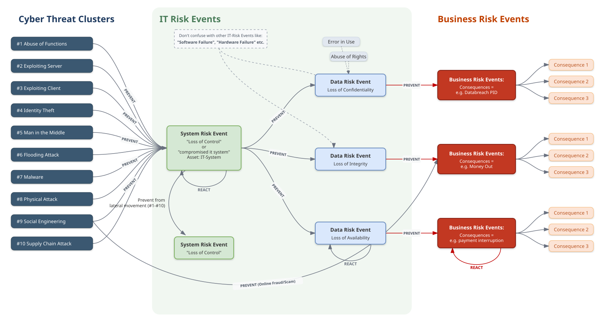
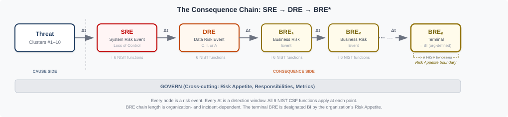

# A Cause-Oriented Cyber Threat Taxonomy: The Top Level Cyber Threat Clusters Framework

**Author:** Bernhard Kreinz
**Version:** 2.3
**Date:** 2026-06-07
**License:** CC BY 4.0
**DOI:** [10.5281/zenodo.20633177](https://doi.org/10.5281/zenodo.20633177)

## Abstract

Cybersecurity discourse routinely uses the term "cyber threat" to denote several distinct concepts at once: the cause of a compromise, its outcome, the actor responsible, and the technique employed. This conflation impedes consistent classification, comparable incident documentation, and clear communication of cyber risk between leadership, risk functions, and technical teams. Established frameworks address adjacent layers — control objectives, adversary techniques, software weaknesses, and quantitative risk — but none provides a compact, non-overlapping taxonomy on the cause side that holds stable across system types. The Top Level Cyber Threat Clusters (TLCTC) framework proposes ten top-level threat clusters, each defined by the single generic vulnerability it initially targets. The taxonomy separates threats (causes) from system events, data risk events, business consequences, and actor identity. This paper presents the framework's derivation logic, its design principles and threat topology, the ten cluster definitions, the ten axioms that constrain interpretation, and the classification rules that keep assignment reproducible, together with example mappings expressed in an attack-path notation. By distinguishing a stable strategic management view from a concrete operational security view, TLCTC functions as a translation layer linking strategic risk governance, security operations, and secure software development.

**Keywords:** cyber threat taxonomy; cyber risk taxonomy; cybersecurity ontology; cyber threat classification; threat modeling; cause-oriented taxonomy; TLCTC; Top Level Cyber Threat Clusters

## 1. Introduction and Problem Statement

Cybersecurity suffers from a persistent language problem: the field describes fundamentally different things using the same words, and uses different words for the same thing. In practice, the term "cyber threat" is routinely mixed with threat actors, vulnerabilities, control failures, incidents, and outcomes such as data breach, denial of service, or ransomware. A single label is asked to carry the cause of a compromise, the technique used to achieve it, the actor who carried it out, and the consequence that followed. These are categorically distinct concepts, and collapsing them into one term blurs the boundary between *why* a compromise becomes possible and *what* happens once it does.

This semantic diffusion — the absence of a shared, stable meaning for the field's core terms — has practical costs. When cause, technique, actor, and outcome share a vocabulary, it becomes difficult to compare incidents across organizations, aggregate threat intelligence into stable categories, design controls that target a specific root weakness, or communicate cyber risk consistently between leadership, risk functions, and technical teams. The same event may be classified differently by two analysts not because they disagree about the facts, but because the underlying terms admit multiple readings. Outcome-named categories such as "ransomware" or "data breach" compound the problem: they describe an effect, not the generic vulnerability an attacker exploited, so they cannot anchor a reproducible mapping from threat to control. The condition is not mere terminological untidiness: threat-intelligence vendors and agencies each report under their own scheme — adversary groups, e-crime categories, threat-landscape buckets — so accounts of the same event resist combination. In Kuhn's terms, the field remains *pre-paradigmatic*: competing schools coexist, each with its own terminology, methods, and explanatory models, with no shared foundation that lets their results accumulate [12].

Existing frameworks address adjacent layers of this space but leave the cause side underspecified. Control catalogues and management standards (e.g. the NIST Cybersecurity Framework, and risk-assessment guidance such as NIST SP 800-30) organize what an organization should do; adversary-technique knowledge bases (e.g. MITRE ATT&CK) enumerate observed behaviours; software-weakness and vulnerability registries (e.g. MITRE CWE and CVE) catalogue concrete defects; and quantitative methods (e.g. FAIR) estimate loss. Adjacent threat-classification and attack-lifecycle models — STRIDE, VERIS, the Lockheed Martin Cyber Kill Chain, the Diamond Model, and threat-landscape reporting such as the ENISA Threat Landscape — describe techniques, incident attributes, intrusion phases, or observed activity. Each is valuable within its scope, yet none provides a compact, non-overlapping taxonomy of the generic vulnerabilities that compromises ultimately exploit — a stable backbone that holds across enterprise IT, cloud, OT, IoT, and endpoint environments without being tied to a particular technology or actor.

The Top Level Cyber Threat Clusters (TLCTC) framework addresses this gap by anchoring analysis in causality. A cyber threat is defined by the generic vulnerability (root weakness) it exploits, not by who performs it and not by the consequence that follows. The framework's contribution is a compact set of ten non-overlapping, cause-side threat clusters, each defined by the single generic vulnerability it initially targets. Threats are kept on the cause side and separated from outcomes, actor identity, and control failures, so that complete real-world intrusions can be expressed as ordered sequences of cluster steps — attack paths — without changing the meaning of the individual steps.

A further consequence of the same ambiguity is organizational. Strategic risk governance, security operations, and secure software development each describe threats in their own vocabulary, so a finding rarely travels intact from a board-level risk register to a SOC playbook to a developer's backlog. TLCTC is designed as a shared, cause-oriented vocabulary across these communities: a stable strategic management view (the ten clusters and their generic vulnerabilities) maps both to a concrete operational security view (specific vulnerabilities, techniques, and procedures) and to a development view (the design responsibility each cluster implies). The same cluster therefore names a threat consistently for the executive who must govern it, the analyst who must detect it, and the engineer who must prevent it.

TLCTC does not claim to be a finished paradigm. It is offered as a testable proposal for the shared foundation a paradigm would require — common axioms, definitions, and cause-side categories — so that, when independent analysts and vendors classify against the same clusters, their otherwise incompatible reports become combinable.

## 2. The Thought Experiment: Deriving the Ten Clusters

TLCTC is built deductively rather than by cataloguing observed attacks. An empirical catalogue grows with every new observation but never reaches closure; a purely heuristic grouping is convenient but cannot be shown to be wrong. An analytical approach instead derives the categories from the intrinsic structure of what is being protected — which is what lets the framework claim completeness and mutual exclusivity *by construction* rather than by enumeration. Two devices carry this method: the **thought experiment** that follows, which decomposes the IT landscape one attack surface at a time into the generic vulnerabilities an attacker can target, and the **axioms** (Section 5), which state explicitly the premises that constrain how the resulting clusters may be interpreted — the kind of foundation a shared language requires but that most threat vocabularies leave implicit.

The approach is also testable in Popper's sense [13]: each cluster carries boundary tests (Section 4) specifying the conditions under which a classification would be *wrong*. The supply-chain test is the clearest case — remove the third-party trust relationship, and if the attack still succeeds the step was never #10. A taxonomy that states how it could be falsified can be argued about on evidence rather than preference.

The ten TLCTC clusters are not an arbitrary enumeration or an industry convention; they are derived through a systematic decomposition of the attack surfaces present in information technology. Imagine the complex world of IT as a single object. Although robust and seemingly closed, this object exposes various attack surfaces — the generic vulnerabilities, or root weaknesses. Examining each surface in turn yields, one at a time, the full set of clusters.

**1.** Begin at the software asset. Concentrating first on the essentials, consider the functional domain and scope, and observe that every function can be abused and that more scope also means more attack surface. This yields the first threat cluster: **Abuse of Functions**.

**2.** Every piece of software, however well optimized, may contain code flaws that can be exploited — especially when the software is in a **server role** and processes attacker-controlled requests or inputs. This leads to the threat cluster: **Exploiting Server**.

**3.** On the client side too, existing software code flaws can be exploited. This type of attack, where the client **processes attacker-controlled resources or content** during outbound interaction, manifests as the threat cluster: **Exploiting Client**.

**4.** Software interacts with identities and credentials, both human and technical. When **access-enabling identity artifacts** — credentials, tokens, keys, session identifiers, and the like — are **used or presented** to impersonate an identity, they can be abused. This leads to the threat cluster: **Identity Theft**.

**5.** Communication is crucial in a connected world. As data is transmitted between two points, rogue parties might eavesdrop, modify, or inject themselves into the exchange. This reveals the threat cluster: **Man in the Middle**.

**6.** Continuous connectivity also makes systems susceptible to attacks that deliberately **exhaust or overload resources** and thereby degrade service. This leads to the threat cluster: **Flooding Attack**.

**7.** The digital landscape involves a continuous exchange of files and data. Some transfers introduce **foreign executable content**, and if such content is **executed**, it poses a threat. Here arises the threat cluster: **Malware**.

**8.** Physical points of access and interaction remain, through which intruders might enter. This gives the threat cluster: **Physical Attack**.

**9.** The human factor must not be forgotten: people are susceptible to deception, manipulation, and misconduct. This human element leads to the threat cluster: **Social Engineering**.

**10.** Software and hardware ecosystems are almost always linked with third-party software, hardware, or services. When an organization **accepts and relies on** such a third-party trust relationship — components, updates, providers — that trust can be leveraged by attackers. This leads to the final threat cluster: **Supply Chain Attack**.

Through this thought experiment and a careful examination of the vulnerabilities present in the IT landscape, ten distinct top-level cyber threat clusters are derived. The decomposition is intended to be complete and mutually exclusive: it provides a clear structure and a deeper understanding of the diverse threats that IT systems, people, and processes face.

## 3. Taxonomy Design Principles and Threat Topology

### 3.1 Cause-Orientation and the Cause/Event/Consequence Separation

TLCTC is a cause-oriented taxonomy. A threat cluster sits on the *cause* side of an attack: it names the generic vulnerability an attacker exploits, not the event that follows or the consequence that results. Conceptually, this corresponds to the cause side of a bow-tie model, where threats are the causes that converge on a central risk event, and losses of confidentiality, integrity, or availability are recorded separately as outcomes on the consequence side. (Section 3.4 develops this cause–event–consequence model; the *control* side of the bow-tie — control frameworks, indicators, and governance mapping — belongs to a separate application document and is out of scope here.)

The practical consequence is that outcomes are never threats. Labels such as "data breach," "service outage," or "ransomware" describe effects, not the generic vulnerability that was exploited to produce them. They are recorded as data risk events on the consequence side, while the threat that caused them is classified by its cause. Keeping these layers apart is what allows two analysts to classify the same incident the same way and what makes mappings from threat to control reproducible.

### 3.2 Non-Overlap: One Generic Vulnerability, One Cluster

The taxonomy is built on a strict classification principle: every distinct attack step exploits exactly one generic vulnerability (root weakness), and each generic vulnerability belongs to exactly one of the ten clusters. The clusters are therefore non-overlapping by construction. A step that appears to belong to two clusters is, under this principle, two steps and must be split, each anchored in the single generic vulnerability it targets. Because each attack vector is defined by the generic vulnerability it *initially* targets, classification is anchored in the initial cause rather than in technique labels or downstream effects.

To remain universally applicable, the framework deliberately avoids differentiating by system type. Whether the environment is enterprise IT, cloud, SaaS, OT/SCADA, IoT, endpoints, or network infrastructure, the same foundational attack surfaces recur — software functions and implementation flaws, identity artifacts, communication paths, capacity limits, executable-content handling, physical accessibility, human psychology, and third-party trust dependencies. Sector labels do not create new threat classes; they change only the specific vulnerabilities and controls at the operational level. This supports a separation between a stable Strategic Management Layer (clusters and generic vulnerabilities, used for governance and control mapping) and an Operational Security Layer (concrete vulnerabilities, techniques, and procedures, used in detection, response, and engineering).

### 3.3 Threat Topology: Internal and Bridge

Beyond classification, each cluster carries a structural property called its *threat topology*, which describes whether the generic vulnerability is exploited within the software domain or from a different control regime. A **domain** is a set of assets governed by a coherent control regime — its policies, monitoring, enforcement, and accountability. Domains may be technical, organizational, or socio-technical (for example, the cyber/IT domain, the physical security domain, the human decision domain, or a vendor development domain).

TLCTC uses two topology types:

- **Internal** — the generic vulnerability is exploited *within* the software domain's control regime. Clusters #1 through #7 are internal: abuse of designed functions, server- and client-side implementation flaws, credential use within the identity domain, exploitation of insufficient end-to-end protection within a communication relationship, exhaustion of finite capacity, and execution of foreign executable content.
- **Bridge** — the generic vulnerability inherently enables crossing into, or leverage over, the software domain *from a different control regime* outside the software domain. Clusters #8, #9, and #10 are bridge clusters: Physical Attack originates in the physical security domain, Social Engineering in the human decision domain, and Supply Chain Attack in the third-party governance domain.

Topology matters for control ownership and defense alignment: internal threats can be addressed primarily within the software-security control regime, whereas bridge threats require controls in multiple regimes (human, physical, third-party governance) and often involve organizational handoffs. Notably, Man in the Middle (#5) is internal rather than bridge: it sits "between" communicating parties but does not inherently cross into a different governance domain, since its generic vulnerability is insufficient end-to-end protection inside a single communication relationship.

Topology is a structural property and does not change cluster classification, which remains anchored in the initial generic vulnerability. Cluster-level topology (a stable property of the cluster definition) is related to but distinct from step-level topology (whether a specific step crosses a concrete domain boundary in a given scenario). Every #8, #9, and #10 step is normally a bridge step; internal-cluster steps (#1–#7) may also cross a boundary in multi-tenant or partner contexts, in which case the crossing is annotated in the attack-path notation (Section 7) rather than reclassified.

### 3.4 The Cause–Event–Consequence Model

TLCTC anchors its cause/outcome separation (Axiom III) in a bow-tie risk structure with a single central event. The ten clusters sit on the cause (left) side; outcomes sit on the consequence (right) side; the two are joined by one pivot event:

> **System Risk Event (SRE) — Loss of Control / System Compromise:** the point at which the attacker achieves unauthorized control over the system's behavior, privileges, data, or trust relationships, sufficient to pursue attack objectives.

The SRE is positioned deliberately *before* outcomes. Compromise can exist without immediate observable impact — an attacker may hold persistent control for weeks before exfiltration — so the central event opens a detection window between initial compromise and any data loss. Other threats cause an outcome effectively at the moment of compromise (a successful SQL injection reading data, a flood exhausting capacity). The model accommodates both: the SRE is the pivot, whether consequences are delayed or simultaneous.



*Figure 1 — The Cyber Bow-Tie. The ten clusters act exclusively on the cause (left) side; the System Risk Event ("Loss of Control") is the single central pivot; Data Risk Events and cascading Business Risk Events sit on the consequence (right) side.*

Consequences follow a structured, variable-length chain:

> **SRE → DRE → BRE\*** (System Risk Event → Data Risk Event → Business Risk Event(s))

| Event | Definition | Examples |
| --- | --- | --- |
| **SRE** | Loss of Control / System Compromise — the central event | RCE achieved; persistent access established |
| **DRE** | Loss of Confidentiality, Integrity, or Availability/Accessibility | data exfiltrated `[DRE: C]`; records altered `[DRE: I]`; service encrypted `[DRE: Ac]` |
| **BRE** | A discrete business-level event triggered by a DRE or a preceding BRE | regulatory notification; outage declared; fine imposed |

Business Risk Events may cascade (`SRE → DRE → BRE₁ → … → BREₙ`); chain length is organization-dependent. An organization's risk appetite determines at which BRE the chain reaches its terminal **Business Impact** — a role a BRE can hold, not a separate event type. Every transition carries its own Δt detection-and-intervention window, and the chain can break at any point: not every SRE leads to a DRE, and not every DRE leads to a BRE.



*Figure 2 — The consequence chain. Every node is a risk event and every Δt a detection-and-intervention window; the organization's risk appetite designates the terminal BRE as its Business Impact.*

Crucially, **outcomes are never threats.** A data risk event such as "data breach" or "ransomware impact" records *what happened*; it never changes the cluster classification of the step that caused it. This is the operational form of Axiom III, and it is what allows the same outcome to be traced back to different cause-side clusters.

## 4. The Ten Threat Clusters

Each cluster is identified by a strategic ID (`#N`) for management-level use and an operational root ID (`TLCTC-0N.00`) that anchors its operational sub-threats. The definition, attacker's view, and generic vulnerability for each cluster below are reproduced verbatim from the canonical machine-readable framework dictionary (`tlctc-framework.v2.3.json`) so that this paper and the schema cannot drift. The developer's view — the defensive design responsibility implied by each cluster — the normative **boundary tests**, and the supporting prose are drawn from the canonical cluster definitions (whitepaper §4.1); these are editorial/normative guidance and are not carried in the JSON dictionary.

### #1 Abuse of Functions

- **Strategic ID:** #1
- **Operational root ID:** TLCTC-01.00
- **Name:** Abuse of Functions
- **Definition:** An attacker abuses the logic or scope of existing, legitimate software functions for malicious purposes without exploiting a code flaw.
- **Attacker's view:** "I abuse a functionality, not a coding issue."
- **Developer's view:** "I must understand and constrain the functional domain of my code. Every feature and configuration surface needs explicit boundaries and misuse assumptions."
- **Generic vulnerability:** The inherent trust, scope, and complexity designed into software functionality and configuration.
- **Topology:** Internal.

This cluster covers the manipulation of legitimate software capabilities — features, APIs, configurations, administrative settings, and workflows — through standard interfaces using built-in input types and valid sequences of actions, achieving an attacker advantage without requiring an implementation flaw.

**Boundary tests (normative):**

- If an implementation flaw is required → #2 or #3.
- If this step enables execution of FEC → record #1 for enablement and `→ #7` for execution (`#1 → #7`).
- If the step is primarily credential use/presentation → #4.

### #2 Exploiting Server

- **Strategic ID:** #2
- **Operational root ID:** TLCTC-02.00
- **Name:** Exploiting Server
- **Definition:** An attacker targets flaws within the server-side application's source code implementation.
- **Attacker's view:** "I abuse a flaw in the application's source code on the server side."
- **Developer's view:** "I must apply language-specific secure coding principles for all server-side code and implement appropriate safeguards for known pitfalls."
- **Generic vulnerability:** Server-side implementation flaws enable unintended behavior.
- **Topology:** Internal.

The vulnerable component accepts and handles inbound requests or stimuli relative to the attacker. Crafted payloads (for example SQL injection strings, buffer overflows, or XXE payloads) trigger specific implementation bugs, forcing unintended behavior or enabling code execution.

**Boundary tests (normative):**

- If behavior is achieved without an implementation flaw (pure feature/config misuse) → #1.
- If the vulnerable component is in a client role → #3.
- TOCTOU / race conditions are implementation flaws → #2 (and `→ #7` only if FEC executes).
- If exploitation results in FEC execution → append `→ #7` (`#2 → #7`) per R-EXEC.
- If exploitation yields security impact without FEC execution (e.g. authorization bypass, SQLi data read/write) → #2 only; document outcomes as Data Risk Events.

### #3 Exploiting Client

- **Strategic ID:** #3
- **Operational root ID:** TLCTC-03.00
- **Name:** Exploiting Client
- **Definition:** An attacker targets flaws within the source code implementation of any software acting in a client role.
- **Attacker's view:** "I abuse a flaw in the source code of software acting as a client."
- **Developer's view:** "I must apply secure coding principles for client-role code and never trust incoming data from servers, files, URLs, or APIs."
- **Generic vulnerability:** Client-side implementation flaws enable unintended behavior.
- **Topology:** Internal.

The vulnerable component consumes external responses, content, or state. Exploitation targets coding mistakes in parsing, rendering, state management, or response handling, typically through crafted content delivered during outbound interaction.

**Boundary tests (normative):**

- If behavior is achieved without an implementation flaw (pure feature misuse) → #1.
- If the vulnerable component is in a server role → #2.
- If exploitation results in FEC execution → append `→ #7` (`#3 → #7`) per R-EXEC.
- If exploitation yields security impact without FEC execution → #3 only; document outcomes as Data Risk Events.

### #4 Identity Theft

- **Strategic ID:** #4
- **Operational root ID:** TLCTC-04.00
- **Name:** Identity Theft
- **Definition:** An attacker misuses authentication credentials to impersonate an identity.
- **Attacker's view:** "I abuse stolen or forged credentials to act as someone else."
- **Developer's view:** "I must implement secure credential lifecycle management: storage, transmission, session handling, and robust authentication/authorization with defense-in-depth."
- **Generic vulnerability:** Weak identity management processes and/or inadequate credential protection mechanisms throughout the identity lifecycle.
- **Topology:** Internal.

This cluster covers the presentation or use of credentials, tokens, keys, session artifacts, or other identity representations to authenticate and act as an identity different from the presenter's own. Credential acquisition maps to the enabling cluster; credential use always maps here (see R-CRED).

**Boundary tests (normative):**

- Credential acquisition/exposure/derivation/forgery maps to the enabling cluster; credential use/presentation always maps to #4 (R-CRED).
- If the step creates fraudulent credentials, certificates, or tokens, map that creation/derivation to the enabling mechanism (#1/#2/#3/#7/#10 as appropriate), then map subsequent use to #4.
- If the step is primarily persuading a human to reveal or approve → #9 for that manipulation step.

### #5 Man in the Middle

- **Strategic ID:** #5
- **Operational root ID:** TLCTC-05.00
- **Name:** Man in the Middle
- **Definition:** An attacker intercepts, modifies, or relays communication between two parties by exploiting a privileged position on the communication path.
- **Attacker's view:** "I abuse my position between communicating parties."
- **Developer's view:** "I must ensure confidentiality and integrity of data in transit: strong E2E protection, proper certificate/path validation, and designs that assume uncontrolled networks are hostile."
- **Generic vulnerability:** The lack of sufficient control, integrity protection, or confidentiality over the communication channel/path.
- **Topology:** Internal.

The cluster covers interception, observation, modification, injection, replay, or protocol downgrade/stripping from a controlled position on a communication path. Gaining the position maps to another cluster; #5 begins once the position is controlled (see R-MITM).

**Boundary tests (normative):**

- Gaining the privileged position maps to another cluster; #5 begins once the position is controlled (R-MITM).
- If the primary act is credential use after capture → #4 for the use step.

### #6 Flooding Attack

- **Strategic ID:** #6
- **Operational root ID:** TLCTC-06.00
- **Name:** Flooding Attack
- **Definition:** An attacker intentionally overwhelms system resources or exceeds capacity limits through a high volume of requests, data, or operations, leading to denial of service.
- **Attacker's view:** "I abuse the circumstance of always limited capacity."
- **Developer's view:** "I must implement efficient resource management: limits, timeouts, quotas, circuit breakers, and scalable designs—every loop and allocation must consider abuse."
- **Generic vulnerability:** Finite capacity limitations inherent in any system component.
- **Topology:** Internal.

The cluster covers exhaustion of finite resources — bandwidth, CPU, memory, storage, quotas, or pools — through volume or intensity that exceeds capacity limits. Availability loss caused primarily by an implementation defect is classified as #2 or #3 instead (see R-FLOOD).

**Boundary tests (normative):**

- If availability loss is primarily caused by an implementation defect (crash, algorithmic-complexity weakness such as ReDoS) → #2/#3.
- If availability loss is primarily capacity exhaustion by volume/intensity → #6 (R-FLOOD).
- If attackers amplify load by abusing legitimate functions, the enabling step may be #1, but the exhaustion event remains #6.

### #7 Malware

- **Strategic ID:** #7
- **Operational root ID:** TLCTC-07.00
- **Name:** Malware
- **Definition:** An attacker abuses the inherent ability of a software environment to execute foreign executable content, including malicious code or legitimate tools executing attacker-controlled code.
- **Attacker's view:** "I abuse the environment's designed capability to execute malware code, malicious scripts, or foreign-introduced tools for my purposes."
- **Developer's view:** "I must control execution paths: allow-listing, code signing/verification, sandboxing, safe file handling, and avoiding uncontrolled dynamic execution."
- **Generic vulnerability:** The software environment's designed capability to execute potentially untrusted foreign code.
- **Topology:** Internal.

The cluster covers execution of Foreign Executable Content (FEC) through the environment's designed execution capabilities — binaries, scripts, macros, modules, or attacker-controlled commands fed into interpreters — including dual-use tooling when it executes attacker-controlled content. If FEC executes, a #7 step must be recorded at the execution moment (see R-EXEC).

**Boundary tests (normative):**

- If FEC executes → #7 (R-EXEC), even if execution is in-memory and no files are created.
- If legitimate function misuse enables FEC execution → `#1 → #7`.
- If an exploit payload triggers an implementation flaw and results in FEC execution → `#2/#3 → #7`.
- If an implementation flaw is exploited but no FEC executes → do not add #7.

### #8 Physical Attack

- **Strategic ID:** #8
- **Operational root ID:** TLCTC-08.00
- **Name:** Physical Attack
- **Definition:** Unauthorized physical interaction with or interference to hardware, facilities, media, interfaces, or signals—via direct contact or exploitation of physical phenomena/emanations.
- **Attacker's view:** "I abuse the physical accessibility or properties of hardware, devices, and signals."
- **Developer's view:** "I must assume physical access can mean compromise: secure key storage, encryption at rest, tamper evidence, secure failure modes, and exposure-minimizing designs."
- **Generic vulnerability:** Physical accessibility of infrastructure and the exploitability of physical-layer properties.
- **Topology:** Bridge (Physical → Cyber).

The cluster spans direct contact with hardware, facilities, media, and interfaces (including removable media) as well as exploitation of physical-layer properties such as wireless spectrum, emanations, and environmental dependencies.

**Boundary tests (normative):**

- If the physical step leads to FEC execution → `#8 → #7`.

### #9 Social Engineering

- **Strategic ID:** #9
- **Operational root ID:** TLCTC-09.00
- **Name:** Social Engineering
- **Definition:** An attacker psychologically manipulates individuals into performing actions counter to their best interests.
- **Attacker's view:** "I abuse human trust and psychology."
- **Developer's view:** "I must design interfaces and processes that promote secure behavior: clear indicators, safe defaults, and friction for high-risk actions."
- **Generic vulnerability:** Humans can be influenced into unsafe actions or decisions.
- **Topology:** Bridge (Human → Cyber).

The cluster covers psychological manipulation that causes a human to disclose information, grant access, execute content, modify configuration, or bypass procedures. #9 is only the human manipulation step; subsequent technical steps map to their own clusters. Technical vulnerabilities are never #9.

**Boundary tests (normative):**

- Technical vulnerabilities (CVEs) are never #9.
- #9 is only the human manipulation step; subsequent technical steps map to their own clusters.
- Typical sequences: `#9 → #4`, `#9 → #7`, `#9 → #1`.

### #10 Supply Chain Attack

- **Strategic ID:** #10
- **Operational root ID:** TLCTC-10.00
- **Name:** Supply Chain Attack
- **Definition:** An attacker compromises systems by targeting vulnerabilities within third-party software, hardware, services, or update mechanisms that are trusted and integrated by the target.
- **Attacker's view:** "I abuse the trust in third-party components."
- **Developer's view:** "I must minimize and compartmentalize third-party trust, harden trust-acceptance points, verify provenance/attestations, and ensure trust is continuously re-validated and revocable."
- **Generic vulnerability:** Trust in third-party components and update channels can be subverted.
- **Topology:** Bridge (Third-party → Organization).

The cluster is placed at the Trust Acceptance Event (TAE) — the moment the organization's domain honors the third-party trust link and treats a trust artifact or decision as authoritative (validate, accept, install, apply, execute, or attach privileges). Downstream effects map normally, often `#10 → #7` or `#10 → #1` (see R-SUPPLY).

**Boundary tests (normative):**

- Place #10 at the Trust Acceptance Event (TAE), where the third-party trust link is honored and becomes authoritative inside the organization.
- Falsifiability: if removing the third-party trust link stops this step from succeeding → #10 belongs here.
- Downstream effects map normally: often `#10 → #7` (accepted artifact leads to FEC execution) or `#10 → #1` (accepted authorization/entitlement enables function abuse).
- Federation clarity: credential use at the identity provider is #4; acceptance of the IdP assertion/token at the service provider is #10.

### The Two-Layer Model: Strategic and Operational Layers

TLCTC is deliberately a two-layer framework, and each cluster carries two equivalent identifiers, one per layer (Axiom VIII).

The **Strategic (Management) Layer** uses the human-readable form `#X` (X ∈ {1…10}) — the ten clusters and their generic vulnerabilities. It is the layer of governance: executive communication, risk registers, board reporting, and the attack-path notation (Section 7), which expresses whole intrusions in cluster terms without operational detail. It answers *which generic vulnerabilities matter and how they chain.*

The **Operational (Security) Layer** uses the machine-readable form `TLCTC-XX.YY` — operational sub-threats, and beneath them the specific vulnerabilities (CVEs), techniques, and controls. This single layer serves the **two operational audiences**: **security operations** (SOC detection and response, threat-intelligence exchange, SIEM and tooling) and **secure development** (the per-cluster Developer's View and the secure development lifecycle). It answers *through which concrete vector, and with which control, this cluster is realized and prevented.*

The two layers are linked by strict semantic equivalence (below), so a single cluster carries one consistent meaning from the boardroom to the SOC to the developer's backlog. Governance lives at the strategic layer; development and operations share the operational layer.

**Equivalence and stability (normative):**

- `#X` and `TLCTC-0X.00` (or `TLCTC-10.00`) refer to the same top-level cluster and MUST be treated as semantically equivalent.
- `TLCTC-XX.00` is reserved for the top-level cluster; sub-cluster `00` MUST NOT carry any other meaning.
- `TLCTC-XX.YY` with `YY ≠ 00` MAY express an operational sub-threat but MUST NOT change the top-level meaning of cluster `XX`.
- Cluster identifiers `#1`–`#10` / `TLCTC-01`–`TLCTC-10` are immutable; their definitions MUST NOT change without axiom-level justification.

The two-digit suffix `YY` is hierarchical: `TLCTC-XX.Y0` (tens digit) is a **sub-cluster** — a vector class within the cluster — and `TLCTC-XX.YZ` (ones digit ≠ 0) is a **refinement** within that sub-cluster, yielding up to 81 operational positions per cluster (strategic shorthand `#X.Y`, e.g. `#8.1` = `TLCTC-08.10`). Every sub-cluster must answer: *through which vector does the attacker reach the same generic vulnerability?* If the answer requires a different generic vulnerability, it belongs in a different cluster.

Four clusters have reference sub-cluster decompositions; the remaining six are left open for community refinement:

| Cluster | Sub-cluster vectors |
| --- | --- |
| **#2 Exploiting Server** | `#2.1` protocol · `#2.2` core function · `#2.3` external handler |
| **#3 Exploiting Client** | `#3.1` protocol · `#3.2` core function · `#3.3` external handler |
| **#8 Physical Attack** | `#8.1` mechanical (contact) · `#8.2` signal (no contact) |
| **#10 Supply Chain Attack** | `#10.1` update · `#10.2` development · `#10.3` hardware |

The `#2`/`#3` symmetry yields a complete 2×3 matrix (server/client × protocol/core/handler): any code exploit on a networked component maps to exactly one cell. This operational layer is where specific vulnerabilities (CVEs), techniques, and tooling attach beneath the stable strategic clusters. The four decompositions above are reference examples that demonstrate the method; the full and evolving sub-cluster catalogue — including proposals for the remaining six clusters — is maintained separately in the *TLCTC Operational Enumeration* companion document, which is community-extensible and deliberately not frozen with this core.

## 5. The Ten Axioms

The framework relies on non-negotiable axioms as constraints on interpretation. They prevent category errors and ensure that independent practitioners classify the same situation the same way, making analysis comparable, auditable, and operationally useful. Each axiom statement below is reproduced verbatim from the canonical framework dictionary (`tlctc-framework.v2.3.json`), with one clarifying sentence drawn from the canonical axioms section.

The axioms fall into four groups: scope (I–II), separation (III–V), classification (VI–VIII), and sequence (IX–X).

**Axiom I — No System-Type Differentiation.** The framework is generic and applies to all IT systems; it does not differentiate by system type. Sector labels (e.g., SCADA, IoT, cloud, medical devices) do not create new threat classes; they only change the specific vulnerabilities and controls at the operational level.

**Axiom II — Client–Server as the Universal Interaction Model.** All networked systems can be abstracted as client-server interaction. The clusters address the generic vulnerabilities arising from these interactions, independent of protocol or architecture depth.

**Axiom III — Threats Are Causes, Not Outcomes.** Threats are on the cause side; outcomes and events are not threats. Threat clusters must not be conflated with data risk events such as Loss of Confidentiality, Integrity, or Availability/Accessibility.

**Axiom IV — Threats Are Not Threat Actors.** Threat clusters are separate from threat actors. Actor identity (attribution, motivation, capability) is not a structuring element for threat categorization; TLCTC classifies actions and exploited generic vulnerabilities, not "who."

**Axiom V — Control Failure Is Not a Threat.** Control failures are not threats. Control failure is control-risk; risk remains structured as Threat → Event/Incident → Consequences, and controls influence likelihood and impact but do not define the threat cluster.

**Axiom VI — One Step, One Generic Vulnerability, One Cluster.** For every generic vulnerability, there is one threat cluster (non-overlap). Every distinct attack step exploits exactly one generic vulnerability in the attack surface, and each generic vulnerability maps to exactly one cluster.

**Axiom VII — Attack Vectors Are Defined by the Initial Generic Vulnerability.** Each distinct attack vector is defined by the generic vulnerability it initially targets. Classification is anchored in this initial cause, not in technique labels or downstream effects.

**Axiom VIII — Strategic vs Operational Layering.** Top-level clusters have sub-threats (strategic vs operational layering). This separates a stable Strategic Management Layer (clusters / generic vulnerabilities) from an Operational Security Layer (specific vulnerabilities, techniques, and procedures).

**Axiom IX — Clusters Chain into Attack Paths; Δt Expresses Velocity.** Clusters can be used in sequence to describe an attack path; Δt measures velocity. The time between successive cluster steps is a scenario attribute (Δt), and the set of Δt values expresses the attack velocity of the path.

**Axiom X — Credentials Have Dual Operational Nature.** Credentials are system control elements; acquisition and application are distinct steps. Acquisition (credential as data) maps to the enabling cluster, while application (presenting the credential to authenticate) always maps to #4 Identity Theft.

## 6. Classification Rules

The classification rules operationalize the axioms, resolving recurring boundary questions so that assignment remains reproducible. Each rule statement below is reproduced verbatim from the canonical framework dictionary (`tlctc-framework.v2.3.json`), together with its enforcement level. Most rules carry the enforcement level **must**; R-UNRES-7 is **should** and R-UNRES-6 is **may**. Two are machine-enforceable (R-EXEC, R-INTRA-9); the remainder are enforced through analyst judgment guided by the stated rule.

The rules are presented in two groups: the six core rules, and the ten v2.1 extension rules covering transit, intra-system boundaries, and unresolved steps.

### 6.1 Core Rules

**R-EXEC** (must, machine-enforceable). If Foreign Executable Content executes, a #7 step MUST be recorded at the execution moment.

**R-ROLE** (must). Classify by the role of the component containing the flaw relative to the attacker: server-role flaw = #2, client-role flaw = #3.

**R-FLOOD** (must). If the primary mechanism is volume or intensity exhausting finite resources, classify as #6. If it is an implementation defect causing crash/hang/degradation, classify as #2 or #3 per R-ROLE.

**R-SUPPLY** (must). #10 Supply Chain Attack MUST be placed at the Trust Acceptance Event (TAE) — the moment the third-party trust link is honored and the trust artifact becomes authoritative inside the target domain.

**R-MITM** (must). Position acquisition maps to the enabling cluster; once position is established, interception/modification/relay actions map to #5.

**R-CRED** (must). Credential acquisition maps to the enabling cluster. Credential application (use of the credential to authenticate) is ALWAYS classified as #4 Identity Theft, regardless of the acquisition method. These are separate attack steps.

### 6.2 v2.1 Extension Rules

**R-TRANSIT-3** (must). Vendor code running on the target device is NOT transit. Software executing on the victim's own device is the attack surface, classified by R-ROLE (typically #3), not a transit (relay/carrier) party.

**R-INTRA-7** (must). Intra-system boundary crossings never change cluster classification. They are observability annotations, not classification inputs.

**R-INTRA-9** (must, machine-enforceable). The 'memory' intra-system boundary type is deferred and MUST NOT be used.

**R-UNRES-2** (must). '?' and '…' are epistemic annotations, NOT clusters. They have no generic vulnerability, do not appear in cluster definitions, and must not be referenced as if they were '#11'/'#12'.

**R-UNRES-3** (must). '?'/'…' are excluded from statistics — they represent absence of knowledge, not a category.

**R-UNRES-5** (must). DRE tags ('+ [DRE: ...]') MUST NOT be appended to '?'/'…'. Without a classified cluster there is no causal basis for asserting a data risk event in the notation.

**R-UNRES-6** (may). Boundary operators ('||...||', '⇒', '|...|') MAY appear adjacent to '?'/'…' — boundaries are independently observable.

**R-UNRES-7** (should). Every '?'/'…' is an open analytical task. Progressively replace with classified steps as evidence matures.

**R-UNRES-8** (must). Any path containing '?'/'…' MUST carry a prose annotation explaining what is unresolved and why.

**R-UNRES-9** (must). Binary rule: if any cluster can be defended — even weakly — use '#X [conf=low]', not '?'. Reserve '?'/'…' for genuine 'we know something happened, we don't know what' situations.

*Note: R-UNRES numbering is intentionally non-contiguous — R-UNRES-1 and R-UNRES-4 were consolidated into adjacent rules during the v2.1 drafting and are deliberately absent. The seven R-UNRES rules are therefore 2, 3, 5, 6, 7, 8, and 9, which together with R-TRANSIT-3, R-INTRA-7, and R-INTRA-9 make up the ten v2.1 extension rules.*

## 7. Attack-Path Notation

A complete intrusion is expressed as an **attack path**: an ordered list of attack steps, each mapping to exactly one cluster (Axiom VI), connected by operators. A path is read left-to-right as best-estimate chronological progression. This section defines only the primitives needed to *read* a path; the formal grammar lives in the whitepaper §11.7 and the `grammar/` ABNF.

### 7.1 Sequence and Parallel

The **sequence operator** `→` means the right-hand step occurs after, and is enabled by, the left-hand step:

```
#9 → #4 → #1 → #7
```

The **parallel operator** `+`, always inside parentheses, denotes effectively concurrent steps whose ordering is not meaningful — for example enabling persistence while executing a payload:

```
#4 → (#1 + #7)
```

Each element of a parallel group is still a separate step and must be a single cluster reference. If an order exists — even a fast one — use `→` rather than `+`.

### 7.2 Velocity (Δt)

A Δt annotation attaches to the sequence operator and records the elapsed time between two steps:

```
#9 →[Δt=2h] #4 →[Δt=5m] #1 →[Δt=instant] #7
```

The set of Δt values across a path expresses its **attack velocity** (Axiom IX). Four velocity classes group transitions by time scale and by the defense mode that can realistically operate at that speed:

| Class | Δt scale | Primary defense mode |
| --- | --- | --- |
| **VC-1: Strategic** | days → months | log retention, threat hunting |
| **VC-2: Tactical** | hours | SIEM alerting, analyst triage |
| **VC-3: Operational** | minutes | automation (SOAR/EDR), rapid containment |
| **VC-4: Real-Time** | seconds → ms | architecture, rate limits, automatic isolation |

A transition at VC-3 or faster is structurally too fast for purely human response at that edge; defense must be automated or architectural.

Because velocity is a time, it can be compared directly against the defender's own time. The **Detection Coverage Score (DCS)** expresses that comparison as a ratio of the defender's mean time to detect (MTTD) at an edge to the attacker's velocity across it:

```
DCS = MTTD / Δt
```

A score below 1.0 means detection occurs before the attacker completes the transition (the defender is ahead); a score above 1.0 means the step completes before it is detected (the attacker is ahead). For example, if an adversary moves `#4 → #1` in 10 minutes while detection takes 15 minutes, DCS = 1.5 — a structural blind spot that analyst effort cannot close at that speed, only automation or architecture. DCS belongs in the core because it is fundamentally a time relationship between attack velocity and detection; its use as a control-effectiveness key control indicator (KCI) is a downstream result developed in the separate application and governance document.

### 7.3 Domain Boundary Operator

The domain boundary operator makes a **responsibility-sphere transition** explicit. It annotates the boundary-crossing step (it is never a step on its own) and is required for the bridge clusters #8, #9, #10:

```
||[context][@Source→@Target]||
```

`[context]` names the channel (e.g. `update`, `auth`, `human`, `physical`); `@Source` and `@Target` are the originating and receiving spheres. For example, a supply-chain update accepted and then executed:

```
#10 ||[update][@Vendor→@Org]|| → #7
```

### 7.4 Transit Operator (v2.1)

The **transit operator** `⇒` marks a sphere that *carries or relays* the attack but is neither its source nor its target. It appears inside a domain boundary operator and never changes cluster classification. Chained transit reads **right-to-left** (the rightmost carrier delivers to the target):

```
#9 ||[human][@Attacker⇒@SMSProvider→@Victim]||
#5 ||[signaling][@Attacker⇒@CarrierB(SS7)⇒@CarrierA→@Target]||
```

Transit (`⇒`, a passive relay) is distinct from #10 (the Trust Acceptance Event, where a trust artifact becomes authoritative inside the target domain). Per R-TRANSIT-3, vendor code running on the target device is the attack surface (classified by R-ROLE, typically #3), not transit.

### 7.5 Intra-System Boundary Operator (v2.1)

The **intra-system operator** `|[type][@from→@to]|` (single pipes) marks a boundary crossing *within a single host*. There are four defined types — `sandbox`, `privilege`, `process`, `hypervisor` (the `memory` type is deferred per R-INTRA-9). These are observability annotations only and never change classification (R-INTRA-7):

```
#3 |[sandbox][@renderer→@os]|
#2 |[privilege][@user→@root]|
#2 |[hypervisor][@guest→@host]|
#7 |[process][@malware→@lsass]|
```

### 7.6 Data Risk Event Tags

A DRE tag records an **outcome** — never a step — appended with `+ [DRE: …]`, using C (Confidentiality), I (Integrity), and A (Availability/Accessibility). When the distinction is operationally relevant, use `Av` (data gone or unreachable) versus `Ac` (data present but unusable, e.g. ransomware encryption):

```
#6 + [DRE: Av]            availability loss after a flood — service unreachable
#2 → #7 + [DRE: Ac]       execution leading to ransomware encryption
```

### 7.7 Epistemic States and Unresolved Steps

Incident analysis is iterative, so a path may mix four epistemic states for a step:

| State | Syntax | Use when |
| --- | --- | --- |
| Classified | `#X` | cluster assigned, evidence supports it |
| Low-confidence | `#X [conf=low]` | best-supported cluster, explicit caveat |
| Inferred | `#X [inferred]` | not observed but logically required |
| Unresolved | `?` or `…` | something happened, no cluster defensible |

The **unresolved-step operators** are `?` (exactly one step occurred, cluster unknown) and `…` (a gap of one or more steps, both count and clusters unknown). Per R-UNRES-9, if *any* cluster can be defended — even weakly — use `#X [conf=low]` rather than `?`. Unresolved operators are epistemic annotations, not clusters (R-UNRES-2): they are excluded from statistics, never carry DRE tags, and every path containing one must carry a prose note explaining what is unresolved.

```
#3 →[Δt=0s] #7 →[Δt=4h] ? →[Δt=<10m] #4 → #1
```

### 7.8 Worked Examples

Pegasus network injection — a carrier relays the redirection (transit), Safari on the device is the exploited client (#3 with an internal privilege crossing), and the payload execution is #7:

```
#5 ||[network][@NSO_Operator⇒@MobileCarrier→@Target]|| →[Δt≈0s]
#3 ||[browser][@NSO(free247downloads.com)→@Target(Safari)]|| |[privilege][@user→@root]| →[Δt≈0s]
#7 + [DRE: C]
```

OAuth phishing — email and identity providers are topological intermediaries; the use of coerced authorization is #4, and subsequent abuse of legitimate cloud functions is #1:

```
#9 ||[email][@Attacker⇒@Microsoft(M365)→@Target]|| →[Δt=hours]
#4 ||[auth][@Attacker⇒@AzureAD.OAuth→@Target(CloudResources)]|| →[Δt≈0s]
#1 + [DRE: C]
```

## 8. Limitations and Open Questions

This paper presents a framework, not a validated result, and several limitations should be stated plainly.

**The derivation is argued, not formally proven.** The decomposition in Section 2 yields ten clusters and is claimed to be complete and mutually exclusive by construction, but that claim rests on the analytical argument given here, not a formal proof. The number ten is a *consequence* of the decomposition, not a target — and it is offered with an explicit invitation: if ten is the wrong number, a better decomposition should say what the right number is, and why.

**The operational layer is only partially developed.** Reference sub-cluster decompositions are provided for four clusters (#2, #3, #8, #10); the remaining six are analytically feasible but left open for community refinement and empirical validation (Section 4). The two-layer model is therefore complete at the strategic layer and deliberately incomplete at the operational layer.

**Empirical validation is outstanding.** The reproducibility claim — that independent analysts, guided by the axioms and boundary tests, classify the same incident the same way — is testable but not yet tested at scale here. Inter-rater agreement studies and large mapping studies against public incident corpora are the natural next step and are deferred to companion work.

**Scope is bounded by design.** This core deliberately excludes the control, indicator, and governance material (NIST CSF mapping, KRI/KCI/KPI, the full bow-tie control treatment), which belong to a separate application document; a reader seeking control guidance will not find it here.

**Classification still requires judgment.** Most rules are enforced by analyst judgment rather than mechanically (Section 6); boundary cases — particularly the #1/#2/#3 distinction and the #4 credential boundary — depend on correctly identifying the generic vulnerability, and reasonable analysts may disagree before the boundary tests are applied.

Stating these limits is itself part of the method. A framework that specifies where it is unproven, and how it could fail, is one that can be improved by evidence rather than defended by assertion.

## 9. Glossary

The following one-line definitions cover the terms used in this paper so that it is self-contained. They are condensed from the canonical glossary; see `tlctc-glossary.md` for the exhaustive, authoritative version.

- **Attack path** — an ordered sequence of attack steps describing a complete attack scenario, written in the attack-path notation (Section 7), where each step maps to exactly one cluster.
- **Attack vector** — a distinct initiating method, defined by the generic vulnerability it *initially* targets (Axiom VII); the label is based on cause, not outcome.
- **BRE (Business Risk Event)** — a business-level consequence event (e.g. regulatory notification, outage declaration, fine) triggered by a DRE or a preceding BRE; BREs may chain.
- **Business Impact (BI)** — the role assigned to the terminal BRE in a consequence chain, set by an organization's risk appetite; not a separate event type and context-dependent (one organization's terminal BI may be another's mid-chain BRE).
- **DCS (Detection Coverage Score)** — a time ratio comparing the defender's mean time to detect at an edge to the attacker's velocity across it (`DCS = MTTD / Δt`); below 1.0 the defender detects before the step completes, above 1.0 the attacker is ahead. Used operationally as a control-effectiveness KCI (developed in the application doc).
- **Δt / attack velocity** — the time interval between two adjacent steps, attached to the sequence operator (an edge property, not a step property). The set of Δt values expresses a path's velocity; transitions are grouped into classes VC-1 through VC-4.
- **Domain** — a set of assets governed by a coherent control regime (policies, monitoring, enforcement, accountability); may be technical, organizational, or socio-technical (e.g. cyber/IT, physical security, human decision, vendor development).
- **Domain boundary** — a point where responsibility spheres or control regimes change; crossing it moves the attack from one set of applicable controls to another, annotated with the `||...||` operator.
- **DRE (Data Risk Event)** — an outcome event recording Loss of Confidentiality (C), Integrity (I), or Availability/Accessibility (A). DREs are recorded separately from cluster steps and never change a step's classification; `Av`/`Ac` refine the general `A` code.
- **Epistemic state** — the knowledge status of a step in a path: classified (`#X`), low-confidence (`#X [conf=low]`), inferred (`#X [inferred]`), or unresolved (`?` / `…`); these are distinct from the step's ontological cluster classification.
- **FEC (Foreign Executable Content)** — program content that the environment loads, interprets, or executes through its intended execution capability; its execution is the generic vulnerability of #7 Malware (R-EXEC).
- **Generic vulnerability** — the single root-level attack surface that defines a cluster; the stable, technology-independent weakness a cluster targets. Every generic vulnerability maps to exactly one cluster (Axiom VI), and every specific vulnerability (e.g. a CVE) is an instance of one.
- **Intra-system boundary** — a boundary crossing within a single host (sandbox, privilege, process, hypervisor), annotated with `|...|`; an observability annotation that never changes classification (R-INTRA-7).
- **Responsibility sphere** — the organizational owner of a domain, denoted `@Entity` (e.g. `@Org`, `@Vendor`, `@Facilities`); spheres have distinct policies, teams, and legal boundaries.
- **SRE (System Risk Event)** — the central event of the Cyber Bow-Tie: Loss of Control / System Compromise. It is the pivot between the cause side (clusters) and the consequence side (data and business risk events).
- **Sub-cluster / operational sub-threat** — an operational refinement of a top-level cluster, written `#X.Y` / `TLCTC-XX.Y0`, distinguishing the vector through which the attacker reaches the *same* generic vulnerability (e.g. `#2.1` protocol vs `#2.2` core-function). A different generic vulnerability is a different cluster, not a sub-cluster.
- **TAE (Trust Acceptance Event)** — the moment a domain honors a third-party trust link and treats a trust artifact as authoritative (validate, accept, install, apply, execute, attach privileges). #10 Supply Chain Attack is placed at the TAE (R-SUPPLY).
- **Threat cluster** — an organizational construct grouping the threats that exploit one common generic vulnerability. TLCTC defines exactly ten, mutually exclusive.
- **Threat topology** — a structural property of each cluster: *internal* (#1–#7), where the generic vulnerability is exploited within the software domain's control regime, or *bridge* (#8–#10), where it inherently enables crossing into the software domain from a different control regime (physical, human, third-party). Topology never changes classification.
- **Transit** — a responsibility sphere that carries or relays an attack without being its source or target, marked with `⇒` inside a domain boundary operator; distinct from #10 (a passive relay, not a trust acceptance).

For the complete glossary, including all terms and cross-references not used in this paper, see `tlctc-glossary.md`.

## 10. References

The following adjacent frameworks are referenced in this paper for positioning. Citations are provided for the canonical source of each; URLs were current at the time of writing.

1. Shostack, A. *Threat Modeling: Designing for Security.* Wiley, 2014. (STRIDE threat-modeling methodology, originally developed at Microsoft.)

2. Verizon. *The VERIS Framework (Vocabulary for Event Recording and Incident Sharing).* https://veriscommunity.net/

3. MITRE Corporation. *MITRE ATT&CK: Adversarial Tactics, Techniques, and Common Knowledge.* https://attack.mitre.org/

4. MITRE Corporation. *Common Weakness Enumeration (CWE).* https://cwe.mitre.org/

5. MITRE Corporation. *Common Vulnerabilities and Exposures (CVE).* https://www.cve.org/

6. ENISA (European Union Agency for Cybersecurity). *ENISA Threat Landscape.* https://www.enisa.europa.eu/topics/cyber-threats/threats-and-trends

7. National Institute of Standards and Technology. *The NIST Cybersecurity Framework (CSF) 2.0.* NIST Cybersecurity White Paper NIST CSWP 29, February 26, 2024. https://doi.org/10.6028/NIST.CSWP.29

8. Joint Task Force Transformation Initiative. *NIST Special Publication 800-30 Revision 1: Guide for Conducting Risk Assessments.* NIST, 2012. https://doi.org/10.6028/NIST.SP.800-30r1

9. Freund, J., and Jones, J. *Measuring and Managing Information Risk: A FAIR Approach.* Butterworth-Heinemann, 2014. (Factor Analysis of Information Risk; see also The Open Group, Open FAIR standard.)

10. Hutchins, E. M., Cloppert, M. J., and Amin, R. M. *Intelligence-Driven Computer Network Defense Informed by Analysis of Adversary Campaigns and Intrusion Kill Chains.* Leading Issues in Information Warfare & Security Research, Vol. 1, 2011. Lockheed Martin Corporation. (The Cyber Kill Chain.)

11. Caltagirone, S., Pendergast, A., and Betz, C. *The Diamond Model of Intrusion Analysis.* Center for Cyber Intelligence Analysis and Threat Research (CCIATR), 2013.

12. Kuhn, T. S. *The Structure of Scientific Revolutions.* University of Chicago Press, 1962.

13. Popper, K. R. *The Logic of Scientific Discovery.* Hutchinson, 1959 (orig. *Logik der Forschung*, 1934).
