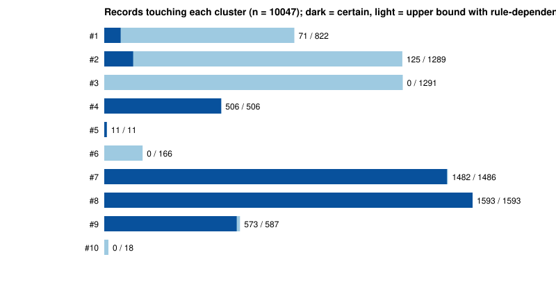
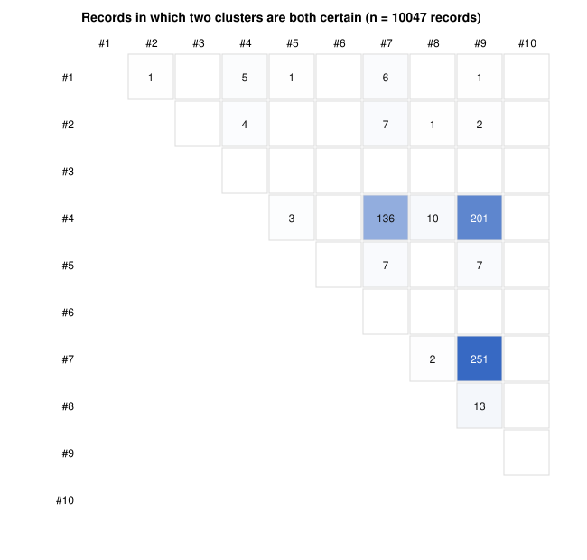
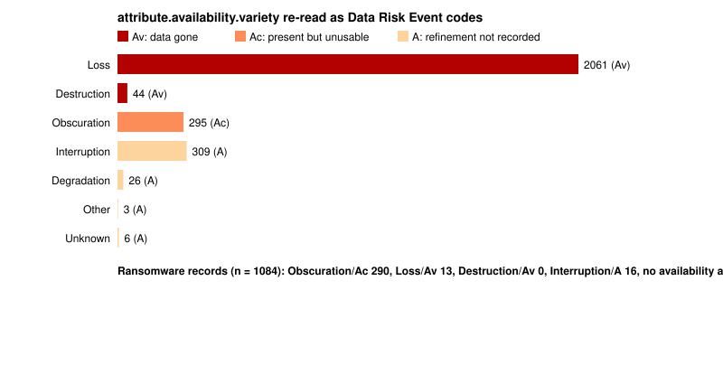

# What a Cause Axis Recovers from VERIS: A TLCTC Reading of 10,047 VCDB Records

**Author:** Bernhard Kreinz
**Version:** 1.0
**Date:** 2026-09-18
**License:** CC BY 4.0
**Implements:** TLCTC framework specification v2.5 (canonical dictionary `json-schemas/layer-1/tlctc-framework.v2.5.json`); VERIS 1.4.1 (vz-risk/veris commit `45d9d7a`, 2026-06-12); VERIS Community Database snapshot of 2026-08-04 (vz-risk/VCDB commit `230cf22`, joined dataset, 10,047 records). This study introduces no normative content; every cluster, axiom and rule is cited from the core paper and the dictionary.
**Companion to:** *A Cause-Oriented Cyber Threat Taxonomy: The TLCTC Framework* (v2.5 core paper) — DOI [10.5281/zenodo.20633176](https://doi.org/10.5281/zenodo.20633176); the mapping itself lives in `mappings/veris/` of the TLCTC repository.

## Abstract

VERIS, the Vocabulary for Event Recording and Incident Sharing, is the most widely used structured format for recording security incidents and the data spine of the Verizon Data Breach Investigations Report. Its A4 model records an incident as actors, actions, assets and attributes, and its maintainers have stated since version 1.3.2 that a future 2.0 would add sequencing of those elements. This study asks what a cause-oriented threat taxonomy adds to a VERIS record as it stands today. A mapping from every VERIS 1.4.1 action variety, action vector, action result and attribute value to the TLCTC v2.5 clusters was built (337 entries in seven mapping types), applied by a deterministic classifier to the 10,047 records of the VERIS Community Database, and cross-checked against the independently built VERIS → ATT&CK and ATT&CK → TLCTC mappings. Three findings stand out. First, four in ten VCDB records carry no threat at all under the TLCTC cause-side partition: a quarter record errors and environmental events, and a further one in seven record insiders using an entitlement they genuinely held (VERIS "Misuse"), which is Abuse of Rights, operational risk with no cluster; VERIS keeps all of these on the same axis as attacks. Second, among records that do carry a threat, one in five names a cluster whose rules require a companion step the record does not contain, most often malware without its delivery step or credential use without its acquisition step, and one in three needs a rule VERIS does not encode (the role of the flawed component, capacity versus defect, designed function versus implant) before a single cluster can be assigned. Third, ransomware, the dominant recent incident type, is recorded without any availability attribute in seven of ten cases, so the distinction between data that is gone and data that is present but unusable, which determines recovery posture, cannot be read from the record. The mapping is offered to the VERIS project as a framework crosswalk in the format of its existing ATT&CK and CIS mappings; the study is the evidence for what the crosswalk recovers and for what only sequencing can recover.

**Keywords:** VERIS; VCDB; DBIR; incident classification; cause-oriented taxonomy; TLCTC; attack paths; data risk events; sequencing

## 1. Introduction

The Vocabulary for Event Recording and Incident Sharing (VERIS) [1] was designed to make incidents comparable across organisations. Its four core sections, Actor, Action, Asset and Attribute, are enumerations: an incident is recorded by ticking the values that apply. Thousands of reporters, the VERIS Community Database (VCDB) [2] and the Verizon Data Breach Investigations Report (DBIR) [3] speak this dialect, which is why any evolution of VERIS has to respect its installed base.

The framework's own maintainers have named its main structural limit. The README of the VERIS repository states that "Version 2.0 will be for major feature additions. The primary one being considered is adding sequencing of the 4A's, timeline, and discovery method so that the sequence things happened in in the incident can be captured" [4]. The corresponding issue, *Add Sequencing to VERIS*, has been open since June 2016 [5]. Without sequencing, a record that ticks Social and Hacking and Malware says that all three occurred but not which enabled which.

TLCTC approaches incidents from the other end. It classifies by cause: each of its ten clusters is defined by the generic vulnerability an attack step exploits, outcomes are recorded separately as Data Risk Events, and an incident is an ordered sequence of cluster steps, an attack path, with a velocity annotation between steps [6]. The framework's rules are explicit about companion steps: foreign code that executes is a #7 step at the moment of execution and needs a delivering step before it (R-EXEC); credential use is always #4 and needs an acquisition step before it (R-CRED); manipulation of a person is #9 and needs a technical follow-on after it. These rules are exactly the sequencing VERIS 2.0 has been promising.

An earlier essay [7] argued, on the structure of the two schemas, that VERIS's Action axis mixes causes, outcomes, errors and environmental events, and that the pragmatic evolution is to replace the semantics of that axis while keeping the four-letter mnemonic. This study tests that argument on data. It builds the mapping, applies it to every record in VCDB, and reports what the record can establish about cause, what it cannot, and where the two independent routes from VERIS to TLCTC disagree.

The study makes no claim about breaches in general. VCDB is a convenience sample of publicly reported incidents with known selection effects, which are stated in §2.3 and carried through every table as strata.

## 2. Method

### 2.1 The mapping

The mapping (`mappings/veris/tlctc-veris.json`, rendered as `veris-1.4.1_tlctc-2.5.csv` for the VERIS repository) has one entry for every value of VERIS 1.4.1 under `action.<category>.variety`, `action.<category>.vector`, `action.<category>.result`, `attribute.confidentiality.data_disclosure`, `attribute.integrity.variety` and `attribute.availability.variety`, plus one entry for a record whose action category is `unknown`. Coverage is total and machine-checked against the pinned VERIS enumeration file. Every entry carries the VERIS description verbatim, a mapping type, and a one-sentence rationale that names the rule or axiom applied.

The seven mapping types encode what a VERIS value can say about cause:

| Type | Entries | Meaning |
|---|---|---|
| `direct` | 49 | The value names exactly one generic vulnerability: one cluster. |
| `conditional` | 8 | The value spans clusters; a named rule with a stated question decides (R-ROLE for `Exploit vuln` and `XSS`, R-FLOOD for `DoS`, R-EXEC for `Backdoor`, `Adminware` and `Client-side attack`, R-SUPPLY for `Forgery`). |
| `chain` | 51 | The value names one cluster, and the rules require a companion step that VERIS does not record: every malware variety (#7, R-EXEC), every social variety (#9), credential application (#4, R-CRED), and flaws whose payload then executes (#2 then #7). |
| `context` | 65 | Vectors: no cluster. The value annotates the boundary context, a responsibility-sphere crossing, an intra-system boundary, or a role hint. |
| `no-cluster` | 58 | Off the threat axis: the cause-side partition row is named (failure, error in use, abuse of rights), or the action is intentional but involves no IT-system step. |
| `outcome` | 87 | Not a cause (Axiom III). Attribute values map to a Data Risk Event code; action results map to nothing. |
| `unresolved` | 19 | `Other` and `Unknown` in a threat-bearing category: the record says something happened without saying what. |

The decisions that carry weight in the results are these. `Exploit vuln` maps to #2 or #3 by R-ROLE, which VERIS cannot decide because it does not record whether the flawed component served the attacker or consumed attacker content; its named children (SQL injection, buffer overflow, path traversal, XML external entities and so on) are attacks on the victim's service and map to #2 directly, aligned row by row with the repository's CWE mapping: cross-site scripting is #2 or #3 by where the encoding flaw sits, cross-site request forgery, open-redirect abuse, forced browsing and cache poisoning abuse designed functions (#1), session fixation and session prediction end in authenticating as someone else (#4), entity expansion exhausts capacity (#6), and remote file inclusion and insecure deserialisation are #2 followed by #7 when the loaded code runs. `Use of stolen creds`, `Pass-the-hash`, `Session replay` and `Offline cracking` are #4 with an acquisition step before them. Every malware variety is #7 at the moment of execution with the enabling step before it; the capability VERIS names (backdoor, ransomware, keylogger) is a feature of the payload, not a separate step. Every `misuse` variety is Abuse of Rights: VERIS defines misuse as entrusted resources or privileges used contrary to their intended purpose, which is an actor inside an entitlement a grantor genuinely conferred, acting against its purpose, the dictionary's own example being an administrator using genuine root to exfiltrate; operational risk, no cluster, no System Risk Event (R-SCOPE). The one exception is `Password or Session Sharing`, where the borrower authenticates as someone else (#4). An insider who reaches past the conferred envelope is #1, but VERIS would code that as hacking, not misuse. All `error` varieties are Error in Use or Failure, and all `environmental` varieties are Failure, with no cluster (Axiom V, Axiom II). `Extortion`, `Propaganda` and `Assault` act on people without an IT-system step and are outside the core clusters. On the outcome side, `Obscuration` is Ac (data present but unusable), `Loss` and `Destruction` are Av (data gone), and `Interruption`, `Degradation` and `Acceleration` keep the parent code A because the record does not say which. The full table, with every rationale, is the mapping file; the walk-through is `mappings/veris/decision-tree.md`.

### 2.2 The classifier

A standard-library Python classifier (`mappings/veris/cli`) reads a VERIS record, collects its values, and reports: the clusters that are *certain* (from direct and chain entries), the *rule-dependent groups* of alternatives (from conditional entries), every *chain* with whether a companion cluster is recorded elsewhere in the same record or *lost*, the cause-side *partition rows* touched, the Data Risk Events, the boundary context, and the values that resolve to nothing. Two derived sets are used throughout: the *lower bound* (certain clusters only) and the *upper bound* (certain plus every alternative of every rule-dependent group). A record is *threat-bearing* if it has at least one certain cluster or one rule-dependent group.

No attack path is emitted. VERIS records an unordered set of actions, and the classifier does not invent an order; where it reports a sequence it is labelled as the hypothesis the companion rules imply, not as an observation.

### 2.3 Data and strata

The dataset is VCDB's packaged joined file at commit `230cf22` (2026-08-04): 10,047 records, of which 9,907 are on schema 1.4.0, 111 on 1.4.1 and 29 on 1.3.x. VCDB's own packaging excludes about 5,000 web-skimmer breaches that were discovered by script in one batch, and the study inherits that exclusion. The zip's SHA-256 is recorded in the results file and in `mappings/veris/PINNED.md`; no record is stored in the TLCTC repository except twenty test fixtures under their own CC BY-SA 4.0 notice.

The VCDB README warns that most issues are chosen randomly but healthcare incidents (`plus.sub_source = phidbr`) and priority incidents (`priority`) are selected on purpose [2]. Every table below is therefore reported for the whole set and for strata: by incident year (up to 2014; 2015 to 2019; 2020 to 2026) and by `plus.sub_source` (none; phidbr; priority; other). Year strata are uneven: 5,684 records date from 2014 or earlier, 3,046 from 2015 to 2019 and 1,317 from 2020 onwards. The 2020 to 2026 stratum is the most recent coding practice and the closest to what a VERIS 2.0 would inherit.

### 2.4 The cross-check

The VERIS repository publishes a VERIS → ATT&CK mapping (1,270 edges, VERIS 1.4.1 to ATT&CK 19.1, in the MITRE Center for Threat-Informed Defense Mappings Explorer format [8]); the TLCTC repository publishes an ATT&CK → TLCTC mapping (698 techniques). Composing the two gives a second, independently built route from a VERIS value to clusters. For each record, the classifier compares the clusters its action varieties reach directly with the clusters they reach through ATT&CK. Only action varieties whose direct mapping names clusters take part; vectors, results and attributes have ATT&CK edges but no cluster on the direct route (Axiom III), so including them would measure that difference of scope, not the soundness of the mapping. A record *agrees* when every cluster the direct route names is also reached through ATT&CK, is a *subset* case when the two routes overlap but the direct route names a cluster ATT&CK does not reach, is *disjoint* when both routes name clusters and share none, and has *no ATT&CK edge* when none of its cluster-bearing varieties is mapped upstream.

### 2.5 What is not claimed

The mapping is one analyst's reading of the VERIS descriptions against the TLCTC rules; no inter-rater test has been run. The numbers describe VCDB as coded, not the population of incidents. Where VERIS coders left a value `Unknown`, the study counts an unresolved step and does not guess.

## 3. The Mapping by Category

Table 1 summarises the mapping per VERIS action category. The counts are entries, not records; the cluster column lists the clusters the category's varieties name and how many varieties name each.

**Table 1. Mapping entries per VERIS 1.4.1 action category (varieties).**

| Category | Entries | direct | conditional | chain | no-cluster | outcome | unresolved | Clusters named (varieties) |
|---|---|---|---|---|---|---|---|---|
| hacking | 56 | 39 | 4 | 9 | 1 | 1 | 2 | #2 ×29, #1 ×12, #4 ×7, #6 ×3, #3 ×3, #5 ×2, #7 ×1 |
| malware | 38 | 0 | 3 | 32 | 0 | 1 | 2 | #7 ×31, #1 ×2, #4 ×2, #3 ×2, #2 ×1 |
| social | 15 | 0 | 1 | 9 | 2 | 1 | 2 | #9 ×10, #10 ×1 |
| misuse | 15 | 0 | 0 | 1 | 13 | 1 | 0 | #4 ×1; Abuse of Rights row ×13 |
| physical | 14 | 10 | 0 | 0 | 1 | 1 | 2 | #8 ×10 |
| error | 16 | 0 | 0 | 0 | 16 | 0 | 0 | Error in Use row ×12, Failure row ×4 |
| environmental | 25 | 0 | 0 | 0 | 25 | 0 | 0 | Failure row ×25 |

The 65 vector entries are all `context` (plus 12 `unresolved` for `Other`/`Unknown` vectors): the `Partner` vector in hacking, malware and social marks a responsibility-sphere crossing `@Vendor→@Org` whose cluster is #10 only if a trust artefact was honoured (R-SUPPLY), otherwise the partner is a transit carrier; `Software update` marks the `[update]` context and a Trust Acceptance Event; the mail, messaging, phone and in-person vectors mark the `[human]` context of a #9 step; `Web application` and the remote-access services are server-role hints for R-ROLE; `Email autoexecute` and `Web application - drive-by` are client-role hints. The 54 action result entries are outcomes with no Data Risk Event of their own: `Infiltrate`, `Elevate`, `Persist` and the rest describe what a step achieved, not the vulnerability it exploited.

Table 2 gives the outcome side. VERIS records what was lost in three attribute enumerations; TLCTC records the same facts as Data Risk Event codes on the record that changed state.

**Table 2. Attribute values → Data Risk Event codes.**

| VERIS attribute value | DRE | Reading |
|---|---|---|
| `confidentiality.data_disclosure = Yes` | C | confirmed disclosure |
| `confidentiality.data_disclosure = Potentially` | C (potential) | at risk, not confirmed |
| `integrity.variety` = Modify data, Defacement, Modify configuration, Log tampering, Software installation, Modify privileges, Modify authentication, Register MFA device, Created account | Ii | the record no longer corresponds to its intended state |
| `integrity.variety` = Misrepresentation, Fraudulent transaction | If | content may be accurate, attribution is false |
| `integrity.variety` = Other, Unknown | I | refinement unknown |
| `integrity.variety` = Alter behavior | none | a person's behaviour, not a record |
| `integrity.variety` = Hardware tampering, Repurpose | none | a system-altitude event (the compromise the step recorded), not a data state |
| `availability.variety` = Obscuration | Ac | present but unusable (ransomware) |
| `availability.variety` = Loss, Destruction | Av | gone |
| `availability.variety` = Interruption, Degradation, Acceleration, Other, Unknown | A | refinement not recorded |

Three rows of Table 1 deserve a note because they are where a VERIS reader would expect a cluster and the mapping gives none. The whole `misuse` category is the third row of the cause-side partition: VERIS codes an action as misuse precisely when the actor was entrusted with the resource, and an entitled actor acting against the purpose of the grant has exploited no generic vulnerability, so no cluster and no System Risk Event apply and the consequence chain starts at the Data Risk Event. This is the framework's own reading, not a concession to VERIS; the dictionary's examples of Abuse of Rights (an administrator using genuine root to exfiltrate, a badge holder propping open a door) are VERIS's `Privilege abuse` and `Possession abuse` almost verbatim. `Extortion`, `Propaganda` and `Assault` are intentional and outside any grant, but they act on a person and involve no IT-system step; TLCTC's core clusters classify steps against systems, and a demand or a threat belongs to the business-side event chain. `Reverse engineering` is attacker-side preparation and touches no victim system. All three readings follow the cause-side partition of the dictionary and the scope decisions of the core paper; none invents a category.

## 4. Results

All numbers are taken from `mappings/veris/study/results.json` (generated 2026-09-18 from the snapshot of §2.3); `results.md` holds every table for every stratum. Percentages are of the row's denominator.

### 4.1 Threat-axis purity

Under Axiom V (control failures are not threats), Axiom II (the framework scopes to interactions between systems and actors) and R-SCOPE (an entitled actor inside their grant is not an attack), a record whose only actions are errors, environmental events or in-grant misuse carries no cluster. Table 3 shows how much of VCDB that is.

**Table 3. Records by threat-axis status.**

| Status | all (10,047) | ≤2014 (5,684) | 2015–2019 (3,046) | 2020–2026 (1,317) | sub_source none (8,110) | phidbr (1,310) | priority (602) |
|---|---|---|---|---|---|---|---|
| threat-bearing (≥1 cluster or rule-dependent group) | 4,070 (40.5%) | 1,828 (32.2%) | 1,199 (39.4%) | 1,043 (79.2%) | 3,490 (43.0%) | 412 (31.5%) | 159 (26.4%) |
| operational risk only, no cluster | 4,020 (40.0%) | 2,541 (44.7%) | 1,312 (43.1%) | 167 (12.7%) | 3,063 (37.8%) | 715 (54.6%) | 228 (37.9%) |
| — of which error in use or failure | 2,578 | 1,591 | 841 | 146 | 1,967 | 393 | 206 |
| — of which abuse of rights (misuse inside a genuine entitlement) | 1,413 | 936 | 456 | 21 | 1,074 | 315 | 22 |
| unknown only (action recorded, nothing named) | 1,957 (19.5%) | 1,315 (23.1%) | 535 (17.6%) | 107 (8.1%) | 1,557 (19.2%) | 183 (14.0%) | 215 (35.7%) |
| threat and operational actions mixed | 186 (1.9%) | 100 | 85 | 1 | 151 | 31 | 4 |

Four in ten records are not threat records at all in TLCTC terms, and in the healthcare stratum it is more than half. Two rows make up the share. A quarter of the database is errors and environmental events; the dominant single signatures (§4.6) are `error.variety.Misdelivery` alone (952 records) and `error.variety.Loss` alone (382): misdirected mail and lost devices. A further one in seven is insider misuse inside a genuine entitlement, `misuse.variety.Privilege abuse` alone being the second most frequent signature in the database (964 records). Both rows are real incidents with real Data Risk Events: of the 2,578 error-or-failure records, 2,157 carry a confirmed outcome (1,895 a disclosure, 413 a loss of availability), and of the 1,413 Abuse of Rights records, 1,314 do (1,262 a disclosure). But neither row has an exploited generic vulnerability; in the bow-tie both enter at the event, not the threat, and the controls that address them (process design for the first, segregation of duties, mandate limits and purpose auditing for the second) are not cyber controls. VERIS puts them on the same Action axis as SQL injection, which is what makes DBIR patterns such as "Miscellaneous Errors" and "Privilege Misuse" sit beside "System Intrusion" as if all three answered the question *which threat*. The mixed row is small: coders rarely combine an error or a misuse with an attack in one record.

### 4.2 Cause recoverability

For the 4,070 threat-bearing records, Table 4 asks whether the VERIS actions determine a cluster set or leave a rule to be applied, and whether the rules' companion steps are present.

**Table 4. Threat-bearing records by recoverability.**

| Status | all (4,070) | ≤2014 (1,828) | 2015–2019 (1,199) | 2020–2026 (1,043) | none (3,490) | phidbr (412) | priority (159) |
|---|---|---|---|---|---|---|---|
| resolved: direct rows only, companions present or not required | 1,911 (47.0%) | 1,227 (67.1%) | 634 (52.9%) | 50 (4.8%) | 1,659 (47.5%) | 205 (49.8%) | 43 (27.0%) |
| rule-dependent: ≥1 group VERIS cannot decide | 1,311 (32.2%) | 381 (20.8%) | 145 (12.1%) | 785 (75.3%) | 1,247 (35.7%) | 15 (3.6%) | 49 (30.8%) |
| cause lost: a required companion step is absent | 848 (20.8%) | 220 (12.0%) | 420 (35.0%) | 208 (19.9%) | 584 (16.7%) | 192 (46.6%) | 67 (42.1%) |
| — malware with no enabling step (#7 without its delivery) | 425 (10.4%) | 91 | 223 | 111 | 261 | 119 | 40 |
| — credential use with no acquisition step (#4 alone) | 212 (5.2%) | 61 | 55 | 96 | 167 | 24 | 21 |
| — social engineering with no follow-on (#9 alone) | 211 (5.2%) | 68 | 142 | 1 | 156 | 49 | 6 |
| records with ≥2 clusters in the upper bound | 1,602 (39.4%) | 532 | 254 | 816 | 1,466 | 67 | 67 |
| mean clusters per record, lower / upper bound | 1.07 / 1.91 | | | | | | |

Three readings. First, the rule-dependent share is driven by two values: `hacking.variety.Exploit vuln` (1,034 records; #2 or #3 by R-ROLE) and `hacking.variety.Backdoor` (747; #1 or #7 by R-EXEC), with `DoS` (166; R-FLOOD) third. VERIS does not record the role of the flawed component or whether the persistence was a designed function or an implant, so a single cluster cannot be assigned from the record. Second, one threat-bearing record in five has lost the step its named cluster requires, and the value that most often loses its companion is `malware.variety.Ransomware` (280 records with no other action): the record says that foreign code executed and encrypted data, and nothing about how it got there. `Use of stolen creds` alone (212) is the same pattern for credentials, and `Phishing` alone (105) and `Bribery` alone (57) for the human step, the latter because the insider's subsequent act is Abuse of Rights and so records no cluster of its own. Third, the upper bound nearly doubles the mean cluster count of the lower bound; the difference is the information VERIS would need to record, or a coder would need to decide, before the record could carry one path.

### 4.3 Cluster frequency and co-occurrence

Figure 1 (`images/veris-cluster-frequency.svg`) and Table 5 give the number of records touching each cluster, as a lower bound (certain) and an upper bound (with rule-dependent alternatives).

**Table 5. Records touching each cluster, certain / upper bound.**

| Cluster | all (10,047) | sub_source none (8,110) | 2020–2026 (1,317) |
|---|---|---|---|
| #1 Abuse of Functions | 71 / 822 | 54 / 805 | 7 / 754 |
| #2 Exploiting Server | 125 / 1,289 | 104 / 1,231 | 4 / 785 |
| #3 Exploiting Client | 0 / 1,291 | 0 / 1,233 | 0 / 785 |
| #4 Identity Theft | 506 / 506 | 398 / 398 | 121 / 121 |
| #5 Man in the Middle | 11 / 11 | 11 / 11 | 0 / 0 |
| #6 Flooding Attack | 0 / 166 | 0 / 164 | 0 / 2 |
| #7 Malware | 1,482 / 1,486 | 1,281 / 1,285 | 878 / 878 |
| #8 Physical Attack | 1,593 / 1,593 | 1,419 / 1,419 | 13 / 13 |
| #9 Social Engineering | 573 / 587 | 454 / 462 | 29 / 29 |
| #10 Supply Chain Attack | 0 / 18 | 0 / 12 | 0 / 0 |



Three features of the historical VCDB are visible at once. #8 (1,593 records, 1,182 of them with `physical.variety.Theft`: lost and stolen devices) and #7 (1,482) are the largest certain clusters, which reflects the years and the breach-notification sources the database draws on rather than the current threat landscape. #1 is almost empty as a certain cluster (71 records): VERIS's insider varieties are Abuse of Rights, not #1, and its attacker-side function-abuse values (`Abuse of functionality`, `Exploit misconfig`, `Disable controls`, forced browsing) are rarely coded; the 822 upper bound is the `Backdoor` value that VERIS cannot place on either side of R-EXEC. #6 never becomes certain because VERIS's `DoS` cannot say whether capacity or a defect was exploited, #10 never becomes certain because VERIS marks supply chain through the `Partner` vector and `Forgery`, neither of which records a Trust Acceptance Event, and #2 and #3 are almost entirely upper bound: 1,034 `Exploit vuln` records that VERIS cannot place on either side of R-ROLE. The 2020 to 2026 column is #7 country: 878 of 1,317 records, and the reason is §4.6.

Co-occurrence is the closest an unordered record comes to an edge in an attack path. 415 records (4.1%) carry two or more certain clusters; Figure 2 (`images/veris-cooccurrence.svg`) is the matrix. The ten most frequent pairs, with the order the companion rules imply, are: #7 + #9 (251; #9 → #7), #4 + #9 (201; #9 → #4), #4 + #7 (136; either order), #8 + #9 (13; #9 → #8), #4 + #8 (10; #8 → #4), #2 + #7 (7; #2 → #7), #5 + #7 (7; #5 → #7), #5 + #9 (7; #9 → #5), #1 + #7 (6; #1 → #7), #1 + #4 (5; #1 → #4). The first two are the phishing-to-malware and phishing-to-credential chains the core paper's worked examples describe; VERIS records both ends and not the arrow, which is what issue #127 asks for.



### 4.4 Availability: Av versus Ac

TLCTC refines Availability into Av (data gone) and Ac (data present but unusable, the ransomware case) because the two call for different recovery postures and are told apart by inspecting the record, not by the story of how it got there. Table 6 re-reads VERIS's availability varieties.

**Table 6. `attribute.availability.variety` re-read as DRE codes (all records).**

| VERIS value | records | DRE |
|---|---|---|
| Loss | 2,061 | Av |
| Interruption | 309 | A (refinement not recorded) |
| Obscuration | 295 | Ac |
| Destruction | 44 | Av |
| Degradation | 26 | A |
| Unknown / Other | 9 | A |
| any availability attribute | 2,669 of 10,047 | |



The enumeration can express the distinction: `Obscuration` is Ac and `Loss` or `Destruction` is Av. The records mostly do not. Of the 1,084 records with `malware.variety.Ransomware`, 290 (26.8%) carry `Obscuration`, 13 carry `Loss`, 16 carry `Interruption`, and 772 (71.2%) carry no availability attribute at all; 849 (78.3%) carry a confirmed confidentiality disclosure. In the 2020 to 2026 stratum the gap is wider: 754 of 873 ransomware records (86.4%) have no availability attribute. The recent VCDB therefore records ransomware as a confidentiality event with the encryption unstated, which is consistent with a coding practice driven by breach notifications (which report disclosure) rather than by incident response (which reports what was encrypted). Whatever the reason, the distinction that decides whether backups or decryption are the recovery path cannot be read from seven in ten ransomware records.

### 4.5 Unknown collapse

**Table 7. Records that give up on the action.**

| Measure | all (10,047) | 2020–2026 (1,317) | priority (602) |
|---|---|---|---|
| `action.unknown` (no category at all) | 287 (2.9%) | 19 | 26 |
| any variety `Unknown` or `Other` in a threat-bearing category | 3,250 (32.3%) | 219 (16.6%) | 290 (48.2%) |
| unknown only (no cluster, nothing else resolved) | 1,957 (19.5%) | 107 (8.1%) | 215 (35.7%) |
| hacking records / with variety `Unknown` | 3,368 / 1,695 (50.3%) | 1,038 / 131 (12.6%) | 295 / 208 (70.5%) |
| malware records / with variety `Unknown` | 1,647 / 172 (10.4%) | 879 / 1 | |

Half of all hacking records say `Unknown` for the variety, and `hacking.variety.Unknown` alone is the single most frequent action signature in the database (1,369 records). In TLCTC notation these records are `?`: something happened, the cluster cannot be defended, and the record is excluded from cluster statistics rather than counted under a catch-all (R-UNRES-3). The recent stratum is much better on hacking (12.6%) for the reason given next.

### 4.6 Template coding

The `signatures` table counts the exact set of action varieties a record carries. VCDB has 534 distinct signatures, but the 2020 to 2026 stratum has 66, and one of them accounts for 747 of its 1,317 records (56.7%): `hacking.variety.Backdoor` + `hacking.variety.Exploit vuln` + `malware.variety.Backdoor` + `malware.variety.Backdoor or C2` + `malware.variety.Ransomware`. This is a coding template (VCDB's issue labels name templates such as `Malware-ext-Ransomware-databreach`), applied to ransomware incidents whose actual initial access was not reported. The mapping cannot tell a template from an observation: it dutifully reports #7 certain, #2 | #3 and #1 | #7 rule-dependent, companion present. The 785 rule-dependent records of the 2020 to 2026 stratum in Table 4 are almost entirely this signature, and so are the #2/#3 upper bounds of Table 5. The honest TLCTC rendering of such a record is `? → #7 + [DRE: C, Ac]`: an unresolved delivery step, malware at execution, and the outcomes. VERIS has no way to say "not reported" other than `Unknown`, and the template chose to assert `Exploit vuln` instead.

### 4.7 ATT&CK-transitive agreement

**Table 8. Agreement between the direct VERIS → TLCTC route and the VERIS → ATT&CK → TLCTC route.**

| Class | all (10,047) | 2020–2026 (1,317) | sub_source none (8,110) |
|---|---|---|---|
| agree | 2,122 (21.1%) | 1,027 (78.0%) | 1,734 |
| subset (overlap, direct names a cluster ATT&CK does not reach) | 286 (2.8%) | 3 | 282 |
| disjoint | 9 (0.1%) | 0 | 8 |
| no ATT&CK edge for any cluster-bearing variety | 7,630 (75.9%) | 287 | 6,086 |

Where both routes speak, they agree on 2,122 of 2,417 records (87.8%) and contradict each other on nine. The nine, and the 286 subset cases, are explained by a handful of values: `malware.variety.Capture stored data` (187 records; direct #7, transitive #1, #4, #5, because ATT&CK's collection techniques are classified by the function they use, not by the payload that uses them), `malware.variety.Scan network` (106; #7 versus #1, same reason), and a few single-digit cases (`Packet sniffer`, `Buffer overflow`, `OS commanding`, `Cryptanalysis`, malware `DoS`). Aligning the `Exploit vuln` children with the repository's CWE mapping (forced browsing, cache poisoning, cross-site request forgery and open-redirect abuse as #1, session fixation and prediction as #4) removed the disagreements those values had produced in an earlier draft. All of them are the same disagreement in different clothes: VERIS's malware varieties name a *capability of a payload*, which the direct mapping classifies as #7 at execution under R-EXEC, while the ATT&CK route classifies the *technique the payload performs*, which is often function abuse (#1). Both are defensible readings of a value that does not say whether foreign code ran; the direct mapping follows VERIS's own placement of the value under `malware`. The three-quarters of records with no ATT&CK edge are the errors, the physical thefts, the insider misuse and the `Unknown` hacking, which ATT&CK does not model.

## 5. Discussion

**What a cause axis recovers without any change to VERIS.** Applying the mapping to a record as coded already separates the threat from the non-threat (Table 3), names the cluster for 47% of threat-bearing records and bounds it for the rest (Table 4), turns the availability enumeration into Av/Ac where the coder filled it in (Table 6), and produces cluster frequencies with an honest lower and upper bound (Table 5). A VERIS user can have all of this today by joining `veris-1.4.1_tlctc-2.5.csv` to their records, exactly as they join the ATT&CK crosswalk.

**VERIS's Misuse category is the third row of the partition.** The single largest reclassification the mapping performs is not between clusters but off the cluster axis: 1,789 records carry a `misuse` action, and VERIS's definition of misuse (entrusted resources used against their purpose) is the definition of Abuse of Rights. The DBIR's "Privilege Misuse" pattern therefore describes events with no compromise, no detection window and no cyber control that could have prevented them, sitting in a report whose other patterns describe attacks. TLCTC does not lose these events; it files them where segregation of duties, mandate limits and purpose auditing live, and keeps the Data Risk Event they produced. VERIS could carry the same distinction with one flag on the misuse block: was the action inside the actor's entitlement, or past it.

**What the crosswalk cannot recover.** Three things are structurally absent from a VERIS record and no mapping can supply them. The first is the role of the flawed component: `Exploit vuln` is #2 or #3 and the record does not say (1,034 records). The second is the companion step: 848 records name a cluster whose rules require a step before or after it, and the record has none; a malware record without its delivery, a credential-use record without its theft. The third is order: 415 records name two or more clusters and none says which came first. The first could be fixed with one enumeration (`role: server | client` on `Exploit vuln`); the second and third are the sequencing that issue #127 has asked for since 2016. TLCTC's Layer 3 record is one concrete shape that sequencing could take: an ordered list of steps, each with one cluster, a velocity annotation between steps, and the Data Risk Events on the step that produced them. The earlier essay's A4⁺ proposal [7] is the same idea expressed inside the VERIS mnemonic.

**Templates are a data-quality finding, not a taxonomy finding.** The 747-record ransomware signature of §4.6 is a property of how VCDB is coded, and it inflates every statistic that counts `Exploit vuln` or `Backdoor` in recent years. Any consumer of VCDB, with or without TLCTC, should treat the five-value signature as "ransomware, initial access not reported". A cause-oriented reading makes the problem visible because it asks the record for an enabling step and finds a placeholder.

**Ransomware is recorded as disclosure, not as inaccessibility.** 71% of ransomware records, and 86% since 2020, carry no availability attribute. If the DBIR's ransomware statistics are computed from records coded like VCDB's, the encryption, the event that defines the incident type, is unrecorded in most of them. The Av/Ac distinction is not an academic refinement: it is the difference between restoring from backup and negotiating for a key, and a record format for incident sharing should be able to carry it. VERIS can (`Obscuration`); the coding practice does not.

**Terminology: where VERIS would gain precision.** The findings above share one root: VERIS's enumeration terms are not defined precisely enough to carry cause, and the same word is used for a cause, an outcome, a capability and a channel. The mapping had to resolve each ambiguity by rule; VERIS could resolve them by definition. Table 9 lists the terms the study stumbled on, what the imprecision costs, and the TLCTC definition that would settle each one. The recommendation is not that VERIS adopt TLCTC's clusters as its Action axis (the earlier essay [7] makes that case separately) but the narrower one: wherever VERIS names a concept for which TLCTC has a tested definition, use that definition, so that a VERIS record and a TLCTC path mean the same thing by the same word.

**Table 9. VERIS terms and the TLCTC definitions that would make them precise.**

| VERIS term | The imprecision the study met | The TLCTC definition that resolves it |
|---|---|---|
| *Action* | One axis holds causes (SQLi), outcomes (Destroy data), capabilities (C2), channels (vectors), non-threats (Error, Environmental) and properties (Evade Defenses). | *Attack step*: one exploited generic vulnerability, one cluster (Axiom VI); outcomes are *Data Risk Events* (Axiom III); everything without an actor and intent is a *cause-side partition row*, not an action. |
| *Malware* varieties (Backdoor, C2, RAT, Ransomware, Capture stored data, …) | Each names a feature of a payload; a record with three of them has one execution and three features, but reads as three actions. 422 records name malware and no delivering step. | *#7 step at the moment foreign executable content executes* (R-EXEC); features are properties of that one step; the delivery is a separate step with its own cluster. |
| *Backdoor* (hacking variety, malware variety, hacking vector) | Three meanings: a persistence result, a payload capability, and a channel used later. 747 recent records carry two of them as a template. | Persistence created through designed functions is *#1*; an implant is *#7*; a channel used by later steps is *context*, and the later steps classify by their own generic vulnerability. |
| *Hacking* | A grab-bag spanning five generic vulnerabilities (Exploit vuln, Use of stolen creds, Brute force, DoS, Abuse of functionality). | The five clusters #1, #2/#3, #4, #6 and the rules R-ROLE, R-CRED, R-FLOOD that separate them. |
| *Exploit vuln* | No record of whether the flawed component served the attacker or consumed attacker content (1,034 records undecidable). | *R-ROLE*: server-role flaw #2, client-role flaw #3, by call direction at the interface. |
| *vuln / misconfig / weakness* (the three "Exploit" varieties) | Three words for the layers of one hierarchy, used as if they were three attacks. | *Weakness → specific vulnerability → generic vulnerability*: a CWE is a weakness, a CVE a vulnerability, a cluster's generic vulnerability the class; a misconfiguration is a designed function in a permissive state (#1), not a code flaw. |
| *Misuse*, *Privilege abuse* | "Entrusted resources used against purpose" is a governance concept filed as a threat action; the word "abuse" collides with Abuse of Functions. 1,413 records. | *Abuse of Rights* (R-SCOPE): an entitled actor acting against the purpose of a genuine grant; operational risk, no cluster, no SRE. *Abuse of Functions* (#1) is reaching past the envelope through designed features. |
| *Error*, *Environmental* | Recorded as threat actions although no attacker and no exploited vulnerability exist (2,578 records). | *Error in Use* and *Failure*, two rows of the cause-side partition (Axiom V, Axiom II); real incidents, other register. |
| *Social* varieties Extortion, Propaganda, Influence | Manipulation of people is mixed with actions that never reach an IT system. | *#9* is manipulation that enables a technical follow-on step; a demand or a threat with no system step is business-side (*BRE*), outside the core clusters. |
| *Partner* vector "(indicates supply chain breach)" | A partner that relays an attack and a partner whose artefact the victim's system honoured are the same value. | *Transit* (`⇒`, a carrier) versus *#10 at the Trust Acceptance Event* (R-SUPPLY); a responsibility-sphere crossing `@Vendor→@Org` is the annotation, not a cluster. |
| *Availability* varieties | *Loss* and *Obscuration* can be told apart; *Interruption* and *Degradation* describe service state, not data state; 772 ransomware records carry none of them. | *Av* (data gone) and *Ac* (data present but unusable), split by inspecting the record (the DRE stopping rule); service state belongs to the SRE, not the DRE. |
| *Integrity* varieties | Data-state changes (Modify data) sit beside system-state changes (Software installation, Hardware tampering, Repurpose) and a human one (Alter behavior). | *Ii* (incorrect state) and *If* (misattributed state) for records; system-state changes are the *SRE* the step recorded; behaviour is not a data event. |
| *Evade Defenses* (in five categories) | A manner of acting listed as an action. | A *property of a step* (a capability of the classified step), not a step. |
| *Actor* (External, Internal, Partner) as a structural axis | Actor orientation decides the coding of misuse versus hacking. | *Axiom IV*: classification never depends on who acts; the entitlement question (R-SCOPE) asks about the action, not the actor. |

VERIS 1.4.x has already moved in this direction on its own: `Prompt injection` was added as a hacking variety with a cause-side description, `MitM` was renamed to `AitM`, and the coding guidance stopped using `Social.Extortion` for ransomware. Each of those is a step towards a term meaning one thing. The table is the rest of the list.

**What the TLCTC project offers next.** The mapping is the first contribution, not the last. Each of the following is scoped, and the VERIS and VCDB maintainers decide which, if any, is welcome:

1. *Maintenance.* The crosswalk regenerated for every VERIS release (1.4.2, 1.5), in the same file layout, with the study re-run on the VCDB snapshot of the day. The generator and validator already exist; a refresh is a pinned-commit change.
2. *Two small enumeration additions*, drafted as issues with the evidence from Tables 4 and 3: a `role` value (server or client) on `Exploit vuln`, which would resolve 1,034 records, and an entitlement flag on the misuse block (inside the actor's grant or past it), which would separate Abuse of Rights from Abuse of Functions in 1,789 records. Neither breaks an existing record.
3. *A sequencing proposal for issue #127.* A worked draft of an ordered action list for VERIS 2.0, with one cluster per step, a velocity annotation between steps and the attribute outcomes attached to the step that produced them; TLCTC's Layer 3 schema, its JSON Schema and the 59 published attack paths are available as a tested starting point, and the classifier can be extended to emit a candidate sequence for a coder to confirm.
4. *Data-quality checks for VCDB.* The study's findings translate into lints VCDB's pipeline could run before validation: a record whose action set matches the five-value ransomware template, a ransomware record with no availability attribute, a malware record with no delivering action, a credential-use record with no acquisition action. Each is a one-line rule over fields that already exist.
5. *A pilot of sequenced encodings.* A batch of VCDB incidents encoded through VCDB's own pipeline with the TLCTC path recorded in `plus.analyst_notes`, so that sequencing can be evaluated on real records before any schema changes.
6. *An inter-rater test.* A stratified sample of VERIS values coded independently by VERIS coders and TLCTC analysts, reported with Cohen's κ, which would test the mapping's rows the way §6 says they need testing.

**On the errors and the insiders.** Nothing in this study says that misdelivery, lost laptops and dishonest administrators do not matter; 3,498 of the 4,020 operational-only records carry a confirmed Data Risk Event. It says that they answer a different question. A control catalogue that treats "Miscellaneous Errors" or "Privilege Misuse" as a threat pattern beside "System Intrusion" will look for an attacker where there is none and miss the process or governance control that would have prevented the event. Keeping the rows on separate axes is what lets each be counted and controlled on its own terms.

## 6. Limitations

The mapping is one reading. Each of the 337 entries carries the rule it applied, so a reviewer can disagree with a row and re-run the study; an inter-rater test on a stratified sample of VERIS values is the obvious next step, as it is for the ATT&CK mapping the cross-check relies on. The row with the largest effect on the numbers is the reading of `misuse` as Abuse of Rights; a reader who holds that VERIS coders sometimes file out-of-grant insider actions under misuse rather than hacking should treat the #1 lower bound in Table 5 as a floor and the Abuse of Rights row in Table 3 as a ceiling. The cross-check is not an independent validation of the direct mapping: the two routes share the TLCTC rules, and the 75.9% of records with no ATT&CK edge are exactly the records where the direct mapping does most of its work. VCDB is a sample of publicly reported incidents in which healthcare and priority incidents are over-represented by design, older years dominate, and recent years are dominated by one template; every table is stratified so that a reader can discount those effects, but none of the numbers is a population estimate. Records on schema 1.3.x (29) are classified with the 1.4.1 mapping and may contain values the mapping does not know; the classifier reports them as unmapped rather than guessing. Finally, the study reads VERIS values, not the free-text summaries VCDB records also carry; a coder with the summary in front of them could often resolve the `Unknown` and the companion step that the enumerations leave open.

## 7. Reproducibility

Everything below runs with Python 3.10+ and Node 18+ from a clone of the TLCTC repository; no third-party Python package is needed.

```bash
# regenerate the upstream CSV and check the mapping against the dictionary and the pinned VERIS files
npm run build-veris && npm run validate-veris

# classify one VCDB record, a directory, or the joined file
cd mappings/veris
python -m cli classify tests/fixtures/vcdb/0012CC25-9167-40D8-8FE3-3D0DFD8FB6BB.json --format md
python -m cli classify /path/to/vcdb_1-of-1.json --summary --attack-check --format md

# re-run the study: downloads the pinned VCDB zip, verifies its sha256, writes study/results.{json,md} and the figures
python study/run-study.py

# tests
python -m unittest discover tests
```

Pinned inputs: VERIS 1.4.1 enumerations and labels and the VERIS → ATT&CK mapping from vz-risk/veris commit `45d9d7ace489b9b7bc4f1cee1daa4bf4872dfcaf`; VCDB `data/joined/vcdb.json.zip` from vz-risk/VCDB commit `230cf22b56a481dd1a994b21e4d94c59e2bccea9`, SHA-256 `e4be5dd432ccfad16520a6b60dd83e9d47c63b0f3352c26c4d43a5dd774c32c0`; the TLCTC v2.5 dictionary and the ATT&CK → TLCTC mapping at the repository commit that carries this document. `mappings/veris/PINNED.md` lists the hashes.

## References

1. Verizon. *The VERIS Framework (Vocabulary for Event Recording and Incident Sharing).* https://verisframework.org/ (schema documentation and enumerations). Repository: https://github.com/vz-risk/veris
2. Verizon RISK Team. *VERIS Community Database (VCDB).* https://github.com/vz-risk/VCDB (README, sampling warning; `data/joined/NOTE.txt`, web-skimmer exclusion). Licence CC BY-SA 4.0.
3. Verizon. *Data Breach Investigations Report.* https://www.verizon.com/business/resources/reports/dbir/
4. vz-risk/veris, `README.md`, "Note to VERIS users": the 1.4 and 2.0 roadmap. https://github.com/vz-risk/veris#readme
5. G. Bassett. *Add Sequencing to VERIS.* vz-risk/veris issue #127, opened 2016-06-06, open. https://github.com/vz-risk/veris/issues/127
6. B. Kreinz. *A Cause-Oriented Cyber Threat Taxonomy: The TLCTC Framework*, v2.5.1 core paper, 2026. DOI 10.5281/zenodo.20633176. Dictionary: `json-schemas/layer-1/tlctc-framework.v2.5.json`.
7. B. Kreinz. *Evolving VERIS: Replace the Action Axis, Expand the Attribute Axis.* tlctc.net, 2026-04-27. https://www.tlctc.net/tlctc-veris.html
8. MITRE Center for Threat-Informed Defense. *Mappings Explorer: VERIS.* https://center-for-threat-informed-defense.github.io/mappings-explorer/external/veris/ (VERIS 1.4.1 ↔ ATT&CK 19.1); file `mappings/veris-1.4.1_attack-19.1-enterprise.csv` in vz-risk/veris.
9. TLCTC Project. *MITRE ATT&CK Enterprise → TLCTC Mapping* (698 techniques). `mappings/mitre-attack-enterprise/tlctc-enterprise-attack.json`, https://github.com/Barnes70/TLCTC
10. B. Kreinz. *Applying the Top Level Cyber Threat Clusters: Classification, Governance, and Cross-Domain Application*, v2.5.1 application paper, 2026. DOI 10.5281/zenodo.22697636.
